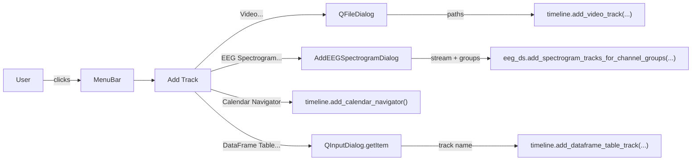

# Add Track menu

## Files Touched

- `pypho_timeline/widgets/TimelineWindow/MainTimelineWindow.ui` — add menu + actions
- `pypho_timeline/widgets/TimelineWindow/MainTimelineWindow.py` — wire actions to handlers
- `pypho_timeline/widgets/TimelineWindow/add_track_dialogs.py` (new, small) — dialog for picking EEG stream + spectrogram channel groups

No changes to `simple_timeline_widget.py`, `timeline_builder.py`, or datasource code — we only orchestrate existing APIs.

## 1. UI: new `menuAdd_Track` in [MainTimelineWindow.ui](pypho_timeline/widgets/TimelineWindow/MainTimelineWindow.ui)

Insert a new `<widget class="QMenu" name="menuAdd_Track">` next to `menuFile` / `menuGoto`, with title `Add Track`, containing:

- `actionAdd_Video_Track` — text: `Video...`
- `actionAdd_EEG_Spectrogram_Track` — text: `EEG Spectrogram...`
- separator
- `actionAdd_Calendar_Navigator_Track` — text: `Calendar Navigator`
- `actionAdd_DataFrame_Table_Track` — text: `DataFrame Table...`

Add `<addaction name="menuAdd_Track"/>` to `menubar` between `menuGoto` and `menuWindow`. Define each `<action>` block at the bottom of the file in the same style as the existing `actionOpen_Recording_File` blocks.

## 2. Wire actions in [MainTimelineWindow.py](pypho_timeline/widgets/TimelineWindow/MainTimelineWindow.py)

Inside `initUI` (around line 89, near the other `if hasattr(self, "actionXxx")` blocks), connect each new action's `triggered` signal to a handler method. Mirror the existing `actionOpen_Recording_File` pattern.

## 3. New handler methods on `MainTimelineWindow`

Add four small methods below the existing `_on_export_*` methods. All check `self.timeline_widget` first and `QMessageBox.warning` on failure (matches the existing error handling style).

- `_on_add_video_track` — `QFileDialog.getOpenFileNames` filtered to `*.mp4 *.avi *.mov`, build `VideoTrackDatasource(video_paths=[...])`, then `timeline.add_video_track(track_name="Video_<basename>", video_datasource=ds, enable_time_crosshair=True)`. Imports inside the method to avoid loading video deps at module import (matches the pattern in `main_offline_timeline.py:206-214`).

- `_on_add_eeg_spectrogram_track` — gather candidate EEG streams from `timeline.track_datasources` (filter to `EEGTrackDatasource` instances that have `raw_datasets_dict`), open `AddEEGSpectrogramDialog` (see step 4); on accept, call `eeg_ds.add_spectrogram_tracks_for_channel_groups(spectrogram_channel_groups=[...], timeline=timeline, timeline_builder=self._timeline_builder)`. This reuses the existing API at [pypho_timeline/rendering/datasources/specific/eeg.py#L944](pypho_timeline/rendering/datasources/specific/eeg.py).

- `_on_add_calendar_navigator_track` — guard against double-add (`hasattr(timeline.ui, "calendar")`), then `timeline.add_calendar_navigator()`.

- `_on_add_dataframe_table_track` — list tracks whose datasource has `detailed_df`, prompt with a small `QInputDialog.getItem`, then call `timeline.add_dataframe_table_track(track_name=f"{name}_table", dataframe=ds.detailed_df, time_column='t')` (matching the inline `_on_show_table` pattern in [simple_timeline_widget.py#L1266-L1278](pypho_timeline/widgets/simple_timeline_widget.py)).

## 4. New file `add_track_dialogs.py`

Single small `AddEEGSpectrogramDialog(QDialog)` class:

- Constructor takes `eeg_track_names: List[str]` and `default_groups: List[SpectrogramChannelGroupConfig]` (use `EMOTIV_EPOC_X_SPECTROGRAM_GROUPS` from `pypho_timeline.rendering.datasources.specific.eeg`).
- Layout:
  - `QComboBox` for EEG stream pick (or a `QListWidget` w/ multi-select, single-select default).
  - `QListWidget` of channel-group names with checkboxes (Frontal / Posterior / and an "All channels averaged (None)" option that maps to passing `None`).
  - Standard `QDialogButtonBox` Ok/Cancel.
- Properties: `selected_eeg_track_name -> str`, `selected_groups -> Optional[List[SpectrogramChannelGroupConfig]]` (None if "All" was the only selection — matches the function's documented "None means single track averaging all channels" behaviour).

## 5. Enable / disable logic

In `initUI`, after the existing `_open_recording_enabled` block, set `setEnabled(False)` on the four new actions if `self.timeline_widget is None`. They will be re-enabled by `sync_session_jump_controls` (called when timeline is attached) — extend that method with a small `_sync_add_track_actions_enabled()` helper that toggles each action based on:

- Video / Calendar Navigator / DataFrame Table → enabled iff `self.timeline_widget is not None`.
- EEG Spectrogram → enabled iff there is at least one `EEGTrackDatasource` (non-spectrogram) loaded.

## 6. Behaviour summary

## Out of scope

- "Power Bands" track type (does not exist yet) — not added.
- Persisting which tracks were added between sessions.
- Removing tracks from the same menu.