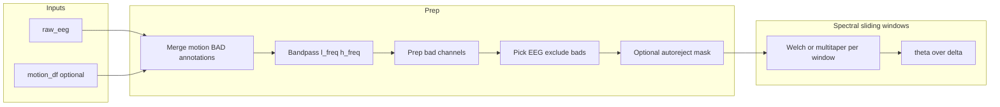

# ADHD sleep intrusions computation (`ADHD_sleep_intrusions.py`)

## Context

- `[COMPUTATIONS_README.md](c:/Users/pho/repos/EmotivEpoc/ACTIVE_DEV/PhoPyMNEHelper/src/phopymnehelper/analysis/COMPUTATIONS_README.md)` describes computations as helpers that may consume multiple streams and return time series + summaries; `[fatigue_analysis.py](c:/Users/pho/repos/EmotivEpoc/ACTIVE_DEV/PhoPyMNEHelper/src/phopymnehelper/analysis/computations/specific/fatigue_analysis.py)` is the pattern: plain functions on `mne.io.Raw`, no required registry hook.
- Motion exclusion should mirror timeline intent: `[MotionData.find_high_accel_periods](c:/Users/pho/repos/EmotivEpoc/ACTIVE_DEV/PhoPyMNEHelper/src/phopymnehelper/motion_data.py)` on a motion `DataFrame` (column `t`), with `should_set_bad_period_annotations=False`, `minimum_bad_duration=0.05`, and `**total_accel_threshold=0.5**` (not `total_change_threshold`—the timeline call at `[stream_to_datasources.py:438](c:/Users/pho/repos/EmotivEpoc/ACTIVE_DEV/pyPhoTimeline/pypho_timeline/rendering/datasources/stream_to_datasources.py)` currently passes an unsupported kwarg unless it is absorbed by `**set_annotations_kwargs`).
- Bad channels: call `[EEGComputations.time_independent_bad_channels](c:/Users/pho/repos/EmotivEpoc/ACTIVE_DEV/PhoPyMNEHelper/src/phopymnehelper/EEG_data.py)` on the working `Raw` (it updates `raw.info["bads"]`).
- Optional heavy QC: `[EEGComputations.apply_autoreject_filter](c:/Users/pho/repos/EmotivEpoc/ACTIVE_DEV/PhoPyMNEHelper/src/phopymnehelper/EEG_data.py)` (default **off**); note it already returns `reject_log` for bad epochs—use that to mask sliding windows, not to replace the whole pipeline with ICA-cleaned epochs unless explicitly requested.

## Proposed API

Single primary entry point in new file:

`[phopymnehelper/analysis/computations/specific/ADHD_sleep_intrusions.py](c:/Users/pho/repos/EmotivEpoc/ACTIVE_DEV/PhoPyMNEHelper/src/phopymnehelper/analysis/computations/specific/ADHD_sleep_intrusions.py)`

```python
def compute_theta_delta_sleep_intrusion_series(
    raw_eeg: mne.io.BaseRaw,
    motion_df: pd.DataFrame | None = None,
    *,
    total_accel_threshold: float = 0.5,
    minimum_motion_bad_duration: float = 0.05,
    meas_date=None,  # default: raw_eeg.info["meas_date"] when motion_df is used
    l_freq: float = 1.0,
    h_freq: float | None = 40.0,
    window_sec: float = 4.0,
    step_sec: float = 1.0,
    delta_band: tuple[float, float] = (1.0, 4.0),
    theta_band: tuple[float, float] = (4.0, 8.0),
    use_autoreject: bool = False,
    autoreject_epoch_sec: float = 3.0,
    autoreject_kwargs: dict | None = None,
    bad_channel_kwargs: dict | None = None,
    channel_agg: str = "mean",  # across good EEG picks after exclusions
    copy_raw: bool = True,
) -> dict:
    ...
```

**Return dict** (stable keys for downstream notebooks):


| Key                            | Meaning                                                                                                                              |
| ------------------------------ | ------------------------------------------------------------------------------------------------------------------------------------ |
| `times`                        | 1D `float` array — window **center** times in seconds (`raw.times` coordinates)                                                      |
| `theta_delta_ratio`            | 1D `float` — `theta_power / (delta_power + eps)`; `np.nan` where window is rejected (motion overlap or autoreject-bad epoch overlap) |
| `session_mean_theta_delta`     | scalar `float` — `nanmean` over valid windows                                                                                        |
| `n_windows`, `n_valid_windows` | counts for QA                                                                                                                        |
| `bad_channel_result`           | output of `time_independent_bad_channels`                                                                                            |
| `motion_high_accel_df`         | DataFrame from motion step, or `None`                                                                                                |
| `params`                       | resolved parameters (reproducibility)                                                                                                |


## Processing pipeline (order matters)




1. **Working object**: If `copy_raw`, operate on `raw_eeg.copy()` so callers’ objects are not mutated except where documented (Prep already writes `bads` on the passed `raw`; pass the copy into `time_independent_bad_channels`).
2. **Motion → bad periods**: If `motion_df` is not `None`, call `MotionData.find_high_accel_periods(a_ds=motion_df, total_accel_threshold=..., should_set_bad_period_annotations=False, minimum_bad_duration=..., meas_date=meas_date or raw.info["meas_date"])`. Merge returned `mne.Annotations` onto the working `Raw` with `raw.set_annotations(raw.annotations + motion_annots)` (handle `annotations is None`).
3. **Filtering**: `raw.filter(l_freq, h_freq, verbose=False)`. Choose default `delta_band` lower edge `**>= l_freq`** (e.g. 1–4 Hz delta with 1 Hz highpass) to avoid spectral leakage below the applied highpass.
4. **Bad channels**: `EEGComputations.time_independent_bad_channels(raw, **(bad_channel_kwargs or {}))`. Pick indices `mne.pick_types(raw.info, eeg=True, exclude="bads")`.
5. **Optional autoreject** (`use_autoreject=False` by default): If `True`, run a **lightweight** variant: `mne.make_fixed_length_epochs(raw, duration=autoreject_epoch_sec, preload=True, reject_by_annotation="omit")` (so motion-annotated segments are dropped from epochs), fit/transform `autoreject`, build a boolean mask over time for samples belonging to bad epochs (union of epoch intervals marked bad). Any sliding window whose **time span** intersects that mask beyond a small tolerance is set to `nan`. **Do not** run the full ICA block from `apply_autoreject_filter` unless you add a separate flag (e.g. `use_autoreject_ica=False`) to keep behavior predictable and fast by default.
6. **Sliding windows — “best practices”**: For each window `[t0, t1]`:
  - Skip (output `nan`) if it overlaps any annotation describing motion bad (e.g. description contains `BAD_motion` / `motion` — align with `[MotionData](c:/Users/pho/repos/EmotivEpoc/ACTIVE_DEV/PhoPyMNEHelper/src/phopymnehelper/motion_data.py)`’s `BAD_motion` label) or optional autoreject-bad coverage.
  - Extract data `raw.get_data(picks=..., start=..., stop=...)` (vectorized loop or strided windows); **average across channels** (or median if `channel_agg=="median"`) to a 1D trace per window.
  - PSD: prefer `**mne.time_frequency.psd_array_multitaper`** (multitaper) with `adaptive=True` and `bandwidth` appropriate for `sfreq`; fallback to `scipy.signal.welch` if needed for portability. Integrate band power via trapezoidal sum over frequencies in `theta_band` and `delta_band`.
  - Ratio: `theta_power / (delta_power + 1e-10)`.
7. **Session summary**: `session_mean_theta_delta = float(np.nanmean(theta_delta_ratio))`.

## Files to add/change


| Action                     | File                                                                                                                                                                                                                                                                                                                                              |
| -------------------------- | ------------------------------------------------------------------------------------------------------------------------------------------------------------------------------------------------------------------------------------------------------------------------------------------------------------------------------------------------- |
| **Add**                    | `[.../specific/ADHD_sleep_intrusions.py](c:/Users/pho/repos/EmotivEpoc/ACTIVE_DEV/PhoPyMNEHelper/src/phopymnehelper/analysis/computations/specific/ADHD_sleep_intrusions.py)` — implementation + small private helpers (`_merge_annotations`, `_window_overlaps_annotations`, `_sliding_window_centers`, optional `_build_autoreject_time_mask`). |
| **Optional one-line**      | `[COMPUTATIONS_README.md](c:/Users/pho/repos/EmotivEpoc/ACTIVE_DEV/PhoPyMNEHelper/src/phopymnehelper/analysis/COMPUTATIONS_README.md)` — list the new module next to fatigue (only if you want docs in-repo).                                                                                                                                     |
| **Not required initially** | `[eeg_registry.py](c:/Users/pho/repos/EmotivEpoc/ACTIVE_DEV/PhoPyMNEHelper/src/phopymnehelper/analysis/computations/eeg_registry.py)` — DAG nodes are EEG-only `RunContext`; this analysis needs **motion + EEG**, so keep it as a callable module unless you later introduce a richer context.                                                   |


## Dependencies and tests

- Reuse existing stack: `mne`, `numpy`, `pandas`; `pyprep` / `autoreject` remain **optional** at runtime (warnings or skip branches if missing—mirror `time_independent_bad_channels` / autoreject guard).
- Add a minimal test **or** a short doctest-style example in the module docstring using synthetic `RawArray` + tiny `motion_df` (optional follow-up if you want CI coverage).

## Risks / assumptions

- **Time alignment**: Motion `t` is assumed comparable to EEG `raw.times` for the same session; document requirement. `meas_date` must be consistent when building annotations from a DataFrame.
- **Prep on long masked data**: Prep runs on full `Raw`; motion segments are excluded at **window and epoch** level, not by cropping `Raw` before Prep (cropping would change physiology statistics). If you later want Prep only on stationary segments, that would be a separate design choice.

