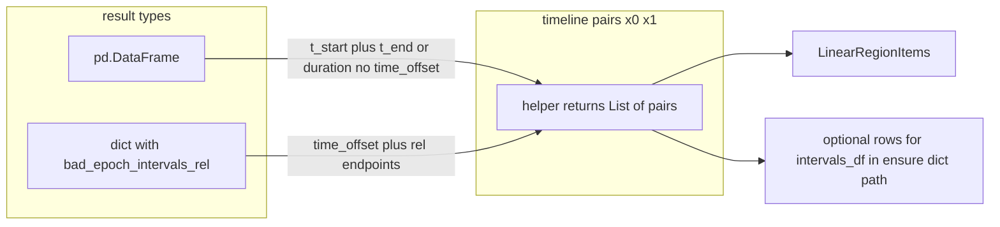

# Align `apply_bad_epochs_overlays_to_timeline` with `ensure_bad_epochs_interval_track`

## Problem

[`apply_bad_epochs_overlays_to_timeline`](C:/Users/pho/repos/EmotivEpoc/ACTIVE_DEV/PhoPyMNEHelper/src/phopymnehelper/analysis/computations/specific/bad_epochs.py) (lines 274–317) always does `intervals = list(result.get("bad_epoch_intervals_rel") or [])`. That only works when `result` is dict-like with that key. [`ensure_bad_epochs_interval_track`](C:/Users/pho/repos/EmotivEpoc/ACTIVE_DEV/PhoPyMNEHelper/src/phopymnehelper/analysis/computations/specific/bad_epochs.py) (201–272) also accepts a **`pd.DataFrame`** (used in notebooks as `merged_bad_epoch_intervals_df`) and raises **`NotImplementedError`** for other types. Overlays should follow the same contract.

Time semantics must match `ensure`:

- **Dict:** endpoints are `time_offset + a`, `time_offset + b` for each `(a, b)` in `bad_epoch_intervals_rel` (relative raw seconds).
- **DataFrame:** values are taken as **already in timeline coordinates**; **`time_offset` is not added** (same as the `result.copy()` branch in `ensure`).

## Implementation

1. **Add a private helper** in [`bad_epochs.py`](C:/Users/pho/repos/EmotivEpoc/ACTIVE_DEV/PhoPyMNEHelper/src/phopymnehelper/analysis/computations/specific/bad_epochs.py) (e.g. `_bad_epochs_timeline_interval_pairs(result: Any, *, time_offset: float) -> List[Tuple[float, float]]`) that:
   - If **`isinstance(result, pd.DataFrame)`:** return `(t_start, t_end)` per row using the same column rules as [`IntervalProvidingTrackDatasource`](C:/Users/pho/repos/EmotivEpoc/ACTIVE_DEV/pyPhoTimeline/pypho_timeline/rendering/datasources/track_datasource.py): require `t_start`; use `t_end` if present, else `t_start + t_duration`; skip rows with `t_end <= t_start`; return `[]` for empty frames.
   - Elif **`isinstance(result, Mapping)`** (not a DataFrame): same loop as today’s dict branch in `ensure` (lines 221–227), producing **absolute** `(x0, x1)` pairs.
   - **Else:** `NotImplementedError` with the same style of message as line 230.

2. **Refactor `ensure_bad_epochs_interval_track` dict branch** (minimal): build `intervals_df` from `rows` derived by mapping the helper’s pairs to `dict(t_start=..., t_duration=..., t_end=...)`, preserving the empty-frame column schema. Leave the **DataFrame** branch as `intervals_df = result.copy()` unchanged.

3. **Update `apply_bad_epochs_overlays_to_timeline`:**
   - Set `pairs = _bad_epochs_timeline_interval_pairs(result, time_offset=time_offset)`.
   - Loop `for x0, x1 in pairs:` and use `x0`, `x1` **directly** when creating `LinearRegionItem` (remove the inner `time_offset` addition to avoid double application for dict results).
   - Widen the `result` annotation from `Mapping[str, Any]` to something accurate (e.g. `Any` or `Union[pd.DataFrame, Mapping[str, Any]]`) and extend the docstring to mirror `ensure` (DataFrame = absolute times; dict = `bad_epoch_intervals_rel` + `time_offset`).

4. **Imports:** add `Mapping` from `collections.abc` if used for the dict-like branch (DataFrame checked first so it is not mistaken for a mapping).

## Verification

- Dict `out` from `BadEpochsQCComputation` / `bad_epoch_intervals_rel` + `time_offset=t0`: overlay x-range unchanged vs current behavior (no double offset).
- `ensure_bad_epochs_interval_track(timeline, merged_df, time_offset=0)` and `apply_bad_epochs_overlays_to_timeline(timeline, merged_df, time_offset=0)`: same interval geometry when `merged_df` has `t_start` and `t_end` or `t_duration` (as required by the interval datasource today).

