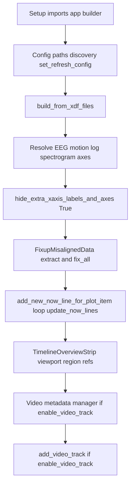

# Align `main_offline_timeline.py` with notebook `run-main` flow

## What the notebook `run-main` path does (top-to-bottom)

Execution order is determined by cell position in [testing_notebook.ipynb](c:/Users/pho/repos/EmotivEpoc/ACTIVE_DEV/pyPhoTimeline/testing_notebook.ipynb). Cells that **also** carry `run-video-only` are still part of `run-main` when they share both tags.

| Step | Notebook behavior | Current `main()` gap |
|------|-------------------|----------------------|
| Config | `enable_video_track = False`; `STREAM_BLOCKLIST = ['VideoRecorderMarkers']`; `active_video_discovery_dirs = []`; creates `AnalysisData/exported_EDF` dir | Uses `STREAM_BLOCKLIST = ['Epoc X Motion', 'Epoc X eQuality']`; passes `[video_recordings_path]` when present; no `exported_EDF` mkdir |
| Build | Same pattern as today | Aligned already |
| Tracks | `get_all_track_names()`, `get_track_tuple` for fixed names, spectrogram bottom-axis tweak loop | Missing |
| Hide | `timeline.hide_extra_xaxis_labels_and_axes(enable_hide_extra_track_x_axes=True)` | Missing (note: [timeline_builder.py](c:/Users/pho/repos/EmotivEpoc/ACTIVE_DEV/pyPhoTimeline/pypho_timeline/timeline_builder.py) `default_post_timeline_create_display_updates` already calls this once after build; notebook repeats it after track tweaks — keep second call for parity) |
| Fixup | `FixupMisalignedData.extract_eeg_track_correction_delta` + `fix_all_timeline_tracks` | Missing |
| Now lines | List comprehension over `timeline.ui.matplotlib_view_widgets` + `update_now_lines()` | Missing |
| Overview | Import strip types; bind `strip` / `region` from `timeline.ui.timeline_overview_strip` | Missing (side-effect minimal; matches notebook) |
| Video | If `enable_video_track`: PhoPyLSLhelper metadata manager + `VideoTrackDatasource` + `timeline.add_video_track(...)` | Missing; notebook defaults `False` so usually skipped |

**Out of scope for `run-main` only:** cells without the tag (e.g. `builder.refresh_from_directories()`, spectrogram computation, ADHD pipelines, alt timelines) stay omitted.

## Implementation plan (single file: `main_offline_timeline.py`)

1. **Configuration parity with the notebook’s second `run-main` cell**
   - Add module-level `enable_video_track: bool = False`.
   - Set `STREAM_BLOCKLIST` default to `['VideoRecorderMarkers']` (keep prior values as comments if you still want one-click alternatives).
   - Set `active_video_discovery_dirs` to `[]` when `enable_video_track` is false; when true, use `[video_recordings_path]` if that directory exists (notebook’s video path list lives only in the optional branch — see step 7).
   - After resolving `xdf_to_rerun_rrd_parent_export_path`, also `mkdir` for `db_root_path.joinpath('AnalysisData/exported_EDF')` like the notebook (unused today but harmless and keeps parity).

2. **Imports**
   - Add only what new steps need: `pandas as pd` (track cell uses `pd.DataFrame` / spectrogram checks); `FixupMisalignedData` from [`pypho_timeline.widgets.simple_timeline_widget`](c:/Users/pho/repos/EmotivEpoc/ACTIVE_DEV/pyPhoTimeline/pypho_timeline/widgets/simple_timeline_widget.py); `TimelineOverviewStrip` and `CustomLinearRegionItem` for the strip cell; conditional imports for video (`VideoTrackDatasource` from `pypho_timeline.__main__`, PhoPyLSLhelper metadata classes) inside or beside the `if enable_video_track:` block.
   - Optionally trim obviously unused imports (`SavedSessionsProcessor`, `matplotlib.pyplot`, `numpy` if nothing references them) — only if you want a cleaner script; not required for behavior.

3. **After `build_from_xdf_files` succeeds**
   - **Track cell:** Reproduce notebook logic: `all_track_names`, `get_track_tuple('EEG_Epoc X')`, motion and log tuples with the same hardcoded names, then the `eeg_spectogram_track_names` loop that hides the bottom axis when each name exists.
   - **Hide:** Call `timeline.hide_extra_xaxis_labels_and_axes(enable_hide_extra_track_x_axes=True)`.
   - **Fixup:** Same as notebook — `eeg_track_correction_delta = FixupMisalignedData.extract_eeg_track_correction_delta(eeg_ds=eeg_ds)` then `fix_all_timeline_tracks(...)`.
     - **Risk:** If no EEG raw `meas_date` / missing `eeg_ds`, `extract_eeg_track_correction_delta` can raise; wrap in a narrow try/except with a clear log message so the script still opens (optional hardening; notebook assumes happy path).
   - **Now lines:** `[timeline.add_new_now_line_for_plot_item(widget.getRootPlotItem()) for widget in timeline.ui.matplotlib_view_widgets.values()]` then `timeline.update_now_lines()`.
   - **Strip:** Instantiate imports and assign `strip = timeline.ui.timeline_overview_strip`, `region = strip._viewport_region` (matches notebook).

4. **`enable_video_track` branch (dual-tagged cells)**
   - When true: mirror notebook — `BaseFileMetadataManager` with `parse_folders=[Path("M:/ScreenRecordings/EyeTrackerVR_Recordings"), Path("M:/ScreenRecordings/REC_continuous_video_recorder")]`, `recent_videos = video_manager.get_most_recent_video_paths(...)`, then `VideoTrackDatasource(video_paths=recent_videos)` and `timeline.add_video_track(track_name="RecentVideosTrack", ...)`.
   - Document at top of block that these paths are machine-specific (same as notebook).

5. **Entrypoint**
   - Keep `app = pg.mkQApp(...)` near start of `main()` (notebook creates app in first cell before builder config); end with `return app.exec_()` unchanged.

6. **Dead config**
   - `DEMO_XDF_PATHS` is unused in `main()` today; leave as-is or delete in a follow-up — not required for `run-main` parity.

## Testing suggestion

Run `python main_offline_timeline.py` with your Dropbox DB layout; confirm window opens, axes/now-lines/fixup run without traceback, and toggling `enable_video_track` only when `M:` paths exist.
