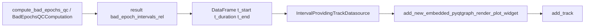

# Bad epochs → interval track on timeline

## Context

- `[bad_epochs.py](C:/Users/pho/repos/EmotivEpoc/ACTIVE_DEV/PhoPyMNEHelper/src/phopymnehelper/analysis/computations/specific/bad_epochs.py)` already produces `bad_epoch_intervals_rel: List[Tuple[float, float]]` (raw-relative seconds) and `[apply_bad_epochs_overlays_to_timeline](C:/Users/pho/repos/EmotivEpoc/ACTIVE_DEV/PhoPyMNEHelper/src/phopymnehelper/analysis/computations/specific/bad_epochs.py)` draws `LinearRegionItem`s on EEG tracks with `x = time_offset + interval`.
- The timeline’s native interval strips use `[IntervalProvidingTrackDatasource](C:/Users/pho/repos/EmotivEpoc/ACTIVE_DEV/pyPhoTimeline/pypho_timeline/rendering/datasources/track_datasource.py)` (`detailed_df=None` is already supported; `[get_detail_renderer](C:/Users/pho/repos/EmotivEpoc/ACTIVE_DEV/pyPhoTimeline/pypho_timeline/rendering/datasources/track_datasource.py)` returns a default `IntervalPlotDetailRenderer`).
- `[add_track](C:/Users/pho/repos/EmotivEpoc/ACTIVE_DEV/pyPhoTimeline/pypho_timeline/rendering/mixins/track_rendering_mixin.py)` **does not replace** an existing track (it logs a warning and returns the old renderer). Updates must mutate the existing datasource’s `intervals_df` and trigger a redraw.

## Design

1. **Time alignment** — For each `(a, b)` in `bad_epoch_intervals_rel`, set `t_start = time_offset + a`, `t_end = time_offset + b`, `t_duration = b - a` (same as overlay path). Callers must pass the **same** `time_offset` they use for `apply_bad_epochs_overlays_to_timeline`. Document that this matches the EEG/XDF timeline x-domain (typically Unix seconds when streams use absolute timestamps).
2. **New public API in PhoPyMNEHelper** (lazy-import `pypho_timeline` inside the function, matching the existing overlay helper):
  - Module constant for default label, e.g. `BAD_EPOCH_INTERVALS_TRACK_DEFAULT_NAME = "bad epoch intervals"`.
  - `ensure_bad_epochs_interval_track(timeline, result, *, time_offset: float = 0.0, track_name: str = BAD_EPOCH_INTERVALS_TRACK_DEFAULT_NAME, ...)`:
    - Build a minimal `pd.DataFrame` with `t_start`, `t_duration`, and `t_end` (empty frame if no intervals—still valid).
    - Instantiate `IntervalProvidingTrackDatasource(intervals_df=..., detailed_df=None, custom_datasource_name=track_name, max_points_per_second=1.0, enable_downsampling=False)` (aligned with UNKNOWN stream path in `[stream_to_datasources.py](C:/Users/pho/repos/EmotivEpoc/ACTIVE_DEV/pyPhoTimeline/pypho_timeline/rendering/datasources/stream_to_datasources.py)`).
    - **If** `track_name` not in `timeline.track_renderers`: mirror `[_add_tracks_to_timeline](C:/Users/pho/repos/EmotivEpoc/ACTIVE_DEV/pyPhoTimeline/pypho_timeline/timeline_builder.py)` / spectrogram notebook cell — `add_new_embedded_pyqtgraph_render_plot_widget` with `CustomCyclicColorsDockDisplayConfig` + `SynchronizedPlotMode.TO_GLOBAL_DATA`, set Y range `(0, 1)`, left label = `track_name`, `add_track(ds, name=track_name, plot_item=...)`, options panel + `_rebuild_timeline_overview_strip` if present.
    - **Else**: assign `existing_ds.intervals_df = new_ds.intervals_df` (same class), then call `**track_renderer.refresh_overview()`** (new wrapper below).
3. **Optional convenience** — Add keyword to `[apply_bad_epochs_overlays_to_timeline](C:/Users/pho/repos/EmotivEpoc/ACTIVE_DEV/PhoPyMNEHelper/src/phopymnehelper/analysis/computations/specific/bad_epochs.py)`: `add_interval_track: bool = False` (default **off** to avoid surprising existing callers). When `True`, call `ensure_bad_epochs_interval_track` with the same `time_offset`.
4. **pyPhoTimeline** — In `[track_renderer.py](C:/Users/pho/repos/EmotivEpoc/ACTIVE_DEV/pyPhoTimeline/pypho_timeline/rendering/graphics/track_renderer.py)`, add a one-line public method `refresh_overview(self) -> None` that calls `_update_overview()` so PhoPyMNEHelper (and others) can refresh rectangles without removing docks.
5. **Exports** — Extend `__all__` / package exports in `[computations/__init__.py](C:/Users/pho/repos/EmotivEpoc/ACTIVE_DEV/PhoPyMNEHelper/src/phopymnehelper/analysis/computations/__init__.py)` and `[specific/__init__.py](C:/Users/pho/repos/EmotivEpoc/ACTIVE_DEV/PhoPyMNEHelper/src/phopymnehelper/analysis/computations/specific/__init__.py)` for the new constant and `ensure_bad_epochs_interval_track`.
6. **Scope boundaries** — No change to `BadEpochsQCComputation.compute` (remains pure). PhoPyMNEHelper still does not need a declared `pypho_timeline` dependency in `[pyproject.toml](C:/Users/pho/repos/EmotivEpoc/ACTIVE_DEV/PhoPyMNEHelper/pyproject.toml)`; timeline usage stays optional at runtime.

## Verification

- From a notebook or test env with both packages: run `compute_bad_epochs_qc`, call `ensure_bad_epochs_interval_track(timeline, out, time_offset=t0)`, confirm a new dock appears and interval bars align with regions from `apply_bad_epochs_overlays_to_timeline(..., same time_offset)`.
- Call `ensure_bad_epochs_interval_track` twice with different results; rectangles should update without duplicate docks (uses refresh path).

