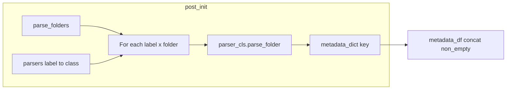

# Implement `BaseFileMetadataManager`

## Current state

- `[manager.py](c:\Users\pho\repos\EmotivEpoc\ACTIVE_DEV\PhoPyLSLhelper\src\phopylslhelper\file_metadata_caching\manager.py)` defines a stub: wrong import (`PhoPyLSLhelper.src...`), docstring describes `parse_folders` + `parsers` but those fields are missing, unused imports, and `pd.concat` on possibly empty inputs.
- `[file_metadata.py](c:\Users\pho\repos\EmotivEpoc\ACTIVE_DEV\PhoPyLSLhelper\src\phopylslhelper\file_metadata_caching\file_metadata.py)` has `BaseFileMetadataParser` with `parse_filesystem_folder` but no single entry point for the manager.
- `[video_metadata.py](c:\Users\pho\repos\EmotivEpoc\ACTIVE_DEV\PhoPyLSLhelper\src\phopylslhelper\file_metadata_caching\video_metadata.py)` exposes `parse_video_folder`; `[data_file_metadata.py](c:\Users\pho\repos\EmotivEpoc\ACTIVE_DEV\PhoPyLSLhelper\src\phopylslhelper\file_metadata_caching\data_file_metadata.py)` exposes `parse_data_folder`.

## Design

1. **Manager fields (attrs)**
  - `parse_folders: List[Path]` — normalize with `Path(...)` in `__attrs_post_init__`.  
  - `parsers: Dict[str, Type[BaseFileMetadataParser]]` — string label (e.g. `'video'`) to parser **class**.  
  - `use_cache: bool = True`, `force_rebuild: bool = False`.  
  - `parser_kwargs: Dict[str, Dict[str, Any]] = field(factory=dict)` — optional extra kwargs per label (e.g. custom `video_extensions` / `data_extensions`).  
  - `metadata_dict: Dict[str, pd.DataFrame] = field(init=False, factory=dict)` — filled in post-init; keys like `f"{label}::{folder.resolve()}"` to avoid collisions.
2. `**__attrs_post_init__`**
  For each `(label, parser_cls)` and each folder, call `parser_cls.parse_folder(folder_path=folder, use_cache=self.use_cache, force_rebuild=self.force_rebuild, **self.parser_kwargs.get(label, {}))` and store the result.
3. `**metadata_df` property**
  Build `dfs = [df for df in self.metadata_dict.values() if not df.empty]`; if `dfs` is empty return `pd.DataFrame()`; else `pd.concat(dfs, ignore_index=True)`.
4. `**parse_folder` hook (small cross-file change)**
  - On `[BaseFileMetadataParser](c:\Users\pho\repos\EmotivEpoc\ACTIVE_DEV\PhoPyLSLhelper\src\phopylslhelper\file_metadata_caching\file_metadata.py)`: add `@classmethod def parse_folder(cls, folder_path: Path, use_cache: bool = True, force_rebuild: bool = False, **kwargs) -> pd.DataFrame:` raising `NotImplementedError` with a clear message (manager requires subclasses to implement).  
  - On `VideoMetadataParser`: `return cls.parse_video_folder(folder_path, use_cache=use_cache, force_rebuild=force_rebuild, **kwargs)` (single-line body per user style).  
  - On `DataFileMetadataParser`: `return cls.parse_data_folder(folder_path, use_cache=use_cache, force_rebuild=force_rebuild, **kwargs)`.
   This avoids brittle `hasattr(..., 'parse_video_folder')` branching in the manager when new parser types are added.
5. `**manager.py` cleanup**
  - Import: `from phopylslhelper.file_metadata_caching.file_metadata import BaseFileMetadataParser` plus `from typing import Type`.  
  - Remove unused imports (`re`, `datetime`, `timedelta`, `List`, `Optional`, `Any` if unused after edits).  
  - Docstring: use `"""` not `f"""`; keep usage snippet aligned with real parameters (`parse_folders`, `parsers` as classes, optional `parser_kwargs`).
6. **Exports (optional but consistent)**
  Add `BaseFileMetadataManager` to `[file_metadata_caching/__init__.py](c:\Users\pho\repos\EmotivEpoc\ACTIVE_DEV\PhoPyLSLhelper\src\phopylslhelper\file_metadata_caching\__init__.py)` `__all__` and import if you want `from phopylslhelper.file_metadata_caching import BaseFileMetadataManager` — omit if you prefer a narrower public surface.

## Files to touch

| File                                          | Change                                   |
| --------------------------------------------- | ---------------------------------------- |
| `file_metadata_caching/manager.py`            | Full manager implementation + import fix |
| `file_metadata_caching/file_metadata.py`      | Add `parse_folder` (NotImplemented)      |
| `file_metadata_caching/video_metadata.py`     | Implement `parse_folder`                 |
| `file_metadata_caching/data_file_metadata.py` | Implement `parse_folder`                 |
| `file_metadata_caching/__init__.py`           | (Optional) export manager                |

## Verification

- Run a quick `uv run python -c "from phopylslhelper.file_metadata_caching.manager import BaseFileMetadataManager; ..."` smoke test with a temp folder (no CI assumption).  
- Confirm `metadata_df` on empty folders returns empty DataFrame without raising.

