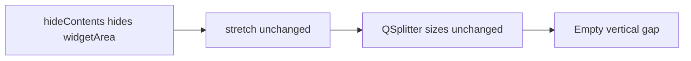

# Fix collapsed dock space redistribution

## Cause

- The "-" button calls `[on_collapse_btn_clicked](c:/Users/pho/repos/EmotivEpoc/ACTIVE_DEV/pyPhoTimeline/pypho_timeline/EXTERNAL/pyqtgraph/dockarea/Dock.py)` → `toggleContentVisibility()` → `[hideContents()](c:/Users/pho/repos/EmotivEpoc/ACTIVE_DEV/pyPhoTimeline/pypho_timeline/EXTERNAL/pyqtgraph/dockarea/Dock.py)`, which hides `widgetArea` only.
- Track heights in a vertical stack are driven by `[VContainer.updateStretch()](c:/Users/pho/repos/EmotivEpoc/ACTIVE_DEV/pyPhoTimeline/pypho_timeline/EXTERNAL/pyqtgraph/dockarea/Container.py)`: it reads each child’s `stretch()` → builds proportional `setSizes(...)`. That only runs when stretch changes (via `sig` → `childStretchChanged`).
- After collapse, each `Dock` still reports the same `(sx, sy)` (default `(10, 10)` from `__init__`), so **splitter ratios never update** and you get a large empty band instead of taller neighbors.

## Approach

Edit `[Dock.hideContents](c:/Users/pho/repos/EmotivEpoc/ACTIVE_DEV/pyPhoTimeline/pypho_timeline/EXTERNAL/pyqtgraph/dockarea/Dock.py)` / `[Dock.showContents](c:/Users/pho/repos/EmotivEpoc/ACTIVE_DEV/pyPhoTimeline/pypho_timeline/EXTERNAL/pyqtgraph/dockarea/Dock.py)` (same file):

1. **Before** changing visibility, save the current stretch tuple (e.g. `self._stretch_before_content_toggle = self._stretch` or two fields) so expand restores the user’s effective weights (including any custom `size=(wx, wy)` from construction).
2. After hiding `widgetArea`, call `setStretch` with a **small collapsed weight** on the axis the parent splitter actually uses:
  - If `self._container` is a `QSplitter` (true for `HContainer` / `VContainer`), use `orientation()`: for **Vertical**, reduce **y**; for **Horizontal**, reduce **x**. Use a small integer constant (e.g. `1` or `2`) so the title bar still gets a thin slice but most space goes to siblings.
  - If there is no splitter parent (edge case), fall back to reducing **y** (timeline’s primary column is vertical).
3. `setStretch` already emits `[sigStretchChanged](c:/Users/pho/repos/EmotivEpoc/ACTIVE_DEV/pyPhoTimeline/pypho_timeline/EXTERNAL/pyqtgraph/dockarea/Dock.py)`, which is connected in `[Container.insert](c:/Users/pho/repos/EmotivEpoc/ACTIVE_DEV/pyPhoTimeline/pypho_timeline/EXTERNAL/pyqtgraph/dockarea/Container.py)` → `**updateStretch()`** on ancestors, so the vertical stack recomputes `setSizes` and **remaining tracks expand**.
4. In `showContents`, `widgetArea.show()` then **restore** the saved stretch via `setStretch(sx, sy)` from the stored tuple.

Avoid importing `HContainer`/`VContainer` from `[Container.py](c:/Users/pho/repos/EmotivEpoc/ACTIVE_DEV/pyPhoTimeline/pypho_timeline/EXTERNAL/pyqtgraph/dockarea/Container.py)` inside `Dock.py` (circular import). Use `isinstance(self._container, QtWidgets.QSplitter)` and `orientation()` instead.

## Tradeoffs / notes

- **Manual splitter drags**: `updateStretch()` reapportions panes from stretch ratios and current container height, so a collapse may **re-normalize** sizes for that column—not only “add freed pixels” to neighbors. This matches pyqtgraph’s existing model and is the minimal fix; preserving exact per-handle pixel state would be a larger change.
- Optional hygiene: remove or gate the `print(...)` calls in `hideContents` / `showContents` while touching those methods (reduces console noise).

## Verification

- Run the app, vertical stack of several tracks, collapse one with "-": **no large white gap**; expanded tracks use noticeably more height; expand restores prior relative sizing.
- If you use **Split All Tracks** / horizontal compare column, spot-check collapse in a **horizontal** splitter (same code path via `orientation()`).

No changes required in `[simple_timeline_widget.py](c:/Users/pho/repos/EmotivEpoc/ACTIVE_DEV/pyPhoTimeline/pypho_timeline/widgets/simple_timeline_widget.py)` or `[nested_dock_area_widget.py](c:/Users/pho/repos/EmotivEpoc/ACTIVE_DEV/pyPhoTimeline/pypho_timeline/docking/nested_dock_area_widget.py)` unless you prefer a higher-level hook later.