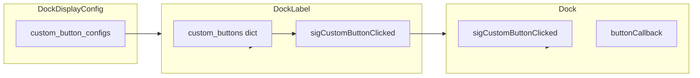

# Custom dock buttons from DockDisplayConfig

## Scope

- **Single file**: [pypho_timeline/EXTERNAL/pyqtgraph/dockarea/Dock.py](pypho_timeline/EXTERNAL/pyqtgraph/dockarea/Dock.py). The full `DockDisplayConfig` and `DockButtonConfig` are defined here; `_embed/dock_display_config.py` has no `custom_button_configs` and is not modified.
- **Config compatibility**: Use `getattr(self.config, 'custom_button_configs', {})` so configs that lack this attribute (e.g. from `_embed` or `dock_display_configs.CustomDockDisplayConfig`) still work.

## Data flow

## 1. DockLabel: custom button storage and creation

- **Attribute**: Add `self.custom_buttons: Dict[str, QtWidgets.QToolButton] = {}` in `DockLabel.__init__` (after existing button setup).
- **Signal**: Add `sigCustomButtonClicked = QtCore.Signal(str)` (emits `button_id`).
- **New method `_buildCustomButtons()`** (call from `updateButtonsFromConfig`):
  - Read `custom_button_configs = getattr(self.config, 'custom_button_configs', {})`.
  - Remove buttons whose key is no longer in config: for each key in a copy of `self.custom_buttons`, if key not in config, call `btn.deleteLater()`, then `del self.custom_buttons[key]`.
  - For each key in `custom_button_configs`: if key not in `self.custom_buttons`, create a `QToolButton`, set icon via `QtWidgets.QApplication.style().standardIcon(cfg.buttonIcon)`, set tooltip from `cfg.buttonToolTip`, set min/fixed size to `MIN_BUTTON_SIZE` (12), connect `clicked` to a lambda that calls `self._on_custom_button_clicked(key)`, set parent to `self`, add to `self.custom_buttons[key]`.
  - For each key, update visibility from `cfg.showButton`, and optionally refresh icon/tooltip from config.
- `**_on_custom_button_clicked(self, button_id: str)**`: Emit `self.sigCustomButtonClicked.emit(button_id)`.

## 2. DockLabel: layout and count

- `**updateButtonsFromConfig()**`: After setting visibility of fixed buttons and computing the fixed button count, call `_buildCustomButtons()`. Then set:
  - `num_visible_custom = sum(1 for c in getattr(self.config, 'custom_button_configs', {}).values() if c.showButton)`
  - `self.num_total_title_bar_buttons = (fixed_count + num_visible_custom)`.
- `**resizeEvent()**`:
  - In the condition that sets `button_size` (line ~1221), extend so `button_size` is also set when `getattr(self, 'custom_buttons', {})` is non-empty (so layout works when only custom buttons are visible).
  - After the `# END if self.optionsButton...` block, add a loop over `self.custom_buttons` (iteration order = insertion order): for each button, if not `btn.isVisible()` skip; else `setFixedSize(button_size, button_size)`, then `move(current_x, 0)` or `move(0, current_y)` depending on orientation, and advance `current_x` or `current_y` by `button_size`.

## 3. Dock: signal and callback

- **Signal**: Add `sigCustomButtonClicked = QtCore.Signal(object, str)` (dock, button_id) on `Dock`.
- **In `Dock.__init__`**: Connect `self.label.sigCustomButtonClicked.connect(self._on_custom_button_clicked)`.
- `**_on_custom_button_clicked(self, button_id: str)**`:
  - Emit `self.sigCustomButtonClicked.emit(self, button_id)`.
  - Get `cfg = getattr(self.config, 'custom_button_configs', {}).get(button_id)`; if `cfg` and `cfg.buttonCallback` is callable, call `cfg.buttonCallback(self, button_id)` (or `cfg.buttonCallback(self)` if callback arity is 1; support both for compatibility).

## 4. Optional: keyboard shortcuts

- **Dock**: In `__init__`, after the label is set up, for each `(key, cfg)` in `getattr(display_config, 'custom_button_configs', {}).items()`: if `cfg.buttonShortcut` is non-empty, create `QtWidgets.QShortcut(QtGui.QKeySequence(cfg.buttonShortcut), self, cfg.buttonShortcutContext, activated=lambda k=key: self._on_custom_button_clicked(k))`. Store in `self._custom_button_shortcuts: Dict[str, QShortcut]` so they can be updated if config changes later (optional). If not implementing update-on-config-change, creating shortcuts once in `__init__` is enough.

## 5. Context menu (optional / follow-up)

- `**buildContextMenu`**: Under "Show dock buttons", add checkable entries for each custom button (e.g. "Custom: ") that toggle `config.custom_button_configs[key].showButton` and call `self.label.updateButtonsFromConfig()`.
- `**updateButtonVisibility`**: Extend to support `button_type == 'custom_<key>'` by setting `self.config.custom_button_configs[key].showButton = visible` and calling `self.label.updateButtonsFromConfig()` (only if we add context menu toggles).

## 6. Debug and exports

- `**debug_dock_label**`: Optionally log presence and count of `custom_buttons` for diagnostics.
- **Exports**: Ensure `DockButtonConfig` (and any new signals) are part of the public API if other modules need to type-hint or connect (no change to `__init__.py` required if already importing from this file).

## Implementation order

1. DockLabel: `custom_buttons` dict, `sigCustomButtonClicked`, `_buildCustomButtons()`, `_on_custom_button_clicked()`.
2. DockLabel: Call `_buildCustomButtons()` from `updateButtonsFromConfig()` and include custom count in `num_total_title_bar_buttons`.
3. DockLabel: In `resizeEvent()`, extend `button_size` condition and add custom-button positioning loop.
4. Dock: Add `sigCustomButtonClicked`, connect in `__init__`, implement `_on_custom_button_clicked()` (emit + optional callback).
5. Optional: shortcuts in Dock `__init__`; optional: context menu and `updateButtonVisibility` for custom keys.

## Key code locations

| What                                      | Where                                                                    |
| ----------------------------------------- | ------------------------------------------------------------------------ |
| `DockButtonConfig`                        | [Dock.py](pypho_timeline/EXTERNAL/pyqtgraph/dockarea/Dock.py) ~78–85     |
| `DockDisplayConfig.custom_button_configs` | [Dock.py](pypho_timeline/EXTERNAL/pyqtgraph/dockarea/Dock.py) ~103       |
| DockLabel button creation                 | [Dock.py](pypho_timeline/EXTERNAL/pyqtgraph/dockarea/Dock.py) ~1044–1100 |
| DockLabel.updateButtonsFromConfig         | [Dock.py](pypho_timeline/EXTERNAL/pyqtgraph/dockarea/Dock.py) ~1126–1157 |
| DockLabel.resizeEvent                     | [Dock.py](pypho_timeline/EXTERNAL/pyqtgraph/dockarea/Dock.py) ~1212–1362 |
| Dock signal connections in **init**       | [Dock.py](pypho_timeline/EXTERNAL/pyqtgraph/dockarea/Dock.py) ~258–272   |

