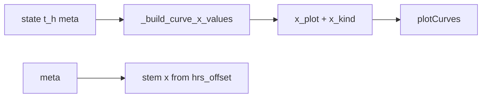

# Robust datetime (and hours) x-axis for DA/NE `plot` / `plotCurves`

## Problem

- [`plot`](c:/Users/pho/repos/EmotivEpoc/ACTIVE_DEV/Dose-Analysis-Python/src/dose_analysis_python/DoseCurveCalculation/pysb_pkpd_da_ne_monoamine.py) passes **`x_h`**, but [`plotCurves`](c:/Users/pho/repos/EmotivEpoc/ACTIVE_DEV/Dose-Analysis-Python/src/dose_analysis_python/DoseCurveCalculation/pysb_pkpd_da_ne_monoamine.py) only reads **`t_h`** for `ax.plot` / `ax.stem` and always labels **"Time [h]"**. So datetime mode never takes effect.
- Dose stems always use **`hrs_offset`** (hours from `t0`); with a datetime x-axis they must use **`t0 + to_timedelta(hrs_offset)`**, same idea as [`_build_x_values`](c:/Users/pho/repos/EmotivEpoc/ACTIVE_DEV/Dose-Analysis-Python/src/dose_analysis_python/Visualization/da_ne_monoamine_bokeh_export.py) in Bokeh export.

## Design

1. **Single abscissa** inside `plotCurves`: after resolving simulation time as **`t_h_sim`** (from argument or `curve_dict["t_h"]`), compute **`x_plot`** and **`x_kind`** (`"linear"` | `"datetime"`) via **`_build_curve_x_values(t_h_sim, meta, use_datetime_x)`**. Use **`x_plot`** for all `ax.plot` calls.
2. **Stems**: if `x_kind == "datetime"`, stem x = `pd.Timestamp(meta["t0"]) + pd.to_timedelta(recordQuantaDf["hrs_offset"], unit="h")` (same formula as Bokeh). Else keep current `hrs_offset`.
3. **Axis label**: `"Time [h]"` vs `"Time"` (or `"Wall time"`) from `x_kind`.
4. **`plot()`**: remove **`x_h`**; call `plotCurves(curve_dict=self.state, use_datetime_x=use_datetime_x, **kwargs)` only. Default **`use_datetime_x=True`** (your preference).
5. **`plotCurves` signature**: add **`use_datetime_x: bool = False`** (safe default for docstring examples that pass raw `t_h, y` without `meta`). When `True`, require **`meta`** with **`t0`** — available from `curve_dict["meta"]` in the usual path; for **`curve_dict is None`**, accept optional **`meta=`** in `**kwargs` or add an explicit **`meta`** parameter and document that `use_datetime_x=True` needs it.
6. **`_build_curve_x_values`**: make it the only place that decides linear vs datetime:
   - If `use_datetime_x` is false: return `(asarray(t_h, float), "linear")`.
   - If `use_datetime_x` is true and **`t_h` is already datetime-like** (e.g. `DatetimeIndex` / `datetime64` array): return it unchanged with `"datetime"` (avoids double-shifting if a caller passes absolute times).
   - Else require `meta["t0"]` and return `t0 + to_timedelta(t_h, "h")` with `"datetime"` (match [Bokeh helper](c:/Users/pho/repos/EmotivEpoc/ACTIVE_DEV/Dose-Analysis-Python/src/dose_analysis_python/Visualization/da_ne_monoamine_bokeh_export.py) logic).
7. **kwargs hygiene**: ensure **`use_datetime_x`** is not forwarded into matplotlib/`pylab` by accident (explicit parameter only).

## Files to touch

- Primary: [`pysb_pkpd_da_ne_monoamine.py`](c:/Users/pho/repos/EmotivEpoc/ACTIVE_DEV/Dose-Analysis-Python/src/dose_analysis_python/DoseCurveCalculation/pysb_pkpd_da_ne_monoamine.py) — `plotCurves`, `_build_curve_x_values`, `plot`.
- Tests: [`tests/test_pysb_pkpd_da_ne_monoamine.py`](c:/Users/pho/repos/EmotivEpoc/ACTIVE_DEV/Dose-Analysis-Python/tests/test_pysb_pkpd_da_ne_monoamine.py) — small test with `matplotlib` Agg backend: `make_curve(..., backend="scipy")` then `plotCurves(..., use_datetime_x=True)` and assert x-axis values are datetime-like and length matches `t_h` (no `plt.show()` in CI, or mock if needed).

## Docs / notebook

- Update the class docstring / `plotCurves` docstring with the new parameter and the `meta` requirement for datetime mode without `curve_dict`.
- **Notebooks**: per your rule, do not edit `*.ipynb` unless you ask; existing `active_model.plot(use_datetime_x=True)` remains valid; calls without the flag will now default to datetimes on **`plot()`** only.
