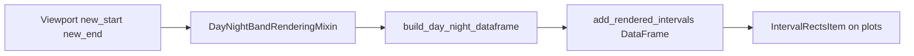

# DayNightBandRenderingMixin implementation

## Behavior

- **Night**: local wall-clock **21:00 → next calendar day 05:00** (one continuous band crossing midnight).
- **Day**: local wall-clock **05:00 → 21:00** on the same calendar day.
- **Alternation**: For every visible range on the X axis (unix seconds), emit both **Day** and **Night** rows with distinct brushes (e.g. light gray vs darker blue/gray), clipped to `[window_start, window_end]`.
- **Timezone**: Use the same display timezone as the rest of the timeline. The codebase already centralizes this as [`DISPLAY_TIMEZONE`](c:\Users\pho\repos\EmotivEpoc\ACTIVE_DEV\pyPhoTimeline\pypho_timeline\utils\datetime_helpers.py) (`America/Detroit`) and uses [`to_display_timezone`](c:\Users\pho\repos\EmotivEpoc\ACTIVE_DEV\pyPhoTimeline\pypho_timeline\rendering\mixins\epoch_rendering_mixin.py) for “current time” display. Build **local** segment boundaries with `pd.Timestamp(..., tz=DISPLAY_TIMEZONE)` (or equivalent) and convert segment bounds to **UTC unix seconds** for `t_start` / `t_duration`, matching how [`Render2DEventRectanglesHelper`](c:\Users\pho\repos\EmotivEpoc\ACTIVE_DEV\pyPhoTimeline\pypho_timeline\rendering\helpers\render_rectangles_helper.py) expects numeric X.

## Architecture

- **Hook**: Override [`EpochRenderingMixin_on_window_update`](c:\Users\pho\repos\EmotivEpoc\ACTIVE_DEV\pyPhoTimeline\pypho_timeline\rendering\mixins\epoch_rendering_mixin.py) to call `super().EpochRenderingMixin_on_window_update(...)` (so [`LiveWindowEventIntervalMonitoringMixin`](c:\Users\pho\repos\EmotivEpoc\ACTIVE_DEV\pyPhoTimeline\pypho_timeline\rendering\mixins\live_window_monitoring_mixin.py) still runs), then refresh day/night geometry when `new_start` / `new_end` are valid floats.
- **Data path**: Build a `pd.DataFrame` with `t_start`, `t_duration` (and optional `label`), pass through [`General2DRenderTimeEpochs.build_render_time_epochs_datasource`](c:\Users\pho\repos\EmotivEpoc\ACTIVE_DEV\pyPhoTimeline\pypho_timeline\_embed\general_2d_render_time_epochs.py) via existing [`add_rendered_intervals`](c:\Users\pho\repos\EmotivEpoc\ACTIVE_DEV\pyPhoTimeline\pypho_timeline\rendering\mixins\epoch_rendering_mixin.py) (already accepts `pd.DataFrame`). Use a **fixed reserved name** (e.g. `'DayNightBands'`) and optional `brush_color` / `pen_color` lists so day vs night rows differ.
- **Y extent**: [`IntervalRectsItem`](c:\Users\pho\repos\EmotivEpoc\ACTIVE_DEV\pyPhoTimeline\pypho_timeline\rendering\graphics\interval_rects_item.py) draws `QRectF(start_t, series_vertical_offset, duration_t, series_height)`. For full-height background bands, read the current view range from the first non-None plot in `interval_rendering_plots` via existing [`EpochRenderingMixin.get_plot_view_range`](c:\Users\pho\repos\EmotivEpoc\ACTIVE_DEV\pyPhoTimeline\pypho_timeline\rendering\mixins\epoch_rendering_mixin.py) and set `series_vertical_offset` / `series_height` to cover `[y_min, y_max]` (handle inverted-Y by using `min`/`max` of the two). If no plot is ready yet, skip or use a safe fallback.

## Implementation details (single file focus)

Primary edits in [`epoch_rendering_mixin.py`](c:\Users\pho\repos\EmotivEpoc\ACTIVE_DEV\pyPhoTimeline\pypho_timeline\rendering\mixins\epoch_rendering_mixin.py):

1. **Constants / hooks on `DayNightBandRenderingMixin`**
   - Class attributes: reserved interval name, default day/night pen/brush colors, optional `night_start_hour=21`, `night_end_hour=5`, and `wall_clock_tz` defaulting to `DISPLAY_TIMEZONE` from [`pypho_timeline.utils.datetime_helpers`](c:\Users\pho\repos\EmotivEpoc\ACTIVE_DEV\pyPhoTimeline\pypho_timeline\utils\datetime_helpers.py).
   - Optional `day_night_bands_enabled: bool = True` to no-op refresh when disabled.

2. **Pure helper** (module-level or `@staticmethod` on the mixin): `build_day_night_intervals_df(win_start: float, win_end: float, *, tz, night_start, night_end, y_off, y_height, day_vis_kwargs, night_vis_kwargs) -> pd.DataFrame`
   - Convert `win_start`/`win_end` to display-local bounds with pandas timestamps.
   - Loop calendar dates from the date of the window start through the date of the window end (plus one day buffer if needed for overnight night segment).
   - For each date `d`: append **Day** `[d 05:00, d 21:00)` and **Night** `[d 21:00, d+1 05:00)`, each clipped to `[win_start, win_end]`; drop zero/negative durations after clip.
   - Sort rows by `t_start`.
   - DST: using `ZoneInfo`/`pd.Timestamp` with explicit tz avoids naive datetime pitfalls.

3. **`_refresh_day_night_bands(self, new_start, new_end)`**
   - If not enabled or missing range, return early.
   - Compute Y span from `interval_rendering_plots`.
   - Build dataframe → `add_rendered_intervals(df, name=<reserved>, ...)` with visualization kwargs for pens/brushes.
   - After items exist, set **low z-order** on each `IntervalRectsItem` in that container (e.g. `setZValue(-100)`) so bands stay behind tracks and other epochs.

4. **Initial paint**: On first viewport update the bands appear; optionally override `EpochRenderingMixin_on_buildUI` to call `_refresh` if the implementor exposes `active_window_*` floats — **skip** unless you find a cheap generic signal (keep minimal: window update only avoids coupling to `SimpleTimelineWidget`).

5. **Exports**: Add `DayNightBandRenderingMixin` to [`rendering/mixins/__init__.py`](c:\Users\pho\repos\EmotivEpoc\ACTIVE_DEV\pyPhoTimeline\pypho_timeline\rendering\mixins\__init__.py) `__all__` for discoverability.

## Integration notes for consumers

-Concrete widgets must still override **`interval_rendering_plots`** (required by [`EpochRenderingMixin`](c:\Users\pho\repos\EmotivEpoc\ACTIVE_DEV\pyPhoTimeline\pypho_timeline\rendering\mixins\epoch_rendering_mixin.py)); the mixin does not remove that requirement.
- For classes using [`TrackRenderingMixin`](c:\Users\pho\repos\EmotivEpoc\ACTIVE_DEV\pyPhoTimeline\pypho_timeline\rendering\mixins\track_rendering_mixin.py), include **`DayNightBandRenderingMixin`** in the inheritance list **before** `EpochRenderingMixin` in MRO **or** rely on method resolution so that `TrackRenderingMixin_on_window_update` → `EpochRenderingMixin_on_window_update` resolves to this mixin’s override (verify MRO for your concrete class order).

## Testing (optional, small)

- Add a unit test that fixes `DISPLAY_TIMEZONE` (or passes a fixed `ZoneInfo`) and asserts segment boundaries and durations for a unix window that spans two midnights.
