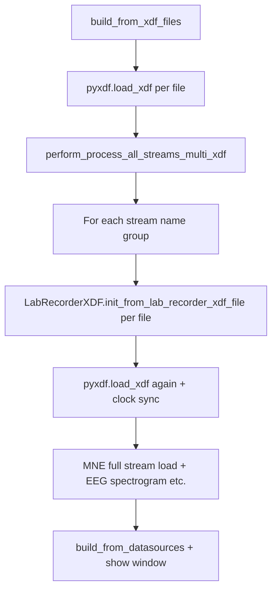

# Diagnosis: freeze opening an actively recording `.xdf`

## What “freeze” is here

The timeline is built in [`TimelineBuilder.build_from_datasources`](c:\Users\pho\repos\EmotivEpoc\ACTIVE_DEV\pyPhoTimeline\pypho_timeline\timeline_builder.py): `MainTimelineWindow.show()` runs **after** XDF loading and processing complete (see flow around lines 1122–1139). All work before `show()` runs on the **Qt GUI thread**, so the window does not paint and input looks frozen until that phase returns.

## Load pipeline (amplified for live / large files)

### 1. Double (and N×) full XDF parsing

- **First parse**: [`build_from_xdf_files`](c:\Users\pho\repos\EmotivEpoc\ACTIVE_DEV\pyPhoTimeline\pypho_timeline\timeline_builder.py) calls `pyxdf.load_xdf` for each path (line ~476).
- **Additional full parses per logical stream**: [`perform_process_all_streams_multi_xdf`](c:\Users\pho\repos\EmotivEpoc\ACTIVE_DEV\pyPhoTimeline\pypho_timeline\rendering\datasources\stream_to_datasources.py) enables `enable_raw_xdf_processing` by default and, **inside each `stream_name` loop**, calls `_subfn_process_xdf_file` for every distinct XDF path in that group (lines 434–444). That invokes `LabRecorderXDF.init_from_lab_recorder_xdf_file(..., should_load_full_file_data=True)` (line ~263).
- **Each `LabRecorderXDF` init parses the file again**: [`init_basic_from_lab_recorder_xdf_file`](c:\Users\pho\repos\EmotivEpoc\ACTIVE_DEV\PhoPyMNEHelper\src\phopymnehelper\xdf_files.py) calls `pyxdf.load_xdf(..., synchronize_clocks=True, handle_clock_resets=True, ...)` (line ~498)—i.e. **another full read**, with **clock synchronization** (notoriously slow; the docstring in that file even warns about it).

So for one recording with e.g. EEG + Motion + quality streams from the **same** file, you pay roughly **1 + 3 full `pyxdf.load_xdf` passes** (and three of them do clock sync) **before** spectrogram work.

For an **actively growing** XDF, each pass reads an ever-larger byte range from disk; wall time grows with file size.

### 2. Heavy EEG path on every load

Still in [`perform_process_all_streams_multi_xdf`](c:\Users\pho\repos\EmotivEpoc\ACTIVE_DEV\pyPhoTimeline\pypho_timeline\rendering\datasources\stream_to_datasources.py), for EEG streams with raw processing enabled (lines 483–525):

- Align raws, run `EEGComputations.time_independent_bad_channels` per interval row, then **`compute_multiraw_spectrogram_results`** and construct one or more `EEGSpectrogramTrackDatasource` instances.

That is **CPU-heavy** and tied to **total data length**; on a long live recording it dominates time.

### 3. Polling path repeats the same pattern on the GUI thread

[`_on_active_xdf_poll_timer`](c:\Users\pho\repos\EmotivEpoc\ACTIVE_DEV\pyPhoTimeline\pypho_timeline/timeline_builder.py) calls `refresh_from_directories()`, which eventually calls `_collect_datasources_by_name_for_paths` → again `pyxdf.load_xdf` + `perform_process_all_streams_multi_xdf` (lines 234–251, 344–349). So **every** detected size/mtime change can repeat the full expensive pipeline **on the main thread**, which again looks like a hung UI for tens of seconds or minutes.

### 4. Secondary risks (worth verifying if the above is “fast enough” on your machine)

- **Incomplete footer/metadata while LabRecorder is writing**: pyxdf may error or behave poorly at file end; your code does not special-case partial files. Primary symptom is usually an exception, not endless freeze—unless retries/logging mask it.
- **Windows file sharing**: if the recorder opened the file with a restrictive sharing mode, reads could block; less common than the CPU/IO load above.

## Closing the `.xdf` / missing metadata angle (from your original spec)

When LabRecorder **finishes** a file, pyxdf typically gets a complete `Fileheader` chunk and consistent stream footers; while recording, some header fields may be provisional or streams may lack final bounds. Your stack already has [`derive_reference_datetime_from_file_metadata`](c:\Users\pho\repos\EmotivEpoc\ACTIVE_DEV\pyPhoTimeline\pypho_timeline\xdf_session_discovery.py) as a fallback when header datetime is missing. The heavier issue for “live” mode is **cost**, not only missing metadata.

## Recommended directions (for a later implementation pass)

- **Live mode**: single parse per refresh; **cache** `LabRecorderXDF` (or pyxdf streams) **per path** and reuse across stream-name loops; avoid re-running `synchronize_clocks=True` on every refresh if possible for incremental updates.
- **Live mode**: set `enable_raw_xdf_processing=False` **or** skip spectrogram / defer spectrogram to a background worker; update overview from pyxdf `time_series` first.
- **Threading**: move `pyxdf.load_xdf` + MNE + spectrogram to `QThread` / worker + signal results to UI; keep only `QObject` updates on the GUI thread.
- **Incremental XDF**: consider tail-append reading or a dedicated “growing file” reader instead of full-file reload when mtime/size changes.

No code changes in this step (plan-only request).
