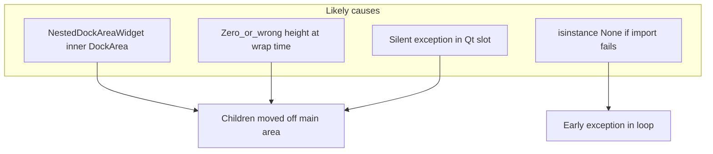

# Logging and analysis: grouped spectrogram tracks not visible

## Why tracks may disappear (hypothesis summary)

1. **Nested dock path is fragile** — `[nested_dock_area_widget.py](c:\Users\pho\repos\EmotivEpoc\ACTIVE_DEV\pyPhoTimeline\pypho_timeline\docking\nested_dock_area_widget.py)` states nesting "doesn't quite work." `[build_wrapping_nested_dock_area](c:\Users\pho\repos\EmotivEpoc\ACTIVE_DEV\pyPhoTimeline\pypho_timeline\docking\dynamic_dock_display_area.py)` moves leaf docks into `NestedDockAreaWidget.displayDockArea` via `addDock(dock=a_dock)`. If the inner `DockArea` or parent `GROUP[...]` dock does not get correct size policies or stretch, children can end up with **zero visible height** or broken geometry even though `timeline.add_track` already ran.
2. `**total_height` from sum of `a_dock.height()`** — At wrap time (lines 488–510), `[total_height = np.sum([a_dock.height() for a_dock in flat_group_dockitems_list])](c:\Users\pho\repos\EmotivEpoc\ACTIVE_DEV\pyPhoTimeline\pypho_timeline\docking\dynamic_dock_display_area.py)`. If widgets have not been laid out yet and heights are **0**, `setMinimumHeight(total_height)` can collapse the group container.
3. **Exceptions swallowed by Qt** — Slots decorated with `@pyqtExceptionPrintingSlot()` may log to console without `TimelineBuilder`’s log file; wrapping the grouping call in `[timeline_builder._add_tracks_to_timeline](c:\Users\pho\repos\EmotivEpoc\ACTIVE_DEV\pyPhoTimeline\pypho_timeline\timeline_builder.py)` with `try/except` + `logger.exception` makes failure visible in the same pipeline as XDF load logs.
4. `**isinstance` guard** — `[_is_eeg_spectrogram_datasource](c:\Users\pho\repos\EmotivEpoc\ACTIVE_DEV\pyPhoTimeline\pypho_timeline\timeline_builder.py)` uses `isinstance(ds, EEGSpectrogramTrackDatasource)` without checking `EEGSpectrogramTrackDatasource is not None`. If the module import block ever sets the class to `None`, **every** datasource hits `TypeError` on the first iteration (usually no tracks at all). Logging + restoring the guard prevents a subtle regression.
5. **Data vs UI** — MNE logs showing `Spectrogram` in `read_dict` do not prove `EEG_Spectrogram_`* entries exist in the `datasources` list. Logs should list **spectrogram datasource names** before grouping so you can separate “never built” from “built then moved/hidden.”

---

## 1. Add logging (implementation)

Use the existing pattern: module logger via `[get_rendering_logger(__name__)](c:\Users\pho\repos\EmotivEpoc\ACTIVE_DEV\pyPhoTimeline\pypho_timeline\utils\logging_util.py)` for docking code; `[timeline_builder](c:\Users\pho\repos\EmotivEpoc\ACTIVE_DEV\pyPhoTimeline\pypho_timeline\timeline_builder.py)` already has a module-level `logger`.

### A. `[timeline_builder.py](c:\Users\pho\repos\EmotivEpoc\ACTIVE_DEV\pyPhoTimeline\pypho_timeline\timeline_builder.py)` — `_add_tracks_to_timeline`

- After defining `_is_eeg_spectrogram_datasource`, compute `spec_names = [d.custom_datasource_name for d in datasources if _is_eeg_spectrogram_datasource(d)]` and log once at **INFO**: count and list of names (empty list is useful).
- Immediately **before** `layout_dockGroups` (only when `spec_names` non-empty):
  - Log **INFO**: calling layout for `SimpleTimelineWidget.EEG_SPECTROGRAM_DOCK_GROUP`.
  - Optionally **DEBUG**: `get_dockGroup_dock_dict()` from `timeline.ui.dynamic_docked_widget_container` — log keys and per-key `[d.name() for d in docks]` (confirm docks are discoverable before wrap).
- Wrap `layout_dockGroups(...)` in `try/except Exception:` → `logger.exception("EEG spectrogram dock grouping failed")` so a stack trace lands in the same log as the rest of the app.
- Immediately **after** successful layout (INFO): e.g. `len(timeline.ui.matplotlib_view_widgets)` and whether `GROUP[...]` exists in `findChildren` / `nested_dock_items` keys if cheap to access (optional DEBUG).

Keep messages grep-friendly, e.g. prefix `[dock_group:eeg_spec]`.

### B. `[dynamic_dock_display_area.py](c:\Users\pho\repos\EmotivEpoc\ACTIVE_DEV\pyPhoTimeline\pypho_timeline\docking\dynamic_dock_display_area.py)`

- At module top: `logger = get_rendering_logger(__name__)`.
- `**layout_dockGroups`**: **DEBUG** log `ordered_group_names` and for each processed group the list of dock `name()` and `dock_group_names` (or only for the EEG group id if you want less noise — prefer logging all groups at DEBUG since this helper is shared).
- `**build_wrapping_nested_dock_area`**: **INFO** log `dock_group_name`, `num_child_docks`, `total_height`, and per-child `name()` + `height()` + `width()`; **WARNING** if `total_height <= 0` or any child height is 0 (strong signal for invisible group). Replace or augment the existing `print(f'\ta_dock_identifier: ...')` with `logger.debug` to avoid duplicate console spam unless you keep print for backward compatibility during transition.

### C. Optional guard (same PR as logging)

Restore safe check: `EEGSpectrogramTrackDatasource is not None and isinstance(...)` in `_is_eeg_spectrogram_datasource` so logging runs even on partial imports.

---

## 2. How to interpret logs

| Observation                                  | Interpretation                                                                                                                                                                                                                      |
| -------------------------------------------- | ----------------------------------------------------------------------------------------------------------------------------------------------------------------------------------------------------------------------------------- |
| `spec_names` empty                           | Spectrogram datasources not in build list — fix pipeline (`[stream_to_datasources](c:\Users\pho\repos\EmotivEpoc\ACTIVE_DEV\pyPhoTimeline\pypho_timeline\rendering\datasources\stream_to_datasources.py)` / filters), not grouping. |
| Group dict missing expected docks / count 0  | `dock_group_names` not on config or wrong group id.                                                                                                                                                                                 |
| `total_height == 0` or all child heights 0   | Fix: minimum height fallback (e.g. `max(total_height, N * 80)`), or defer `layout_dockGroups` until after first `show()` / `QTimer.singleShot(0, ...)` resize.                                                                      |
| Exception in `layout_dockGroups`             | Fix underlying `addDock` / container error from traceback.                                                                                                                                                                          |
| No exception, docks in dict, still invisible | Focus on `NestedDockAreaWidget` layout: size policy, `setMinimumHeight`, inner `DockArea` stretch — may need UI fix beyond logging.                                                                                                 |

---

## 3. Fix directions (after logs narrow the case)

- **Height / timing**: In `build_wrapping_nested_dock_area`, if `total_height < min_px`, set floor (match default track row height ~80 from timeline builder). Optionally invoke `layout_dockGroups` via `QTimer.singleShot(0, lambda: ...)` from timeline after the window is shown (so `height()` is non-zero).
- **Avoid broken nest**: If logs confirm nest is the issue, **stop calling** `layout_dockGroups` for EEG (keep flat docks + `showGroupButton` + shared `dock_group_names` for metadata only) until nested layout is fixed — or implement a simpler “visual group” (single container `QWidget` with vertical layout) instead of pyqtgraph `DockArea` inside `Dock`.
- **Split view**: Remember `[_rebuild_split_track_dock_groups](c:\Users\pho\repos\EmotivEpoc\ACTIVE_DEV\pyPhoTimeline\pypho_timeline\widgets\simple_timeline_widget.py)` unwraps all nested areas; separate follow-up if compare mode must preserve spectrogram stacks.

---

## Files to touch

- `[pypho_timeline/timeline_builder.py](c:\Users\pho\repos\EmotivEpoc\ACTIVE_DEV\pyPhoTimeline\pypho_timeline\timeline_builder.py)` — spec list logging, try/except around `layout_dockGroups`, optional pre/post DEBUG.
- `[pypho_timeline/docking/dynamic_dock_display_area.py](c:\Users\pho\repos\EmotivEpoc\ACTIVE_DEV\pyPhoTimeline\pypho_timeline\docking\dynamic_dock_display_area.py)` — logger, `layout_dockGroups` / `build_wrapping_nested_dock_area` logs, height warnings.

No edits to the plan file in `.cursor/plans/`.