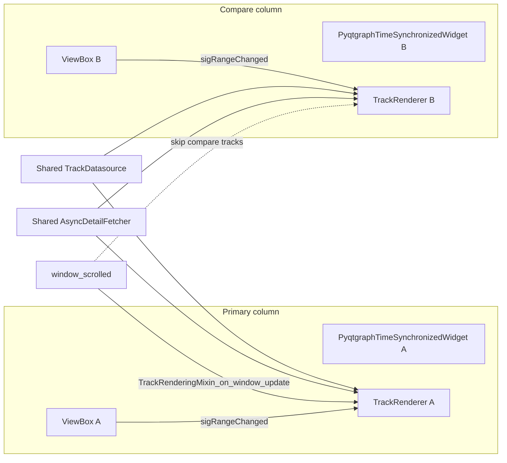

# Independent dual-column timeline views (performance-oriented)

## How scrolling works today

- Each track is a `[PyqtgraphTimeSynchronizedWidget](c:\Users\pho\repos\EmotivEpoc\ACTIVE_DEV\pyPhoTimeline\pypho_timeline\core\pyqtgraph_time_synchronized_widget.py)` inside `[NestedDockAreaWidget](c:\Users\pho\repos\EmotivEpoc\ACTIVE_DEV\pyPhoTimeline\pypho_timeline\widgets\simple_timeline_widget.py)`; horizontal range is the plot’s `ViewBox`.
- `[SpecificDockWidgetManipulatingMixin.add_new_embedded_pyqtgraph_render_plot_widget](c:\Users\pho\repos\EmotivEpoc\ACTIVE_DEV\pyPhoTimeline\pypho_timeline\docking\specific_dock_widget_mixin.py)`: with `SynchronizedPlotMode.TO_GLOBAL_DATA`, tracks are **X-linked** via `plot_item.setXLink(master_plot_item)` (lines 129–159). That is exactly what must **not** happen between primary and compare columns if scrolling is independent.
- `[TrackRenderingMixin](c:\Users\pho\repos\EmotivEpoc\ACTIVE_DEV\pyPhoTimeline\pypho_timeline\rendering\mixins\track_rendering_mixin.py)`: `window_scrolled` is connected once to `TrackRenderingMixin_on_window_update`, which updates **every** entry in `self.track_renderers` with the same `(new_start, new_end)` (lines 263–282). Per-track pan/zoom also calls `update_viewport` via a rate-limited `SignalProxy` on each ViewBox (lines 161–175, 218–234).
- `[SimpleTimelineWidget](c:\Users\pho\repos\EmotivEpoc\ACTIVE_DEV\pyPhoTimeline\pypho_timeline\widgets\simple_timeline_widget.py)` exposes `window_scrolled` and uses `simulate_window_scroll` / calendar for the **single** active window.

So: `**NO_SYNC` only disconnects `window_scrolled → PyqtgraphTimeSynchronizedWidget.on_window_changed`**; it does **not** stop `TrackRenderingMixin_on_window_update` from forcing the compare column’s renderer to the primary window. That must be addressed for true independence.

## Recommended approach (best performance / fit)

**Pattern: one extra docked plot per track, to the right of the existing dock, sharing datasources and the existing async fetcher.**

1. **Layout**
  For each primary track dock, create a sibling with `dockAddLocationOpts=[primary_dock, 'right']` (same pattern as `[add_dataframe_table_track](c:\Users\pho\repos\EmotivEpoc\ACTIVE_DEV\pyPhoTimeline\pypho_timeline\widgets\simple_timeline_widget.py)` using `find_display_dock` + `'right'`). Keeps row alignment without rewriting `PyqtgraphTimeSynchronizedWidget` to multi-column layouts.
2. **Sync mode for compare widgets**
  Use `SynchronizedPlotMode.NO_SYNC` when embedding the compare plot so `[sync_matplotlib_render_plot_widget](c:\Users\pho\repos\EmotivEpoc\ACTIVE_DEV\pyPhoTimeline\pypho_timeline\docking\specific_dock_widget_mixin.py)` does not attach `window_scrolled` to that widget’s `on_window_changed`, and so `**TO_GLOBAL_DATA` X-linking is not applied** to that widget (linking block is gated on `TO_GLOBAL_DATA` only).
3. **Reuse data, not copies**
  Call `add_track(...)` on the compare `plot_item` with the **same** `TrackDatasource` instance as the primary track but a **distinct** track name (e.g. `f"{name}__compare"`).  
  - Memory: one datasource / underlying frames per modality.  
  - Fetching: both renderers use the same `[AsyncDetailFetcher](c:\Users\pho\repos\EmotivEpoc\ACTIVE_DEV\pyPhoTimeline\pypho_timeline\rendering\async_detail_fetcher.py)`; detail cache is keyed by `cache_key` from the datasource, so overlapping intervals still benefit from shared cache (you pay **two** pyqtgraph draw paths and two sets of `detail_graphics`, which is expected).
4. **Independent horizontal range**
  - Do **not** call `setXLink` between primary and compare `PlotItem`s.  
  - Initialize compare `plot_item` x-range to the second region (e.g. different offset into the same merged timeline, or a different slice if you normalize two recordings into one axis).  
  - Rely on existing ViewBox `sigRangeChanged` → `update_viewport` for the compare renderer only (already rate-limited at 30 Hz per track).
5. **Critical code change: exclude compare renderers from global window updates**
  Extend `[TrackRenderingMixin_on_window_update](c:\Users\pho\repos\EmotivEpoc\ACTIVE_DEV\pyPhoTimeline\pypho_timeline\rendering\mixins\track_rendering_mixin.py)` to skip tracks registered as “compare” (e.g. a `set` / naming convention / explicit flag on the renderer). Without this, any calendar or `simulate_window_scroll` will still overwrite the compare column’s viewport via `renderer.update_viewport`.
6. **Optional UX**
  - Second signal (e.g. `compare_window_scrolled`) if you want a **second** navigator tied only to compare panes.  
  - Or no extra signal: user pans/zooms compare column only with the mouse.

## Alternative (more invasive, fewer ViewBoxes overhead)

Refactor `[PyqtgraphTimeSynchronizedWidget._buildGraphics](c:\Users\pho\repos\EmotivEpoc\ACTIVE_DEV\pyPhoTimeline\pypho_timeline\core\pyqtgraph_time_synchronized_widget.py)` to add **two** plots in one `GraphicsLayoutWidget` (row 0, col 0 and col 1). That reduces dock/widget overhead and guarantees vertical alignment, but touches core widget layout and all call sites that assume a single root plot.

## What to avoid for this goal

- `**TO_GLOBAL_DATA` + existing linking** for compare plots (forces shared X).  
- **Second full `SimpleTimelineWidget`** with duplicated fetchers and datasources unless you deliberately isolate data — higher memory and weaker cache sharing.  
- **Assuming `NO_SYNC` alone** gives independent time windows; the mixin’s global `TrackRenderingMixin_on_window_update` must be updated.

## Two recordings vs one timeline

- **Same merged timeline** (one reference time, two disjoint segments): one datasource per modality spanning both segments; primary and compare ViewBoxes show different x-ranges into the same data.  
- **Two files with unrelated clocks**: either merge into one reference axis in the builder, or use two datasources and two tracks (not “the same” datasource); comparison is still two ViewBoxes, but data alignment is a data-layer concern, not a pyqtgraph concern.

