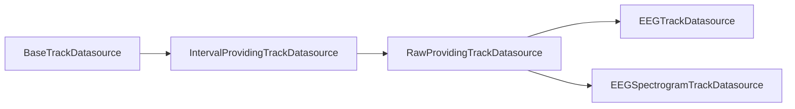

# Subclass EEG datasources from RawProvidingTrackDatasource

## Context

`[RawProvidingTrackDatasource](C:\Users\pho\repos\EmotivEpoc\ACTIVE_DEV\pyPhoTimeline\pypho_timeline\rendering\datasources\track_datasource.py)` **already subclasses** `[IntervalProvidingTrackDatasource](C:\Users\pho\repos\EmotivEpoc\ACTIVE_DEV\pyPhoTimeline\pypho_timeline\rendering\datasources\track_datasource.py)`, adding only `lab_obj` / `raws_dict` (stored as `lab_xdf_obj` and `raws_dict` properties). Switching the EEG classes to `RawProvidingTrackDatasource` does not change interval slicing, `fetch_detailed_data`, or overview behavior; it adds the ability to attach the same XDF / MNE handles the pipeline already loads in `[stream_to_datasources.py](C:\Users\pho\repos\EmotivEpoc\ACTIVE_DEV\pyPhoTimeline\pypho_timeline\rendering\datasources\stream_to_datasources.py)` (lines 403–421, 460–493).

`isinstance(ds, IntervalProvidingTrackDatasource)` remains **True** for instances of the new hierarchy, so existing checks against the interval base class keep working.

## Code changes (primary file)

**File:** `[pypho_timeline/rendering/datasources/specific/eeg.py](C:\Users\pho\repos\EmotivEpoc\ACTIVE_DEV\pyPhoTimeline\pypho_timeline\rendering\datasources\specific\eeg.py)`

1. **Imports**
  - Drop `IntervalProvidingTrackDatasource` from the `track_datasource` import (only used as the old base).  
  - For type hints on `lab_obj` / `raws_dict`, prefer either `TYPE_CHECKING` + forward reference to `LabRecorderXDF` (matching the pattern in `stream_to_datasources.py`), or `Any` if you want zero new imports—keep signatures on one line per your style rules.
2. `**EEGTrackDatasource`**
  - Change base: `class EEGTrackDatasource(RawProvidingTrackDatasource)`.  
  - Update class/docstring to say it extends `RawProvidingTrackDatasource` and can hold lab/raw references.  
  - Extend `__init__` with optional `lab_obj=None`, `raws_dict=None` (types as chosen above), placed before `parent` to mirror `[RawProvidingTrackDatasource.__init](C:\Users\pho\repos\EmotivEpoc\ACTIVE_DEV\pyPhoTimeline\pypho_timeline\rendering\datasources\track_datasource.py)__`.  
  - Pass them through the existing `super().__init__(..., parent=parent)` call as `lab_obj=lab_obj, raws_dict=raws_dict`.  
  - `**from_multiple_sources`:** add the same two optional parameters and pass them into `cls(...)` so merged EEG tracks can carry one shared `lab_obj` / `raws_dict` when provided.
3. `**EEGSpectrogramTrackDatasource`**
  - Same base change and docstring tweak.  
  - Extend `__init__` with `lab_obj=None`, `raws_dict=None` and pass to `super().__init__(..., lab_obj=..., raws_dict=..., parent=parent)` (today’s call omits `detail_renderer`; keep that).  
  - `**from_multiple_sources`:** add optional `lab_obj` / `raws_dict` and forward to `cls(...)`.

No changes are required to `get_detail_renderer`, `fetch_detailed_data`, `exclude_bad_channels`, or spectrogram-specific logic unless you later decide to read from `raws_dict` inside those methods.

## Optional but high-value wiring (second file)

**File:** `[pypho_timeline/rendering/datasources/stream_to_datasources.py](C:\Users\pho\repos\EmotivEpoc\ACTIVE_DEV\pyPhoTimeline\pypho_timeline\rendering\datasources\stream_to_datasources.py)`

In the multi-XDF EEG branch, after `lab_obj` / `raws_dict` are loaded:

- Pass `lab_obj=lab_obj, raws_dict=raws_dict` into `EEGTrackDatasource.from_multiple_sources(...)` (when `enable_raw_xdf_processing` has populated them; otherwise omit or pass `None`).  
- Pass the same into each `EEGSpectrogramTrackDatasource(...)` constructed for that stream.

That way the refactor is not only nominal—callers can use `datasource.lab_xdf_obj` / `datasource.raws_dict` on EEG and spectrogram tracks without ad-hoc side storage.

## Verification

- Run the project’s usual test / lint entrypoint (e.g. `uv run` + analyzer) on touched modules.  
- Smoke: load multi-XDF EEG with raw processing enabled; confirm datasources still render and, if wiring is done, attributes are set.

