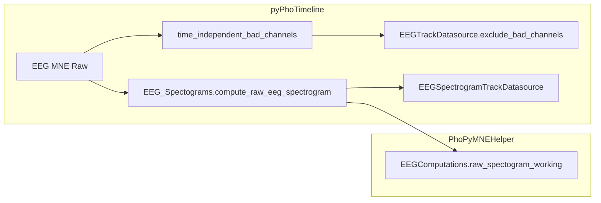

# Extract EEG spectrogram into PhoPyMNEHelper `EEG_Spectograms.py`

## Context

- `[stream_to_datasources.py](c:/Users/pho/repos/EmotivEpoc/ACTIVE_DEV/pyPhoTimeline/pypho_timeline/rendering/datasources/stream_to_datasources.py)` (EEG branch ~464–498) calls `EEGComputations.raw_spectogram_working(raw, nperseg=1024, noverlap=512)` inside a try/except, then builds one or more `[EEGSpectrogramTrackDatasource](c:/Users/pho/repos/EmotivEpoc/ACTIVE_DEV/pyPhoTimeline/pypho_timeline/rendering/datasources/specific/eeg.py)` instances. **Bad-channel detection** (`time_independent_bad_channels` + `datasource.exclude_bad_channels`) is separate from the spectrogram FFT and should **remain** in the timeline layer so PhoPyMNEHelper does not depend on pyPhoTimeline types.
- The “specific computation” contract and folder are defined in `[COMPUTATIONS_README.md](c:/Users/pho/repos/EmotivEpoc/ACTIVE_DEV/PhoPyMNEHelper/src/phopymnehelper/analysis/COMPUTATIONS_README.md)` under `**analysis/computations/specific/`** (same pattern as `[fatigue_analysis.py](c:/Users/pho/repos/EmotivEpoc/ACTIVE_DEV/PhoPyMNEHelper/src/phopymnehelper/analysis/computations/specific/fatigue_analysis.py)`).

## Implementation steps

1. **New module** `[PhoPyMNEHelper/src/phopymnehelper/analysis/computations/specific/EEG_Spectograms.py](c:/Users/pho/repos/EmotivEpoc/ACTIVE_DEV/PhoPyMNEHelper/src/phopymnehelper/analysis/computations/specific/EEG_Spectograms.py)` (filename as you specified; note PEP 8 usually prefers `eeg_spectograms.py`—can rename if you prefer consistency with `fatigue_analysis.py`)
  - Short module docstring pointing at `COMPUTATIONS_README.md` and stating this wraps timeline-oriented defaults.
  - **Constants**: `DEFAULT_SPECTROGRAM_NPERSEG = 1024`, `DEFAULT_SPECTROGRAM_NOVERLAP = 512` (matching current call sites and `[EEGComputations.raw_spectogram_working](c:/Users/pho/repos/EmotivEpoc/ACTIVE_DEV/PhoPyMNEHelper/src/phopymnehelper/EEG_data.py)` defaults).
  - **Public function** (single-line signature per your style), e.g. `def compute_raw_eeg_spectrogram(raw: "mne.io.Raw", *, nperseg: int = DEFAULT_SPECTROGRAM_NPERSEG, noverlap: int = DEFAULT_SPECTROGRAM_NOVERLAP, picks=None, mask_bad_annotated_times: bool = True) -> dict:` that **only** delegates to `EEGComputations.raw_spectogram_working(raw, picks=picks, nperseg=nperseg, noverlap=noverlap, mask_bad_annotated_times=mask_bad_annotated_times)` (lazy or top-level import from `phopymnehelper.EEG_data` is fine; keep consistent with other specific modules).
  - `**__all__`**: export the function and default constants if useful for notebooks.
2. **Wire package surface**: update `[computations/specific/__init__.py](c:/Users/pho/repos/EmotivEpoc/ACTIVE_DEV/PhoPyMNEHelper/src/phopymnehelper/analysis/computations/specific/__init__.py)` to import/re-export the new symbol(s) alongside `compute_theta_delta_sleep_intrusion_series`.
3. **Documentation**: extend the “Implementations in this package” list in `[COMPUTATIONS_README.md](c:/Users/pho/repos/EmotivEpoc/ACTIVE_DEV/PhoPyMNEHelper/src/phopymnehelper/analysis/COMPUTATIONS_README.md)` with one line for `computations/specific/EEG_Spectograms.py` (continuous spectrogram from `mne.io.Raw` with timeline defaults).
4. **pyPhoTimeline call sites** (minimal edits):
  - In `[stream_to_datasources.py](c:/Users/pho/repos/EmotivEpoc/ACTIVE_DEV/pyPhoTimeline/pypho_timeline/rendering/datasources/stream_to_datasources.py)`, inside the existing `try` that imports `EEGComputations` for bad channels, **also** import `compute_raw_eeg_spectrogram` (or import both from their modules—avoid a second try if the same dependency gates both). Replace `EEGComputations.raw_spectogram_working(raw, nperseg=1024, noverlap=512)` with `compute_raw_eeg_spectrogram(raw)` (or explicit kwargs using the constants).
  - For consistency and a single source of defaults, apply the same replacement in `[timeline_builder.py](c:/Users/pho/repos/EmotivEpoc/ACTIVE_DEV/pyPhoTimeline/pypho_timeline/timeline_builder.py)` (~1204) where `EEGComputations.raw_spectogram_working` is called directly today.

## Out of scope (per minimal-change / layer rules)

- Moving `EEGSpectrogramTrackDatasource` or channel-group branching into PhoPyMNEHelper (would create an undesirable dependency on pyPhoTimeline / Qt).
- Registering this in `[eeg_registry.py](c:/Users/pho/repos/EmotivEpoc/ACTIVE_DEV/PhoPyMNEHelper/src/phopymnehelper/analysis/computations/eeg_registry.py)` unless you later want it in the DAG/cache graph; `fatigue_analysis` is not registered there either.

## Verification

- Run `uv`/`python` import check or project analyzer on touched packages if available; ensure the lazy `ImportError` path in `stream_to_datasources.py` still reports clearly when PhoPyMNEHelper (or pyprep chain) is missing—behavior should match today except the spectrogram entry point name.

