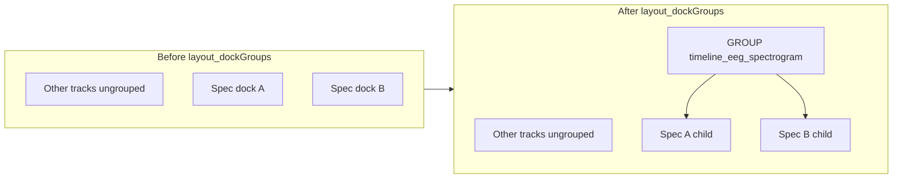

# EEG spectrogram dock grouping (default combined group)

## Behavior today

- `[timeline_builder.py](c:\Users\pho\repos\EmotivEpoc\ACTIVE_DEV\pyPhoTimeline\pypho_timeline\timeline_builder.py)` `_add_tracks_to_timeline` builds every track with `showGroupButton=False` and never passes `dock_group_names`, so spectrogram docks stay ungrouped and have no group control.
- Grouping UI and nesting are already implemented elsewhere:
  - `[specific_dock_widget_mixin.py](c:\Users\pho\repos\EmotivEpoc\ACTIVE_DEV\pyPhoTimeline\pypho_timeline\docking\specific_dock_widget_mixin.py)` merges `dock_group_names` into `display_config` when passed to `add_new_embedded_pyqtgraph_render_plot_widget`.
  - `[dynamic_dock_display_area.py](c:\Users\pho\repos\EmotivEpoc\ACTIVE_DEV\pyPhoTimeline\pypho_timeline\docking\dynamic_dock_display_area.py)` `layout_dockGroups` + `build_wrapping_nested_dock_area` collect all docks sharing a group name into a single parent dock `GROUP[groupId]`; the **parent** gets `showGroupButton=True`; **children** intentionally get `showGroupButton=False` (see lines 523–525).

## Implementation steps

### 1. Add a stable group id constant

In `[simple_timeline_widget.py](c:\Users\pho\repos\EmotivEpoc\ACTIVE_DEV\pyPhoTimeline\pypho_timeline\widgets\simple_timeline_widget.py)` next to `SPLIT_PRIMARY_DOCK_GROUP` / `SPLIT_COMPARE_DOCK_GROUP`, add something like:

- `EEG_SPECTROGRAM_DOCK_GROUP = 'timeline_eeg_spectrogram'` (string stable for layouts and any future logic).

### 2. Tag spectrogram tracks and enable the group button on leaves

In `_add_tracks_to_timeline` (`[timeline_builder.py](c:\Users\pho\repos\EmotivEpoc\ACTIVE_DEV\pyPhoTimeline\pypho_timeline\timeline_builder.py)` ~1397–1427):

- Compute whether the datasource is a spectrogram track, using the existing optional import:  
`EEGSpectrogramTrackDatasource is not None and isinstance(datasource, EEGSpectrogramTrackDatasource)`  
(fallback: `datasource.custom_datasource_name.startswith('EEG_Spectrogram_')` if you want robustness when the class import fails).
- When building `CustomCyclicColorsDockDisplayConfig`, set `showGroupButton=True` **only** for spectrogram datasources (non-spectrogram tracks unchanged).
- When calling `timeline.add_new_embedded_pyqtgraph_render_plot_widget`, pass  
`dock_group_names=[SimpleTimelineWidget.EEG_SPECTROGRAM_DOCK_GROUP]` **only** for spectrogram datasources (omit or `None` for others so they remain ungrouped).

### 3. Run `layout_dockGroups` once after all tracks are added

At the end of `_add_tracks_to_timeline` (after the `for datasource in datasources` loop, ~1508+):

- If there is at least one spectrogram datasource (same predicate as above), call:
`timeline.ui.dynamic_docked_widget_container.layout_dockGroups(   dock_group_names_order=[SimpleTimelineWidget.EEG_SPECTROGRAM_DOCK_GROUP],   dock_group_add_location_opts={SimpleTimelineWidget.EEG_SPECTROGRAM_DOCK_GROUP: ['bottom']}   )`
- **Optional refinement**: only call when there are **two or more** spectrogram docks if you want to avoid a redundant wrapper around a single spectrogram track (with one leaf, keeping `showGroupButton=True` on that dock is enough).

Placement note: `dock_group_add_location_opts` controls where the new `GROUP[...]` dock is inserted relative to the main dock area; `['bottom']` matches other tracks in this builder. Tuning to “stick with neighboring non-spec docks” would require a relative target dock and can be a follow-up if the default stacks oddly.

## Compatibility / follow-up (split-compare column)

`[_rebuild_split_track_dock_groups](c:\Users\pho\repos\EmotivEpoc\ACTIVE_DEV\pyPhoTimeline\pypho_timeline\widgets\simple_timeline_widget.py)` calls `unwrap_docks_in_all_nested_dock_area()` then `_retag_split_track_docks()`, which sets **each** primary track’s `dock_group_names` to **only** `SPLIT_PRIMARY_DOCK_GROUP`. That will **remove** the dedicated EEG spectrogram subgroup when compare mode is enabled, then wrap everything primary into one column. Document or address in a later change if you need “spectrogram stack inside primary column” when split mode is on.

## Files touched

- `[pypho_timeline/widgets/simple_timeline_widget.py](c:\Users\pho\repos\EmotivEpoc\ACTIVE_DEV\pyPhoTimeline\pypho_timeline\widgets\simple_timeline_widget.py)` — new constant.
- `[pypho_timeline/timeline_builder.py](c:\Users\pho\repos\EmotivEpoc\ACTIVE_DEV\pyPhoTimeline\pypho_timeline\timeline_builder.py)` — spectrogram-only `showGroupButton`, `dock_group_names`, post-loop `layout_dockGroups`.

No changes required in `[eeg.py](c:\Users\pho\repos\EmotivEpoc\ACTIVE_DEV\pyPhoTimeline\pypho_timeline\rendering\datasources\specific\eeg.py)` or `[stream_to_datasources.py](c:\Users\pho\repos\EmotivEpoc\ACTIVE_DEV\pyPhoTimeline\pypho_timeline\rendering\datasources\stream_to_datasources.py)` unless you prefer encoding the group id on the datasource (not necessary for this approach).