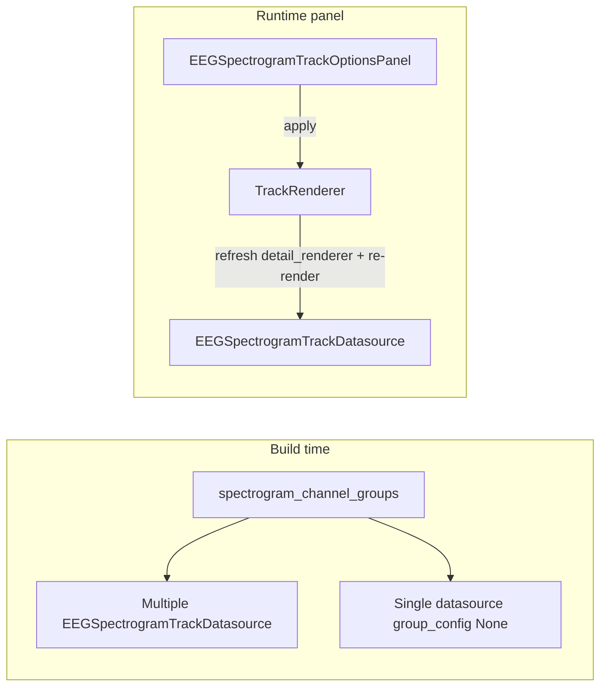

# EEG spectrogram track OptionsPanel

## Context

- `[EEGSpectrogramTrackDatasource](c:\Users\pho\repos\EmotivEpoc\ACTIVE_DEV\pyPhoTimeline\pypho_timeline\rendering\datasources\specific\eeg.py)` stores `_freq_min`, `_freq_max`, and optional `_group_config: SpectrogramChannelGroupConfig` (name + channel list). `[get_detail_renderer()](c:\Users\pho\repos\EmotivEpoc\ACTIVE_DEV\pyPhoTimeline\pypho_timeline\rendering\datasources\specific\eeg.py)` builds an `[EEGSpectrogramDetailRenderer](c:\Users\pho\repos\EmotivEpoc\ACTIVE_DEV\pyPhoTimeline\pypho_timeline\rendering\datasources\specific\eeg.py)` with `group_channels` from that config; averaging uses precomputed `Sxx` so changing the channel subset does **not** require recomputing the spectrogram.
- `[perform_process_all_streams_multi_xdf](c:\Users\pho\repos\EmotivEpoc\ACTIVE_DEV\pyPhoTimeline\pypho_timeline\rendering\datasources\stream_to_datasources.py)` uses `spectrogram_channel_groups` only to decide one combined track vs one track per group; the full list is **not** stored on each datasource today, so the UI cannot offer preset switching without new fields.
- `[getOptionsPanel](c:\Users\pho\repos\EmotivEpoc\ACTIVE_DEV\pyPhoTimeline\pypho_timeline\core\pyqtgraph_time_synchronized_widget.py)` only builds `[TrackChannelVisibilityOptionsPanel](c:\Users\pho\repos\EmotivEpoc\ACTIVE_DEV\pyPhoTimeline\pypho_timeline\widgets\track_options_panels.py)` when `detail_renderer.channel_names` is set; spectrogram tracks hit the empty base `OptionsPanel`.

## 1. Datasource: presets + mutation API

In `[eeg.py](c:\Users\pho\repos\EmotivEpoc\ACTIVE_DEV\pyPhoTimeline\pypho_timeline\rendering\datasources\specific\eeg.py)` on `EEGSpectrogramTrackDatasource`:

- Add optional ctor kwarg `channel_group_presets: Optional[List[SpectrogramChannelGroupConfig]] = None` (stored as `_channel_group_presets`). This is the same list shape as `spectrogram_channel_groups` in stream processing: when non-empty, the panel can offer a preset combo; when `None` or length 0, hide combo or show only “custom / all channels” behavior.
- Add `get_spectrogram_ch_names() -> List[str]` reading `ch_names` from `_spectrogram_result` or first entry of `_spectrogram_results` (defensive if missing).
- Add `set_spectrogram_display(freq_min: float, freq_max: float) -> None` updating `_freq_min` / `_freq_max`.
- Add `set_group_config(self, cfg: Optional[SpectrogramChannelGroupConfig]) -> None` replacing `_group_config` (use a **copy** of `channels` when applying a preset so checkbox edits do not mutate shared preset objects).
- Thread `channel_group_presets` through `[from_multiple_sources](c:\Users\pho\repos\EmotivEpoc\ACTIVE_DEV\pyPhoTimeline\pypho_timeline\rendering\datasources\specific\eeg.py)`: copy from `first` when merging (today `[timeline_builder.py](c:\Users\pho\repos\EmotivEpoc\ACTIVE_DEV\pyPhoTimeline\pypho_timeline\timeline_builder.py)` ~766–771 omits `group_config` and presets on merge—fix by passing `group_config=getattr(first, "_group_config", None)` and `channel_group_presets=getattr(first, "_channel_group_presets", None)`).

In `[stream_to_datasources.py](c:\Users\pho\repos\EmotivEpoc\ACTIVE_DEV\pyPhoTimeline\pypho_timeline\rendering\datasources\stream_to_datasources.py)` (~481–491): pass `channel_group_presets=_effective_groups` when creating **each** grouped spectrogram datasource; for the single-track branch pass `channel_group_presets=(spectrogram_channel_groups if _effective_groups is not None else None)` or simply the caller’s list when you want presets available even for one combined track (optional product choice: only pass when `spectrogram_channel_groups` is non-empty).

## 2. `EEGSpectrogramTrackOptionsPanel`

In `[track_options_panels.py](c:\Users\pho\repos\EmotivEpoc\ACTIVE_DEV\pyPhoTimeline\pypho_timeline\widgets\track_options_panels.py)`:

- New class `EEGSpectrogramTrackOptionsPanel(OptionsPanel)` taking `track_renderer` (same pattern as channel panel: needs `datasource` + re-render hook).
- **UI**
  - Title e.g. “EEG spectrogram”.
  - `QDoubleSpinBox` for `freq_min` / `freq_max` (sensible bounds, e.g. 0.5–200 Hz, step 0.5).
  - If `datasource._channel_group_presets` has length > 1: `QComboBox` of preset names; on change, `set_group_config` with a **new** `SpectrogramChannelGroupConfig` copied from the preset, then rebuild channel checkboxes.
  - For the **active** group (or all `get_spectrogram_ch_names()` when `_group_config` is None): checkboxes for “include in average” over the relevant channel list (intersect names with `get_spectrogram_ch_names()`). Toggling updates `_group_config` to a config with the same display `name` and filtered `channels` list (minimum one channel selected, or disable Apply—pick one simple rule).
- **Signal**: e.g. `spectrogramOptionsApplied = QtCore.Signal()` fired when values change (or on explicit Apply if you prefer; live update is simpler and matches channel panel behavior).
- **Serialization hooks** (aligned with existing pattern): new constant `TRACK_OPTIONS_KIND_EEG_SPECTROGRAM`; implement `track_options_kind`, `dump_track_options_state`, `apply_track_options_state` with payload `freq_min`, `freq_max`, optional `group_name`, `channels` list. Optional: extend `build_track_options_document` / `apply_track_options_document` and add `TrackRenderer.apply_eeg_spectrogram_options_bulk` if you want JSON save/load parity with channel visibility—can be a second small step if you want minimal first PR.

## 3. `TrackRenderer` integration

In `[track_renderer.py](c:\Users\pho\repos\EmotivEpoc\ACTIVE_DEV\pyPhoTimeline\pypho_timeline\rendering\graphics\track_renderer.py)`:

- Add `apply_eeg_spectrogram_options_from_datasource(self) -> None`: after datasource mutates, set `self.detail_renderer = self.datasource.get_detail_renderer()` then `self._trigger_visibility_render()` (same pattern as visibility refresh; avoids stale renderer instance since `detail_renderer` is created once in `__init__` today).

## 4. `getOptionsPanel` branch

In `[pyqtgraph_time_synchronized_widget.py](c:\Users\pho\repos\EmotivEpoc\ACTIVE_DEV\pyPhoTimeline\pypho_timeline\core\pyqtgraph_time_synchronized_widget.py)`, inside `if self.options_panel is None:` when `track_renderer` is a real `TrackRenderer`:

- **Before** the `channel_names` check, lazy-import `EEGSpectrogramTrackDatasource` and if `isinstance(track_renderer.datasource, EEGSpectrogramTrackDatasource)`, instantiate `EEGSpectrogramTrackOptionsPanel(track_renderer=track_renderer)`, connect `spectrogramOptionsApplied` → `track_renderer.apply_eeg_spectrogram_options_from_datasource`, wire `set_options_panel` if desired, and build `desired_connections` like the generic `OptionsPanel` branch (mixin `optionsChanged` / accept / reject). Skip the empty `OptionsPanel` for spectrogram tracks.

## 5. Testing / sanity

- Manual: open a timeline with `EEG_Spectrogram_`* track(s), open options dock, change Hz range and channels; confirm image updates without reload.
- Multi-XDF with `spectrogram_channel_groups`: confirm preset combo appears and switches averaging set.

## Files touched (expected)

| File                                                                                                                                                        | Change                                                            |
| ----------------------------------------------------------------------------------------------------------------------------------------------------------- | ----------------------------------------------------------------- |
| `[eeg.py](c:\Users\pho\repos\EmotivEpoc\ACTIVE_DEV\pyPhoTimeline\pypho_timeline\rendering\datasources\specific\eeg.py)`                                     | `channel_group_presets`, getters/setters, `from_multiple_sources` |
| `[stream_to_datasources.py](c:\Users\pho\repos\EmotivEpoc\ACTIVE_DEV\pyPhoTimeline\pypho_timeline\rendering\datasources\stream_to_datasources.py)`          | pass `channel_group_presets` into constructors                    |
| `[track_options_panels.py](c:\Users\pho\repos\EmotivEpoc\ACTIVE_DEV\pyPhoTimeline\pypho_timeline\widgets\track_options_panels.py)`                          | new panel + optional doc helpers                                  |
| `[track_renderer.py](c:\Users\pho\repos\EmotivEpoc\ACTIVE_DEV\pyPhoTimeline\pypho_timeline\rendering\graphics\track_renderer.py)`                           | `apply_eeg_spectrogram_options_from_datasource`                   |
| `[pyqtgraph_time_synchronized_widget.py](c:\Users\pho\repos\EmotivEpoc\ACTIVE_DEV\pyPhoTimeline\pypho_timeline\core\pyqtgraph_time_synchronized_widget.py)` | spectrogram branch in `getOptionsPanel`                           |
| `[timeline_builder.py](c:\Users\pho\repos\EmotivEpoc\ACTIVE_DEV\pyPhoTimeline\pypho_timeline\timeline_builder.py)`                                          | merge path: pass `group_config` + `channel_group_presets`         |

