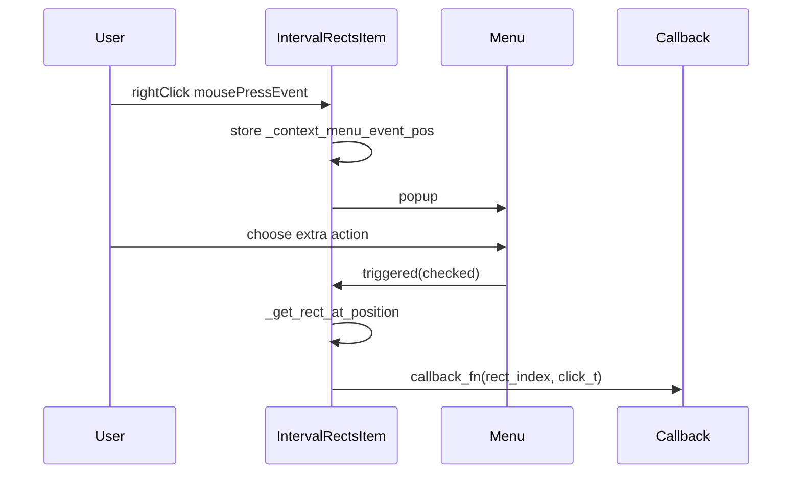

# Finish extra context-menu dispatch for `IntervalRectsItem`

## Problem summary

- `[interval_rects_item.py](C:\Users\pho\repos\EmotivEpoc\ACTIVE_DEV\pyPhoTimeline\pypho_timeline\rendering\graphics\interval_rects_item.py)` **does not compile** (`IndentationError` / empty `try` after line 667).
- `_on_custom_menu_item_executed` **recursively calls itself** instead of `_get_rect_at_position`.
- In `[getContextMenus](C:\Users\pho\repos\EmotivEpoc\ACTIVE_DEV\pyPhoTimeline\pypho_timeline\rendering\graphics\interval_rects_item.py)` (lines 576–582), each extra action does `an_action.triggered.connect(callback_fn)`. `**QAction.triggered` emits a `bool` (`checked`)**, so a handler expecting `(rect_index: int, click_t: float)` would receive `**False`/`True` as `rect_index`** — the VLC path in `[track_renderer.py](C:\Users\pho\repos\EmotivEpoc\ACTIVE_DEV\pyPhoTimeline\pypho_timeline\rendering\graphics\track_renderer.py)` would behave incorrectly even if the NameError below were fixed.
- `[track_renderer.py](C:\Users\pho\repos\EmotivEpoc\ACTIVE_DEV\pyPhoTimeline\pypho_timeline\rendering\graphics\track_renderer.py)` builds `extra_menu_callbacks_dict` correctly (lines 311–358) but the `build_IntervalRectsItem_from_interval_datasource` call uses `**show_in_vlc_callback` (undefined)** and **replaces** the dict with a one-entry dict (line 364), causing **NameError** and ignoring any future entries.

## Intended contract

- `**extra_menu_callbacks_dict`**: `Dict[str, Callable[[int, float], Any]]` — each value is invoked as `callback_fn(rect_index, click_t)` where:
  - `rect_index` comes from `_get_rect_at_position(self._context_menu_event_pos)` (same as `_on_render_detailed`).
  - `click_t` is `float(self._context_menu_event_pos.x())` (plot/item time coordinate; matches existing `[mousePressEvent](C:\Users\pho\repos\EmotivEpoc\ACTIVE_DEV\pyPhoTimeline\pypho_timeline\rendering\graphics\interval_rects_item.py)` / plan notes for VLC offset).

## Implementation steps

### 1. `[interval_rects_item.py](C:\Users\pho\repos\EmotivEpoc\ACTIVE_DEV\pyPhoTimeline\pypho_timeline\rendering\graphics\interval_rects_item.py)`

- Change `**_on_custom_menu_item_executed**` to `**_on_custom_menu_item_executed(self, callback_fn, checked=False)**` (second parameter absorbs Qt’s `triggered` argument; default avoids issues if called without it).
- Body (mirror `[_on_render_detailed](C:\Users\pho\repos\EmotivEpoc\ACTIVE_DEV\pyPhoTimeline\pypho_timeline\rendering\graphics\interval_rects_item.py)` lines 694–713):
  - If no `_context_menu_event_pos`: debug log and return.
  - `rect_index = self._get_rect_at_position(self._context_menu_event_pos)`.
  - If `rect_index is None` or out of range: debug log and return.
  - `click_t = float(self._context_menu_event_pos.x())`.
   `**try` / `except**`: call `callback_fn(rect_index, click_t)`; on error log with **generic** message (e.g. `"error in extra menu callback"` — not hard-coded to VLC).
- In `**getContextMenus`**, for each extra action connect with a **partial or default-arg lambda** so the user callback is the first bound argument, e.g. `triggered.connect(functools.partial(self._on_custom_menu_item_executed, callback_fn))` (add `from functools import partial` at top if not present), or an equivalent one-line lambda per user style rules.
- Optionally tighten `**__init__` type** for `extra_menu_callbacks_dict` to `Dict[str, Callable[[int, float], Any]]` for clarity.
- Remove or trim the **commented duplicate** `_on_show_in_vlc` block (lines 676–690) if redundant after the general dispatcher — keeps the file maintainable without changing behavior.

### 2. `[track_renderer.py](C:\Users\pho\repos\EmotivEpoc\ACTIVE_DEV\pyPhoTimeline\pypho_timeline\rendering\graphics\track_renderer.py)`

- **Delete** the unused nested `**_on_show_in_vlc`** (lines 337–353) — it references `self._show_in_vlc_callback`, which is not part of `IntervalRectsItem`, and is never connected.
- Fix the builder call to `**extra_menu_callbacks_dict=extra_menu_callbacks_dict**` (the dict already empty for non-video tracks; for video it contains `"Show in VLC..."` → `show_in_vlc_callback_fn`).

### 3. Verification

- `uv run python -m py_compile` on the touched files.
- Quick manual check: right-click a video overview interval → **Show in VLC…** should run without NameError and with a sensible `rect_index` (not `0`/`1` from booleans).

## Out of scope (unless you want follow-up)

- Fixing `[self.menu.green = blue](C:\Users\pho\repos\EmotivEpoc\ACTIVE_DEV\pyPhoTimeline\pypho_timeline\rendering\graphics\interval_rects_item.py)` typo (line 593) — pre-existing, unrelated to menu callbacks.

