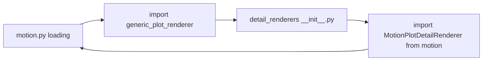

# Fix `detail_renderers` ↔ `motion` circular import

## Cause

Import chain from your traceback:

1. `[pypho_timeline/rendering/datasources/specific/__init__.py](pypho_timeline/rendering/datasources/specific/__init__.py)` loads `[motion.py](pypho_timeline/rendering/datasources/specific/motion.py)`.
2. `[motion.py` line 18](pypho_timeline/rendering/datasources/specific/motion.py) does `from pypho_timeline.rendering.detail_renderers.generic_plot_renderer import GenericPlotDetailRenderer`.
3. Loading any submodule under `detail_renderers` runs `[pypho_timeline/rendering/detail_renderers/__init__.py](pypho_timeline/rendering/detail_renderers/__init__.py)` first.
4. That `__init__.py` currently does `from pypho_timeline.rendering.datasources.specific.motion import MotionPlotDetailRenderer` **before** `motion` has finished initializing → **ImportError: partially initialized module**.

**Reordering** lines inside `detail_renderers/__init__.py` (generics first, then specific) does **not** remove the cycle: the failure happens when `__init__.py` eventually imports `motion` while `motion` is already on the stack waiting for step 2 to finish.

## Recommended fix (single package file, preserves public API)

In `[pypho_timeline/rendering/detail_renderers/__init__.py](pypho_timeline/rendering/detail_renderers/__init__.py)`:

- Keep **only** the imports that do not pull in `datasources.specific.`*:
  - `generic_plot_renderer` (already only depends on `[track_datasource](pypho_timeline/rendering/datasources/track_datasource.py)` + helpers)
  - `log_text_plot_renderer` (only depends on `generic_plot_renderer`)
- **Remove** top-level imports of `MotionPlotDetailRenderer`, `VideoThumbnailDetailRenderer`, and `EEGPlotDetailRenderer` from `datasources.specific`.
- Add **PEP 562** `__getattr__(name)` that lazily imports and returns those three symbols from their respective modules (`...specific.motion`, `...specific.video`, `...specific.eeg`) when code does `from pypho_timeline.rendering.detail_renderers import MotionPlotDetailRenderer` (used by `[pypho_timeline/__main__.py](pypho_timeline/__main__.py)` line 18).
- Keep `__all__` listing the lazy names; optionally add `__dir__()` returning sorted `__all__` for nicer REPL/tab completion.

After this, loading `generic_plot_renderer` no longer re-enters `motion` during `motion`’s own import, so `SimpleTimelineWidget` lazy import should succeed.

## Alternative (slightly more churn)

Same as above, but **omit** lazy exports entirely: slim `detail_renderers/__init__.py` to generics + log only, and update `[pypho_timeline/__main__.py](pypho_timeline/__main__.py)` to import `MotionPlotDetailRenderer` / `VideoThumbnailDetailRenderer` from `pypho_timeline.rendering.datasources.specific` (or the specific submodule files). Grep shows no other package-level `from ...detail_renderers import MotionPlotDetailRenderer` etc. besides `__main__.py`.

## Verification

- Run a quick import check: `python -c "from pypho_timeline.widgets import SimpleTimelineWidget"` (or open the first notebook cell).
- Optionally `python -c "from pypho_timeline.rendering.detail_renderers import MotionPlotDetailRenderer, GenericPlotDetailRenderer"` to confirm lazy re-exports.

No dependency or `uv` changes required.