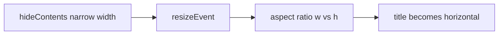

# Fix wrong title bar orientation after collapse

## Root cause

In `[Dock.py](c:/Users/pho/repos/EmotivEpoc/ACTIVE_DEV/pyPhoTimeline/pypho_timeline/EXTERNAL/pyqtgraph/dockarea/Dock.py)`, `[resizeEvent](c:/Users/pho/repos/EmotivEpoc/ACTIVE_DEV/pyPhoTimeline/pypho_timeline/EXTERNAL/pyqtgraph/dockarea/Dock.py)` calls `setOrientation()` every time the dock resizes.

With **auto-orient** enabled, `setOrientation` maps:

- `width > height * 1.5` → `'vertical'` (title on the **left**)
- else → `'horizontal'` (title on the **top**)

After **horizontal collapse** (your `hideContents` path for `orientation == 'vertical'`), the dock is **narrow** and still **tall** (full row height). Then `width > height * 1.5` is false, so auto-orient picks **horizontal** and moves the label to the top — the minimized strip looks like a wrong/truncated horizontal bar (e.g. on the right edge).

## Change (one place)

**File:** `[pypho_timeline/EXTERNAL/pyqtgraph/dockarea/Dock.py](c:/Users/pho/repos/EmotivEpoc/ACTIVE_DEV/pyPhoTimeline/pypho_timeline/EXTERNAL/pyqtgraph/dockarea/Dock.py)`, inside `setOrientation`, in the block `if o == 'auto' and (self.autoOrient):`

**Before** running tab / aspect-ratio rules, add:

- If `self.contentsHidden` and `self.orientation` is already `'vertical'` or `'horizontal'`, set `o = self.orientation` (keep the bar direction that was in effect before the collapsed geometry).

This preserves left-title **vertical** chrome while collapsed; expanding still runs `showContents` → `updateStyle` and normal `resizeEvent` resumes aspect-based updates when appropriate.

Optional one-line comment: e.g. collapsed geometry is not representative for aspect-based auto-orient.

## Verify

- Dock with **auto** orient, wide enough for **vertical** title; click **-**; minimized title should stay **vertical** (thin strip on the side of the cell).
- Top-title **horizontal** docks: collapse still shows top bar; expand/cycle still works.

No changes to `[showContents](c:/Users/pho/repos/EmotivEpoc/ACTIVE_DEV/pyPhoTimeline/pypho_timeline/EXTERNAL/pyqtgraph/dockarea/Dock.py)` or `[hideContents](c:/Users/pho/repos/EmotivEpoc/ACTIVE_DEV/pyPhoTimeline/pypho_timeline/EXTERNAL/pyqtgraph/dockarea/Dock.py)` stretch logic.