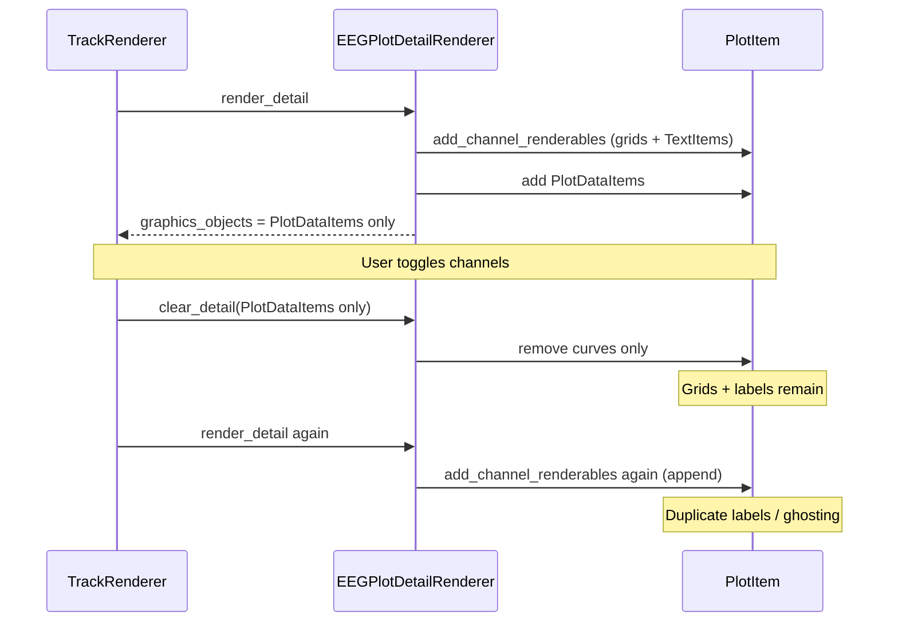

# Fix duplicated EEG channel labels after visibility toggle

## Root cause

1. `**[eeg.py](c:/Users/pho/repos/EmotivEpoc/ACTIVE_DEV/pyPhoTimeline/pypho_timeline/rendering/datasources/specific/eeg.py)**` — Unlike `[motion.py](c:/Users/pho/repos/EmotivEpoc/ACTIVE_DEV/pyPhoTimeline/pypho_timeline/rendering/datasources/specific/motion.py)` (lines 145–146), `EEGPlotDetailRenderer.render_detail` calls `add_channel_renderables_if_needed` but does **not** add `channel_graphics_items` to the returned list. `[TrackRenderer._clear_detail](c:/Users/pho/repos/EmotivEpoc/ACTIVE_DEV/pyPhoTimeline/pypho_timeline/rendering/graphics/track_renderer.py)` only removes objects stored in `detail_graphics`, so grids and `TextItem` labels stay on the plot.
2. `**EEGPlotDetailRenderer.clear_detail`** — Only removes curve items. It does **not** disconnect `plot_item._motion_label_conn` or delete `plot_item._motion_label_items`, unlike `[MotionPlotDetailRenderer.clear_detail](c:/Users/pho/repos/EmotivEpoc/ACTIVE_DEV/pyPhoTimeline/pypho_timeline/rendering/datasources/specific/motion.py)` (lines 218–235). That allows stacked `sigRangeChanged` connections and stale label metadata.
3. `**[normalization.py` — `add_channel_renderables_if_needed](c:/Users/pho/repos/EmotivEpoc/ACTIVE_DEV/pyPhoTimeline/pypho_timeline/rendering/helpers/normalization.py)`** — When the early-return check fails (which it effectively always does for `n > 0` because `len(channel_graphics_items)` is **4×** the channel count: 3 `InfiniteLine` + 1 `TextItem` per channel), the method **appends** to `channel_graphics_items` / `channel_label_items` without removing prior items or disconnecting the old signal (lines 335–336 are commented out; line 379 adds another connection). That amplifies duplication for any code path that skips proper cleanup.

## Recommended changes

### A. Parity with Motion in `eeg.py` (minimal product fix)

- After `add_channel_renderables_if_needed`, prepend channel decoration items to the list that will be returned from `render_detail` (same pattern as motion: `graphics_objects = list(channel_graphics_items) + ...` before plotting curves, then append `PlotDataItem`s).
- Update `EEGPlotDetailRenderer.clear_detail` to match `MotionPlotDetailRenderer.clear_detail`: disconnect `_motion_label_conn` if present, `del plot_item._motion_label_items` (and related attrs if you mirror motion exactly), then remove each object in `graphics_objects`.

### B. Harden `ChannelNormalizationModeNormalizingMixin.add_channel_renderables_if_needed` in `[normalization.py](c:/Users/pho/repos/EmotivEpoc/ACTIVE_DEV/pyPhoTimeline/pypho_timeline/rendering/helpers/normalization.py)`

- **Teardown before rebuild** when the early-return condition is not satisfied: disconnect `getattr(plot_item, '_motion_label_conn', None)`, remove every item in `self.channel_graphics_items` from `plot_item`, then `self.channel_graphics_items.clear()` and `self.channel_label_items.clear()`.
- **Fix the early-return predicate**: use `len(self.channel_label_items) == len(active_channel_names)` (and keep the existing `plot_item._motion_label_items` length check) instead of comparing `len(self.channel_graphics_items)` to `len(active_channel_names)`.

This prevents duplicate signal handlers, fixes list growth on the renderer instance, and makes the “reuse existing decorations” path actually reachable when counts match.

### C. Verification

- Load an EEG track, open channel visibility, toggle several channels, confirm a single set of labels and grids.
- Optional: pan the viewport and confirm label x-position still tracks the left edge (one handler only).

## Files to touch

| File                                                                                                                                                                  | Change                                                                                            |
| --------------------------------------------------------------------------------------------------------------------------------------------------------------------- | ------------------------------------------------------------------------------------------------- |
| `[pypho_timeline/rendering/datasources/specific/eeg.py](c:/Users/pho/repos/EmotivEpoc/ACTIVE_DEV/pyPhoTimeline/pypho_timeline/rendering/datasources/specific/eeg.py)` | Include `channel_graphics_items` in returned `graphics_objects`; align `clear_detail` with motion |
| `[pypho_timeline/rendering/helpers/normalization.py](c:/Users/pho/repos/EmotivEpoc/ACTIVE_DEV/pyPhoTimeline/pypho_timeline/rendering/helpers/normalization.py)`       | Teardown + corrected early-return condition                                                       |

No OpenSpec proposal required: localized bugfix to existing rendering behavior.