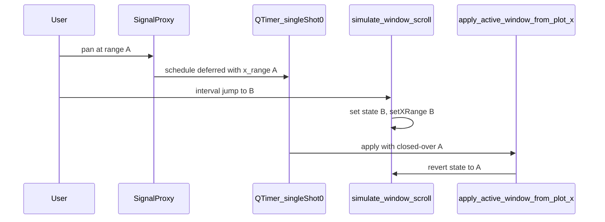

# Fix interval jump reverting after track interaction

## Root cause

1. **Canonical state vs. plot axes**
  `[simulate_window_scroll](c:\Users\pho\repos\EmotivEpoc\ACTIVE_DEV\pyPhoTimeline\pypho_timeline\widgets\simple_timeline_widget.py)` updates `active_window_`*, `spikes_window`, `_last_applied_plot_window_x0/x1`, and emits `window_scrolled`. For tracks in `SynchronizedPlotMode.TO_WINDOW`, `[sync_matplotlib_render_plot_widget](c:\Users\pho\repos\EmotivEpoc\ACTIVE_DEV\pyPhoTimeline\pypho_timeline\docking\specific_dock_widget_mixin.py)` connects `window_scrolled` → `PyqtgraphTimeSynchronizedWidget.on_window_changed`, which calls `setXRange` — so the ViewBox **should** match after the signal runs.
2. **Where the revert comes from**
  In `[TrackRenderingMixin._on_plot_viewport_changed](c:\Users\pho\repos\EmotivEpoc\ACTIVE_DEV\pyPhoTimeline\pypho_timeline\rendering\mixins\track_rendering_mixin.py)`, each proxied `sigRangeChanged` schedules `QTimer.singleShot(0, deferred_update)`. Inside `deferred_update`, the code uses `**x_range` captured from the original event** (`view_range` from `evt`), not the ViewBox’s range **when the timer fires**.
3. **Race with interval jump**
  Typical sequence: user pans at viewport **A** → `SignalProxy` eventually delivers an event and schedules `singleShot(0)` with **A** in the closure → user clicks prev/next → `simulate_window_scroll` moves state to **B** and `setXRange(B)` → the pending `deferred_update` runs and calls `apply_active_window_from_plot_x` with **A** (stale). That overwrites `active_window_`*, re-emits `window_scrolled(A)`, and the UI snaps back. The user often notices this on the **next** scroll or interaction because that’s when the deferred work runs relative to the event loop.

The `_applying_window_from_signal` guard only wraps the `window_scrolled.emit()` call in `simulate_window_scroll`; it does **not** cover these already-queued `singleShot(0)` callbacks.

## Recommended fix (minimal)

**In `deferred_update` inside `_on_plot_viewport_changed`**, resolve the **current** X range from the track’s plot at fire time instead of using the captured `x_range`:

- Obtain `TrackRenderer` via `self.track_renderers.get(track_name)`; use `track_renderer.plot_item.getViewBox()` (guard `None`).
- Read `xr = viewbox.viewRange()[0]`, then `x0, x1 = float(xr[0]), float(xr[1])` (normalize order if needed, same as today).
- Pass those `x0, x1` into `track_renderer.update_viewport` and into the epsilon check / `apply_active_window_from_plot_x`.

If the renderer or viewbox is gone (track removed), return early.

This aligns deferred work with the actual ViewBox after programmatic jumps (and after any other `setXRange`), so stale closures can no longer overwrite the window.

## Verification

- Reproduce: pan to **A**, immediately use prev/next interval to **B**, wait a frame or nudge the plot — viewport should stay at **B**; overview/calendar should stay aligned.
- Regression: normal pan/zoom should still call `apply_active_window_from_plot_x` when the range differs from `_last_applied_plot_window_`* (epsilon logic unchanged, but fed fresh coordinates).

## Files to change

- `[pypho_timeline/rendering/mixins/track_rendering_mixin.py](c:\Users\pho\repos\EmotivEpoc\ACTIVE_DEV\pyPhoTimeline\pypho_timeline\rendering\mixins\track_rendering_mixin.py)` — only the `deferred_update` closure in `_on_plot_viewport_changed` (~lines 244–261).

No change required to `[simple_timeline_widget.py](c:\Users\pho\repos\EmotivEpoc\ACTIVE_DEV\pyPhoTimeline\pypho_timeline\widgets\simple_timeline_widget.py)` interval handlers if the mixin fix removes the stale apply; optional follow-up would be unifying “programmatic scroll” to always push axes through the same path, but the stale-closure fix is the direct fix for the described bug.