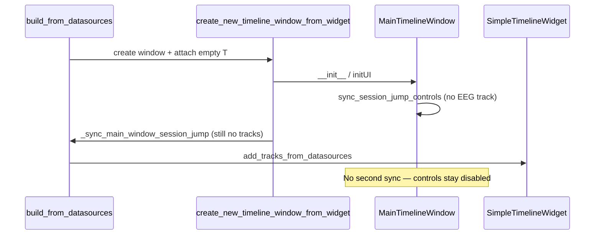

# Fix Session jump-to spinbox stuck at zero

## What the UI actually does

[`MainTimelineWindow.sync_session_jump_controls`](c:/Users/pho/repos/EmotivEpoc/ACTIVE_DEV/pyPhoTimeline/pypho_timeline/widgets/TimelineWindow/MainTimelineWindow.py) (same pattern in [`LiveStreamingTimelineWindow`](c:/Users/pho/repos/EmotivEpoc/ACTIVE_DEV/pyPhoTimeline/pypho_timeline/widgets/live/LiveStreamingTimelineWindow.py)):

1. Resolves the timeline via `self.timeline_widget` (first child of `contentWidget` layout).
2. Looks up `tw.get_track_tuple(SESSION_JUMP_INTERVALS_TRACK_ID)` with **`SESSION_JUMP_INTERVALS_TRACK_ID = 'EEG_Epoc X'`** (hardcoded).
3. Reads `len(ds.get_overview_intervals())` as session count `n`.
4. If anything is missing or `n == 0`: `setMaximum(0)`, `setValue(0)`, **`sessionJumpButton.setEnabled(False)`** — matching your screenshot.

So “stuck at zero” + disabled Go means either no datasource at that track name, no `get_overview_intervals`, exception, or **zero-length** overview intervals — not a Qt spinbox defect.

## Root cause (recent refactor path)

- [`build_from_datasources`](c:/Users/pho/repos/EmotivEpoc/ACTIVE_DEV/pyPhoTimeline/pypho_timeline/timeline_builder.py) (lines ~1182–1184) calls **`create_new_timeline_window_from_widget`**, which runs [`_sync_main_window_session_jump_controls(main_window=...)`](c:/Users/pho/repos/EmotivEpoc/ACTIVE_DEV/pyPhoTimeline/pypho_timeline/timeline_builder.py) **before** tracks exist (`add_tracks_from_datasources` is still commented out inside `create_new` and is invoked only afterward from `build_from_datasources`).
- At that moment `get_track_tuple('EEG_Epoc X')` has no entry in `track_datasources` → spinbox max 0, Go off.
- **`build_from_datasources` never calls `_sync_main_window_session_jump_controls` again** after `add_tracks_from_datasources`, so the UI never updates.

Contrast: [`update_timeline`](c:/Users/pho/repos/EmotivEpoc/ACTIVE_DEV/pyPhoTimeline/pypho_timeline/timeline_builder.py) already does `add_tracks_from_datasources` then `_sync_main_window_session_jump_controls()` (lines ~1336–1338) — correct order.

[`MainTimelineWindow.init_creating_new_timeline`](c:/Users/pho/repos/EmotivEpoc/ACTIVE_DEV/pyPhoTimeline/pypho_timeline/widgets/TimelineWindow/MainTimelineWindow.py) also adds tracks **before** syncing — correct.

## Recommended fix (minimal)

In **`build_from_datasources`**, immediately after:

`timeline.add_tracks_from_datasources(datasources=datasources, use_absolute_datetime_track_mode=use_absolute_datetime_track_mode, **kwargs)`

add:

`self._sync_main_window_session_jump_controls(main_window=main_window)`

so the footer controls see the real `EEG_*` track and interval count.

**Optional cleanup (same PR or follow-up):** Remove or relocate the `_sync_main_window_session_jump_controls` call inside `create_new_timeline_window_from_widget` so it does not imply “tracks are ready” when `build_from_datasources` always adds tracks afterward (today `create_new_timeline_window_from_widget` is only called from `build_from_datasources`). This avoids a brief wrong state between `show()` and `add_tracks`.

## If the problem persists after the fix

Then investigate data/track identity rather than timing:

- Track name must be exactly **`EEG_Epoc X`** (from [`stream_to_datasources`](c:/Users/pho/repos/EmotivEpoc/ACTIVE_DEV/pyPhoTimeline/pypho_timeline/rendering/datasources/stream_to_datasources.py): `f"EEG_{stream_name}"` with XDF stream name `Epoc X`). Different device/stream names → mismatch; consider later making the session-jump track configurable or auto-picking the first `EEGTrackDatasource` in `track_datasources`.
- Stream must be classified as EEG (`_is_eeg_stream` in PhoPyMNEHelper [`xdf_files.py`](c:/Users/pho/repos/EmotivEpoc/ACTIVE_DEV/PhoPyMNEHelper/src/phopymnehelper/xdf_files.py)); otherwise you get `EEGQ_*` or `UNKNOWN_*`, not `EEG_*`.
