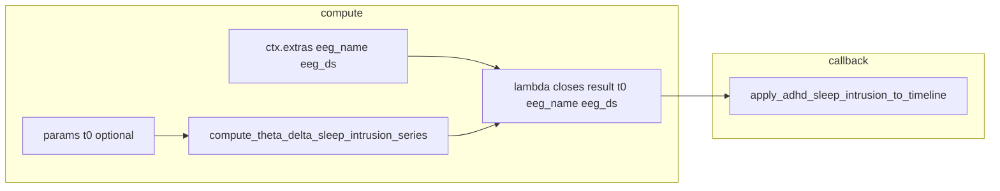

# Fix theta-delta `adhd_ctx` / callback consistency

## Problem

- [`ThetaDeltaSleepIntrusionComputation.compute`](c:\Users\pho\repos\EmotivEpoc\ACTIVE_DEV\PhoPyMNEHelper\src\phopymnehelper\analysis\computations\specific\ADHD_sleep_intrusions.py) closes over `RunContext` and passes it to `apply_adhd_sleep_intrusion_to_timeline`, but that function does `adhd_ctx["out"]`, `adhd_ctx["t0"]`, etc. **`RunContext` is not a `Mapping`** — this raises at callback invocation (already seen in [`testing_notebook.ipynb`](c:\Users\pho\repos\EmotivEpoc\ACTIVE_DEV\pyPhoTimeline\testing_notebook.ipynb)).
- [`RunContext`](c:\Users\pho\repos\EmotivEpoc\ACTIVE_DEV\PhoPyMNEHelper\src\phopymnehelper\analysis\computations\protocol.py) is only `session`, `raw`, `extras`; it has no `out` field. `ctx.out = out_adhd` is an ad-hoc dynamic attribute and is **inconsistent** with other `SpecificComputationBase` implementations (e.g. [`EEGSpectrogramComputation`](c:\Users\pho\repos\EmotivEpoc\ACTIVE_DEV\PhoPyMNEHelper\src\phopymnehelper\analysis\computations\specific\EEG_Spectograms.py) returns the result only; [`BadEpochsQCComputation`](c:\Users\pho\repos\EmotivEpoc\ACTIVE_DEV\PhoPyMNEHelper\src\phopymnehelper\analysis\computations\specific\bad_epochs.py) returns a dict and keeps UI in separate `apply_*` functions).

## Target pattern (match `bad_epochs`)

- **Compute return value** = cacheable series dict (`times`, `theta_delta_ratio`, …) plus optional `apply_adhd_sleep_intrusion_to_timeline_plot_callback_fn`.
- **Timeline apply function** = `apply_adhd_sleep_intrusion_to_timeline(timeline, result, *, t0, eeg_name, eeg_ds)` — same idea as `apply_bad_epochs_overlays_to_timeline(timeline, result, *, time_offset=...)`.
- **DAG / graph wiring**: timeline-only inputs live in **`ctx.extras`** (not fingerprinted); numeric alignment **`t0`** can come from **`params`** (add to param keys and **pop** before calling `compute_theta_delta_sleep_intrusion_series`, since that function does not take `t0`) and/or fallback `ctx.extras.get("t0", 0.0)`.

## Implementation steps (single file: [`ADHD_sleep_intrusions.py`](c:\Users\pho\repos\EmotivEpoc\ACTIVE_DEV\PhoPyMNEHelper\src\phopymnehelper\analysis\computations\specific\ADHD_sleep_intrusions.py))

1. **Param keys and filter**
   - Add `"t0"` to `THETA_DELTA_SLEEP_INTRUSION_PARAM_KEYS`.
   - In `theta_delta_sleep_intrusion_params_fingerprint`, include `t0` like other scalars (no special case).

2. **`compute`**
   - After `filter_theta_delta_sleep_intrusion_params`, **`pop("t0", None)`** (alongside `motion_df`) so it is never forwarded to `compute_theta_delta_sleep_intrusion_series`.
   - Resolve `t0_plot = float(t0) if t0 is not None else float(ctx.extras.get("t0", 0.0))`.
   - Read `eeg_name = ctx.extras.get("eeg_name")`, `eeg_ds = ctx.extras.get("eeg_ds")`.
   - **Remove** `ctx.out = out_adhd` (return value is the single source of truth).
   - Set callback to:  
     `lambda timeline: apply_adhd_sleep_intrusion_to_timeline(timeline, out_adhd, t0=t0_plot, eeg_name=eeg_name, eeg_ds=eeg_ds)`  
     so the closure does **not** depend on `RunContext` subscripting.

3. **`apply_adhd_sleep_intrusion_to_timeline`**
   - Change to **`apply_adhd_sleep_intrusion_to_timeline(timeline, result: Mapping[str, Any], *, t0: float, eeg_name: Optional[str] = None, eeg_ds: Any = None) -> None`** (or require non-optional if you prefer fail-fast).
   - Implement **`_apply_adhd_sleep_intrusion_to_timeline_impl(...)`** with current body using `result` instead of `adhd_ctx["out"]`, and the passed `t0` / `eeg_name` / `eeg_ds`.
   - **Backward compatibility**: at the start of the public function, if the second argument is a `Mapping` that contains **`"out"`** and **`"eeg_name"`** (legacy notebook bag dict), delegate to the impl with  
     `result=m["out"]`, `t0=float(m.get("t0", 0.0))`, `eeg_name=m["eeg_name"]`, `eeg_ds=m["eeg_ds"]`.  
     This keeps [`testing_PhoLogToLabStreamingLayer_xdfOpening_notebook.ipynb`](c:\Users\pho\repos\EmotivEpoc\ACTIVE_DEV\pyPhoTimeline\testing_PhoLogToLabStreamingLayer_xdfOpening_notebook.ipynb) / manual `dict(...)` usage working without editing notebooks.
   - If `eeg_name` or `eeg_ds` is missing when required, **clear `print`/`ValueError`** (match existing style) so graph users know to set `ctx.extras`.

4. **Exports / docstrings**
   - Add `apply_adhd_sleep_intrusion_to_timeline` to `__all__` if you want a stable import from the package `specific` re-export path (optional; notebooks already import from the module).
   - Short module docstring note: for `run_eeg_computations_graph`, set `ctx.extras["eeg_name"]`, `ctx.extras["eeg_ds"]`, optional `ctx.extras["t0"]` or pass `t0` in node params.

## Caller expectation (no notebook edits in this change)

- **Graph executor**: before `run`, populate e.g.  
  `ctx.extras.update({"eeg_name": ..., "eeg_ds": ..., "t0": ...})`  
  (same keys notebooks already use on the legacy dict).
- **Notebooks** using the legacy `adhd_ctx` dict continue to call `apply_adhd_sleep_intrusion_to_timeline(timeline, adhd_ctx)` unchanged via the compatibility branch.

## Files touched

- [`PhoPyMNEHelper/src/phopymnehelper/analysis/computations/specific/ADHD_sleep_intrusions.py`](c:\Users\pho\repos\EmotivEpoc\ACTIVE_DEV\PhoPyMNEHelper\src\phopymnehelper\analysis\computations\specific\ADHD_sleep_intrusions.py) only.
