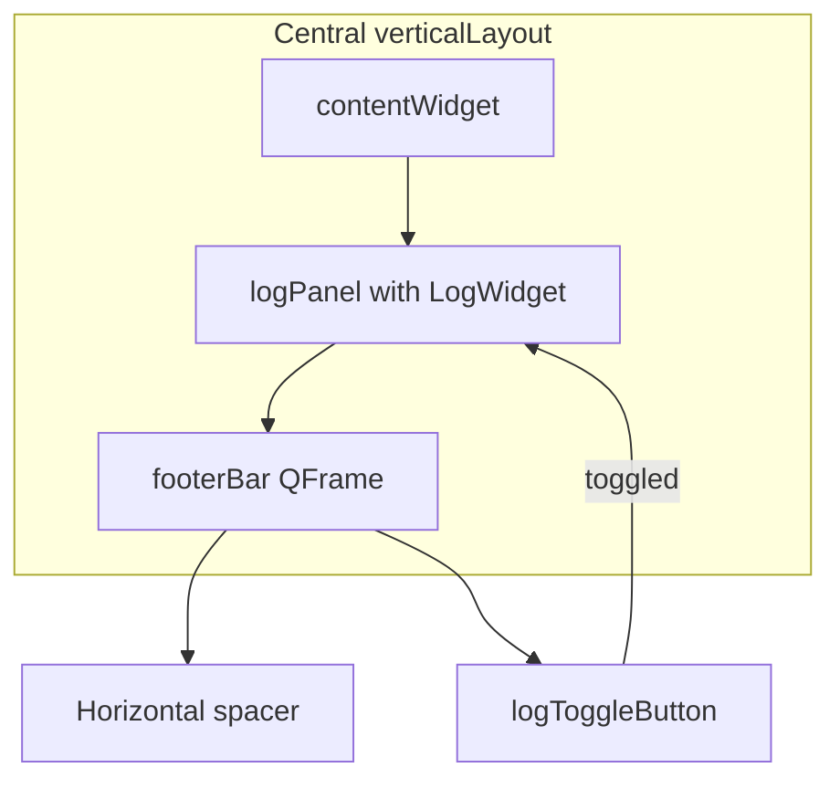

# Footer toolbar and log toggle for MainTimelineWindow

## Current state

- [MainTimelineWindow.ui](pypho_timeline/widgets/TimelineWindow/MainTimelineWindow.ui): Central layout has `contentWidget` (top) and `footerBar` (bottom). The footer already has a horizontal spacer and a checkable `logToggleButton` ("Show Log") — right-aligned.
- [MainTimelineWindow.py](pypho_timeline/widgets/TimelineWindow/MainTimelineWindow.py): Loads the UI and has an empty `initUI()`.
- [log_widget.py](pypho_timeline/widgets/log_widget.py): Existing `LogWidget` (and `QtLogHandler`) built with `qtpy`; provides search, clear, auto-scroll, and thread-safe log display.

## Layout and behavior

- **Layout order:** `contentWidget` → **log panel (new, collapsible)** → `footerBar`. When the log is hidden, only the footer and the toggle button remain (“collapses into the button”).
- **Toggle:** Button is checkable; when checked the log panel is visible, when unchecked it is hidden. Button text: e.g. “Hide Log” when visible, “Show Log” when hidden.

## 1. UI changes ([MainTimelineWindow.ui](pypho_timeline/widgets/TimelineWindow/MainTimelineWindow.ui))

- **Insert log panel** between `contentWidget` and `footerBar` in the central `verticalLayout`:
  - Add a `QWidget` named `logPanel` with a `QVBoxLayout` (so Python can add `LogWidget` into it). Give it a sensible default height when visible (e.g. `minimumHeight` 120, or use a `QSplitter` later if you want resizing; for minimal change a fixed minimum height is enough). The panel will be shown/hidden entirely from code.
- **Harden the footer** so it behaves like a robust toolbar:
  - Change `footerBar` from `QWidget` to `QFrame` (or keep as `QWidget` and put a `QFrame` inside; simplest is to replace with `QFrame`).
  - Set a **minimum height** (e.g. 32–36 px) and optional **frame shape** (e.g. `QFrame::StyledPanel` or `QFrame::Box`) and a thin top border so it reads as a bar. Keep the existing `footerLayout` (spacer + `logToggleButton`) unchanged.

## 2. Python logic ([MainTimelineWindow.py](pypho_timeline/widgets/TimelineWindow/MainTimelineWindow.py))

- **Imports:** Add `LogWidget` (and optionally `QtLogHandler`) from `pypho_timeline.widgets.log_widget`.
- **initUI():**
  - **Create and embed LogWidget:** Instantiate `LogWidget(parent=self.ui.logPanel)` and add it to the log panel’s layout (e.g. `self.ui.logPanel.layout().addWidget(log_widget)`; ensure the UI gives `logPanel` a layout in the .ui, or set one in code).
  - **Initial visibility:** Set the log panel’s initial state to match the button (e.g. start with log hidden and button unchecked so the window opens with the log “collapsed into the button”).
  - **Connect toggle:** Connect `self.ui.logToggleButton.toggled` to a slot that:
    - Calls `self.ui.logPanel.setVisible(checked)`.
    - Updates button text: e.g. `"Hide Log"` when `checked` else `"Show Log"`.
  - **Optional:** Create a `QtLogHandler`, connect its `log_record_received` to the embedded `LogWidget.append_log`, and add the handler to the app or rendering logger so logs appear in the window.

## 3. Notes

- **Qt binding:** The window uses PyQt5; `LogWidget` uses `qtpy`, so it will work with whatever backend qtpy is configured for. No change to LogWidget required.
- **Generator:** The file header says the .py is generated from the .ui; after editing the .ui by hand, re-run the generator if you use it, or leave the .py as hand-edited and only add the new wiring (no need to change the generator for this feature).
- **Optional enhancement:** Persist log visibility in QSettings so the next launch restores the user’s choice.

## Summary diagram

When `logToggleButton` is unchecked, `logPanel` is hidden and the layout collapses so only the footer (and button) remain visible.
