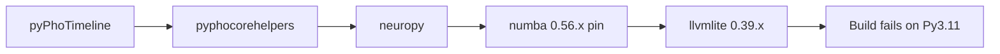

# Hatchling for pyPhoTimeline + Python 3.11 numba fix

## What actually broke in the terminal

The error is **not** from pyPhoTimeline using setuptools. `uv` failed while **building `llvmlite==0.39.1`**, whose `setup.py` rejects Python 3.11 (`only versions >=3.7,<3.11`). That version is pulled by **`numba` 0.56.x**, which is forced by an explicit pin in the editable dependency chain:

- [`pyPhoCoreHelpers/pyproject.toml`](c:/Users/pho/repos/EmotivEpoc/ACTIVE_DEV/pyPhoCoreHelpers/pyproject.toml): `numba>=0.56.4,<0.57`
- [`NeuroPy/pyproject.toml`](c:/Users/pho/repos/EmotivEpoc/ACTIVE_DEV/NeuroPy/pyproject.toml): same line (pyPhoCoreHelpers depends on editable `neuropy`)

[Dose-Analysis-Python](c:/Users/pho/repos/EmotivEpoc/ACTIVE_DEV/Dose-Analysis-Python/pyproject.toml) already uses **hatchling**; this change brings pyPhoTimeline in line with the rest of the stack.



## 1. Migrate pyPhoTimeline to hatchling

**File:** [`pyPhoTimeline/pyproject.toml`](c:/Users/pho/repos/EmotivEpoc/ACTIVE_DEV/pyPhoTimeline/pyproject.toml)

- Replace `[build-system]` to match sibling projects:

```toml
[build-system]
requires = ["hatchling"]
build-backend = "hatchling.build"
```

- Remove `[tool.setuptools]` and `[tool.setuptools.package-data]` (no longer used).

- Add explicit wheel package selection (same style as NeuroPy’s `[tool.hatch.build.targets.wheel]` with `packages = ["neuropy"]`):

```toml
[tool.hatch.build.targets.wheel]
packages = ["pypho_timeline"]
```

This keeps **`pypho_timeline._embed`** included automatically as a subpackage of `pypho_timeline` (same as today’s setuptools `packages` list).

- **Package data:** Hatchling includes non-Python files that live under the packaged tree in the wheel by default, so the previous `package-data` entries (`resources/*.ico`, `resources/*.png`, `py.typed`) remain covered if those paths exist under `pypho_timeline/`. No separate `MANIFEST.in` is required for the usual case.

- **Optional cleanup:** [`pyPhoTimeline/pyproject.toml`](c:/Users/pho/repos/EmotivEpoc/ACTIVE_DEV/pyPhoTimeline/pyproject.toml) lists `setuptools` and `wheel` under `[project] dependencies`; there are **no** `setuptools`/`pkg_resources` imports under `pypho_timeline/`. After the migration, consider removing those two runtime dependencies unless you rely on them outside the library (e.g. a script or plugin path). If in doubt, leave them for a follow-up—they do not affect the llvmlite issue.

## 2. Unblock Python 3.11: relax `numba` in NeuroPy and pyPhoCoreHelpers

**Files:**

- [`NeuroPy/pyproject.toml`](c:/Users/pho/repos/EmotivEpoc/ACTIVE_DEV/NeuroPy/pyproject.toml) — dependency `numba>=0.56.4,<0.57`
- [`pyPhoCoreHelpers/pyproject.toml`](c:/Users/pho/repos/EmotivEpoc/ACTIVE_DEV/pyPhoCoreHelpers/pyproject.toml) — same

**Change:** Replace the `<0.57` cap with a range that allows **numba ≥ 0.57** (first line with official Python 3.11 support and matching `llvmlite` wheels). Use a **reasonable upper bound** (for example `<0.62`) so the resolver stays on a maintained branch without jumping blindly to the latest major.

**Caveat:** NeuroPy still pins **`numpy~=1.20`** and **`scipy~=1.6`** while pyPhoCoreHelpers pins **`numpy>=1.23.2,<2`**. The resolver’s effective numpy version is constrained by the **intersection** of the workspace; `uv lock` will validate compatibility with the chosen numba. If the lock reports a conflict, narrow or bump numpy/scipy in NeuroPy in a **minimal** follow-up (only as much as `uv` requires).

## 3. Verify

From [`pyPhoTimeline`](c:/Users/pho/repos/EmotivEpoc/ACTIVE_DEV/pyPhoTimeline):

- `uv lock` (must complete without building obsolete `llvmlite` for 3.11).
- `uv sync --all-extras` (per your environment rule).
- `uv build` (or `uv run python -c "import pypho_timeline"`) to confirm the hatchling-built wheel/sdist still exposes the package and bundled resources.

Re-run your original command: `uv add ..\Dose-Analysis-Python --editable` — it should get past the previous `llvmlite` failure **once** numba resolves to a 3.11-compatible release (any remaining issues would be unrelated pins, e.g. Prophet/pandas, and would show as new resolver errors).

## Optional (not required for the terminal error)

- If you truly want **Python 3.12+** as well, widen `requires-python` upper bounds (e.g. `<3.13`) in pyPhoTimeline, pyPhoCoreHelpers, and NeuroPy **after** confirming numba/llvmlite and the rest of the stack support that interpreter.
