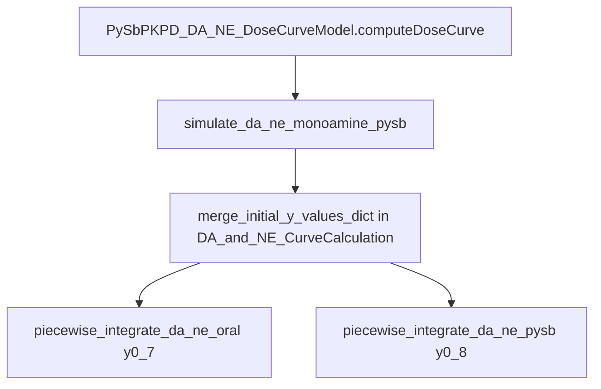

# Propagate `initial_y_values_dict` for DA/NE piecewise integration

## Context

- Default initial **7-state** vector (SciPy ODE in [`DA_and_NE_CurveCalculation.py`](c:/Users/pho/repos/EmotivEpoc/ACTIVE_DEV/Dose-Analysis-Python/src/dose_analysis_python/DoseCurveCalculation/DA_and_NE_CurveCalculation.py)) is `y = [0,0,0,0,1,1,1]` for `[Agut, Ablood, Abrain, Aecf, DA_str, NE_pfc, DA_pfc]`.
- PySB path in [`pysb_pkpd_da_ne_monoamine.py`](c:/Users/pho/repos/EmotivEpoc/ACTIVE_DEV/Dose-Analysis-Python/src/dose_analysis_python/DoseCurveCalculation/pysb_pkpd_da_ne_monoamine.py) uses an **8-vector** (same seven + `T_clock` at index 7), converted via `_y8_to_initials_vector`.
- [`PySbPKPD_DA_NE_DoseCurveModel.computeDoseCurve`](c:/Users/pho/repos/EmotivEpoc/ACTIVE_DEV/Dose-Analysis-Python/src/dose_analysis_python/DoseCurveCalculation/pysb_pkpd_da_ne_monoamine.py) already declares `initial_y_values_dict` but does not pass it; [`export_da_ne_monoamine_timeline_html`](c:/Users/pho/repos/EmotivEpoc/ACTIVE_DEV/Dose-Analysis-Python/src/dose_analysis_python/Visualization/da_ne_monoamine_bokeh_export.py) forwards `**make_curve_kwargs` into `make_curve`, so once `computeDoseCurve` passes the argument through, CLI/HTML export gains it for free.

## API design

- **`initial_y_values_dict`**: optional `Mapping[str, float]` (or `Any` coerced to float). Keys are primarily the seven names in [`STATE_NAMES_7`](c:/Users/pho/repos/EmotivEpoc/ACTIVE_DEV/Dose-Analysis-Python/src/dose_analysis_python/DoseCurveCalculation/pysb_pkpd_da_ne_monoamine.py) (`AMPH_gut`, …, `DA_pfc`). Any omitted key keeps the current default.
- **PySB-only key `"T_clock"`** (optional): sets the eighth component; default `0.0` when absent. **SciPy backend ignores `T_clock`** (no equivalent state); document this so users are not surprised if pysb/scipy differ when `T_clock != 0`.
- **Validation**: reject unknown keys with `ValueError` listing allowed keys (reduces silent typos).

## Implementation steps

1. **Helper** in [`pysb_pkpd_da_ne_monoamine.py`](c:/Users/pho/repos/EmotivEpoc/ACTIVE_DEV/Dose-Analysis-Python/src/dose_analysis_python/DoseCurveCalculation/pysb_pkpd_da_ne_monoamine.py) (next to `STATE_NAMES_7` / `_MONO_ORDER`):
   - e.g. `_initial_y_values_dict_to_y7_and_y8(d: Optional[MutableMapping[str, Any]]) -> Tuple[np.ndarray, np.ndarray]` returning `(y7, y8)` with `y8 = np.concatenate([y7, [t_clock]])`, defaults matching today’s hardcoded vectors.
   - If `d is None`, return the existing defaults without allocation churn if desired (simple is fine).

2. **[`piecewise_integrate_da_ne_oral`](c:/Users/pho/repos/EmotivEpoc/ACTIVE_DEV/Dose-Analysis-Python/src/dose_analysis_python/DoseCurveCalculation/DA_and_NE_CurveCalculation.py)**  
   - Add optional `y0_7: Optional[np.ndarray] = None`.  
   - Before the loop, set `y = np.asarray(y0_7, dtype=float).copy()` if provided, else keep `np.array([0.,0.,0.,0.,1.,1.,1.])`.

3. **[`piecewise_integrate_da_ne_pysb`](c:/Users/pho/repos/EmotivEpoc/ACTIVE_DEV/Dose-Analysis-Python/src/dose_analysis_python/DoseCurveCalculation/pysb_pkpd_da_ne_monoamine.py)**  
   - Add optional `y0_8: Optional[np.ndarray] = None`.  
   - Replace the hardcoded first `y` with `np.asarray(y0_8, dtype=float).copy()` when provided.

4. **[`simulate_da_ne_monoamine_pysb`](c:/Users/pho/repos/EmotivEpoc/ACTIVE_DEV/Dose-Analysis-Python/src/dose_analysis_python/DoseCurveCalculation/pysb_pkpd_da_ne_monoamine.py)**  
   - Add explicit parameter `initial_y_values_dict: Optional[MutableMapping[str, Any]] = None`.  
   - Once `meta` / `params` / model are ready, compute `y7, y8 = _initial_y_values_dict_to_y7_and_y8(initial_y_values_dict)`.  
   - Call `piecewise_integrate_da_ne_pysb(..., y0_8=y8)` and `piecewise_integrate_da_ne_oral(..., y0_7=y7)`.

5. **[`PySbPKPD_DA_NE_DoseCurveModel.computeDoseCurve`](c:/Users/pho/repos/EmotivEpoc/ACTIVE_DEV/Dose-Analysis-Python/src/dose_analysis_python/DoseCurveCalculation/pysb_pkpd_da_ne_monoamine.py)**  
   - Pass `initial_y_values_dict=initial_y_values_dict` into `simulate_da_ne_monoamine_pysb` (remove the empty “Set initial values if provided” stub comment block or replace with a one-line doc note).  
   - Ensure it is **not** dropped when callers pass it only via `**kwargs` from `make_curve`: either keep it as an explicit parameter only (current pattern is fine if all callers use keyword `initial_y_values_dict`) or `kwargs.pop("initial_y_values_dict", initial_y_values_dict)` once—pick one pattern and stick to it to avoid duplicate keyword errors.

6. **Optional consistency (recommended small add)**  
   - Extend [`compute_da_ne_curves_from_dose_input`](c:/Users/pho/repos/EmotivEpoc/ACTIVE_DEV/Dose-Analysis-Python/src/dose_analysis_python/DoseCurveCalculation/DA_and_NE_CurveCalculation.py) with the same optional dict and forward `y0_7` into `piecewise_integrate_da_ne_oral`, importing the merge helper from `pysb_pkpd_da_ne_monoamine` **or** duplicating a minimal `y7`-only merge in `DA_and_NE_CurveCalculation` to avoid a circular import.  
   - **Prefer**: implement a tiny `_default_y7()` + merge-by-name in `DA_and_NE_CurveCalculation.py` only for the scipy-only helper, and keep full `y7+y8+T_clock` logic in `pysb_pkpd_da_ne_monoamine.py` that calls into a shared internal or duplicates the seven-name merge—simplest is **one** public merge function in `pysb_pkpd_da_ne_monoamine.py` (e.g. `initial_y_values_dict_to_y7_y8`) and import it from `DA_and_NE_CurveCalculation` for `compute_da_ne_curves_from_dose_input` only if the dependency direction is acceptable (`DA_and_NE_CurveCalculation` currently does not import the pysb module).  
   - **Safer dependency direction**: put the merge helper in `DA_and_NE_CurveCalculation.py` (returns `y7` and optional `t_clock` scalar), use it from `pysb_pkpd_da_ne_monoamine.py` to build `y8`. That avoids `DA_and_NE_CurveCalculation` importing PySB stack.

   **Revised recommendation**: add `merge_initial_y_values_dict(initial_y_values_dict) -> Tuple[np.ndarray, float]` in [`DA_and_NE_CurveCalculation.py`](c:/Users/pho/repos/EmotivEpoc/ACTIVE_DEV/Dose-Analysis-Python/src/dose_analysis_python/DoseCurveCalculation/DA_and_NE_CurveCalculation.py) returning `(y7, t_clock)` with defaults and `STATE_NAMES_7` imported from `pysb_pkpd_da_ne_monoamine`—**that would create import cycle** (`pysb` imports `piecewise_integrate_da_ne_oral` from DA_and_NE). So either:
   - **A)** Define allowed name tuple **locally** in `DA_and_NE_CurveCalculation.py` matching `STATE_NAMES_7` (document “must match STATE_NAMES_7”), merge there, export a function used by both files; or  
   - **B)** New tiny module e.g. `da_ne_initial_state.py` with names + merge, imported by both.

   Simplest **without new file**: merge function lives in **`pysb_pkpd_da_ne_monoamine.py`** only; `piecewise_integrate_da_ne_oral` takes `y0_7` only; `simulate_*` builds `y7` from dict using names tuple **duplicated** as a constant in merge helper referencing existing `STATE_NAMES_7` from same file. `compute_da_ne_curves_from_dose_input` optionally imports `merge_initial_y_values_dict` from `pysb_pkpd_da_ne_monoamine`—**circular**: `pysb_pkpd_da_ne_monoamine` imports `piecewise_integrate_da_ne_oral` from DA_and_NE.

   Check import cycle:
   - pysb_pkpd_da_ne_monoamine imports from DA_and_NE_CurveCalculation: `dane_p, piecewise_integrate_da_ne_oral`
   - If DA_and_NE imports from pysb_pkpd_da_ne_monoamine → **cycle**.

   **Resolution**: implement `merge_initial_y_values_dict` in **`DA_and_NE_CurveCalculation.py`** with a local `STATE_NAMES_7` tuple (copy the seven strings from pysb file—single source of truth comment), return `(y7, t_clock)`. `pysb_pkpd_da_ne_monoamine` imports that merge function from `DA_and_NE_CurveCalculation` for building `y8`. `STATE_NAMES_7` in pysb file stays the canonical export for plotting; DA_and_NE uses the same literal tuple or imports `STATE_NAMES_7` from pysb—**still cycle if DA_and_NE imports pysb**.

   So: **merge in `DA_and_NE_CurveCalculation.py`** with duplicated tuple `DA_NE_STATE_NAMES_7` or inline tuple matching `STATE_NAMES_7`, document sync. `pysb_pkpd_da_ne_monoamine` imports `merge_initial_y_values_dict` from DA_and_NE. No cycle.

7. **Docstrings**  
   - Update module docstring / `simulate_da_ne_monoamine_pysb` and `piecewise_integrate_da_ne_pysb` docstrings to mention `initial_y_values_dict` and `T_clock` / scipy caveat.

8. **Tests** ([`tests/test_pysb_pkpd_da_ne_monoamine.py`](c:/Users/pho/repos/EmotivEpoc/ACTIVE_DEV/Dose-Analysis-Python/tests/test_pysb_pkpd_da_ne_monoamine.py))  
   - One test: `simulate_da_ne_monoamine_pysb(..., backend="scipy", initial_y_values_dict={"DA_str": 2.0})` asserts `y[4, 0] == 2.0` (index of `DA_str` in `STATE_NAMES_7`).  
   - Optional: assert unknown key raises `ValueError`.  
   - Existing `test_simulate_da_ne_scipy_matches_compute_da_ne_curves_from_dose_input` remains valid if `compute_da_ne_curves_from_dose_input` stays default-only or is updated to forward `None` identically.

## Flow (after change)

