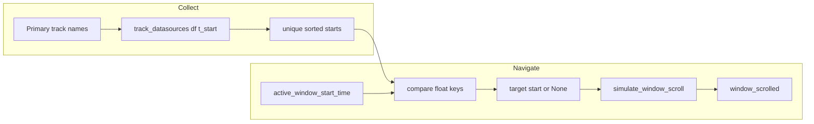

# Interval prev/next buttons on SimpleTimelineWidget

## Context

- `[simple_timeline_widget.py](c:\Users\pho\repos\EmotivEpoc\ACTIVE_DEV\pyPhoTimeline\pypho_timeline\widgets\simple_timeline_widget.py)` already has a top `controls_layout` with a trailing **Split All Tracks** button and uses `[simulate_window_scroll](c:\Users\pho\repos\EmotivEpoc\ACTIVE_DEV\pyPhoTimeline\pypho_timeline\widgets\simple_timeline_widget.py)` to move the primary window and emit `window_scrolled` (same path as the calendar navigator).
- There is **no** existing jump-by-interval helper in the repo; interval semantics are standardized on `t_start` / `t_duration` (see `[_embed/interval_datasource.py](c:\Users\pho\repos\EmotivEpoc\ACTIVE_DEV\pyPhoTimeline\pypho_timeline\_embed\interval_datasource.py)`).
- **Your choice:** navigation uses the **union** of all unique `t_start` values from every **primary** window-sync track (`get_track_names_for_window_sync_group('primary')` + `[track_datasources](c:\Users\pho\repos\EmotivEpoc\ACTIVE_DEV\pyPhoTimeline\pypho_timeline\rendering\mixins\track_rendering_mixin.py)`).

## Behavior

- **Anchor:** current primary window start, `self.active_window_start_time` (same logical position as calendar-driven navigation).
- **Previous:** largest interval start `t` with `t < window_start` (strictly to the left). Jump target is that `t` (preserve native type when possible—datetime vs float—see below).
- **Next:** smallest interval start `t` with `t > window_start` (strictly to the right).
- **Enable/disable:** `jump_prev` enabled iff a previous start exists; `jump_next` iff a next start exists. If there are no `t_start` values at all, both disabled.
- **Apply jump:** call existing `simulate_window_scroll(target_start)` so spikes window, signals, and synced widgets stay consistent.

## Implementation (single file + minimal wiring)

All changes in `[simple_timeline_widget.py](c:\Users\pho\repos\EmotivEpoc\ACTIVE_DEV\pyPhoTimeline\pypho_timeline\widgets\simple_timeline_widget.py)` unless you later extract helpers.

1. **UI (`setupUI`)**
  - Add two `QPushButton`s (e.g. labels `◀` / `▶` or short text) with tooltips (“Previous interval”, “Next interval”).  
  - Place them on the **left** of the row (before `addStretch(1)`), keeping **Split All Tracks** on the right for consistency with current layout.
2. **Collect interval starts**
  - Private method `_collect_primary_interval_starts()`:
    - Iterate `self.get_track_names_for_window_sync_group('primary')`.
    - For each name, read `self.track_datasources[name].df`; skip missing/empty/`t_start` absent.
    - Append all `t_start` values; `np.unique` + `np.sort` on a **numeric key** (see below).
3. **Comparable time helper**
  - Private `_scalar_to_sort_float(t)` mirroring existing patterns: `pd.Timestamp`/`datetime` → `.timestamp()`, plain float/int as `float()`. Ensures union sorting works across tracks.
  - For **choosing the jump target value**, after finding the index in sorted unique floats, map back to the **original** scalar stored alongside (or use `np.unique` return index into a paired array) so `simulate_window_scroll` receives the same representation type as the datasource (datetime vs float).
4. **Prev/next resolution**
  - `_prev_interval_start_for_window()` / `_next_interval_start_for_window()` (or one function returning `(prev, next)`):
    - `w = _scalar_to_sort_float(self.active_window_start_time)`.
    - `searchsorted` on sorted unique float starts: prev = rightmost `< w`, next = leftmost `> w`.
    - Return `None` when absent.
5. **Slots**
  - `_on_jump_prev_clicked` / `_on_jump_next_clicked`: if target is `None`, return; else `simulate_window_scroll(target)`.
6. **Button state**
  - `_update_interval_jump_buttons_enabled()` sets `setEnabled(...)` on both buttons from prev/next presence.
  - Call it:
    - End of `simulate_window_scroll` (after state update).
    - After `setupUI` track area is ready (e.g. end of `setupUI` or `QTimer.singleShot(0, ...)` once tracks from `add_example_tracks` exist).
    - Connect `self.sigTrackAdded` and `self.sigTrackRemoved` (`[TrackRenderingMixin](c:\Users\pho\repos\EmotivEpoc\ACTIVE_DEV\pyPhoTimeline\pypho_timeline\rendering\mixins\track_rendering_mixin.py)`) so buttons react when tracks are added/removed.
  - **Note:** in-place `df` mutations without add/remove will not refresh until the window moves; acceptable unless you want extra `source_data_changed_signal` wiring later.
7. **Optional polish**
  - `setAutoDefault(False)` on these buttons so they do not steal Enter from other controls.

## Data flow (mermaid)

## Testing suggestions (manual)

- Timeline with two primary interval tracks: overlapping `t_start`s dedupe correctly.
- Window start exactly on an interval start: prev goes to earlier interval; next skips to the following distinct start.
- No intervals / one side exhausted: correct disabled states.
- With `add_calendar_navigator`, confirm calendar stays in sync after jumps (existing `window_scrolled` connection).

