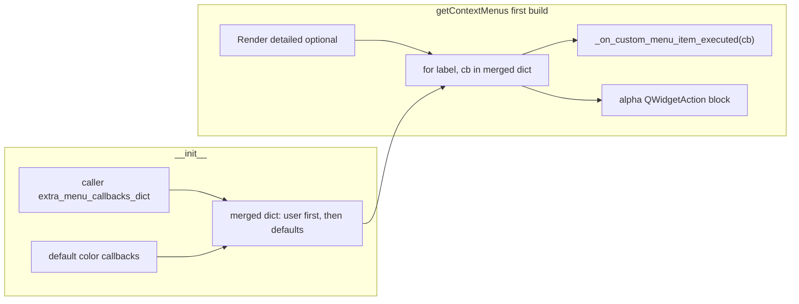

# Refactor interval context menu colors into `_extra_menu_callbacks_dict`

## Current behavior

- `[IntervalRectsItem.__init_](C:\Users\pho\repos\EmotivEpoc\ACTIVE_DEV\pyPhoTimeline\pypho_timeline\rendering\graphics\interval_rects_item.py)_` assigns `self._extra_menu_callbacks_dict` only from the `extra_menu_callbacks_dict` argument (often from `[track_renderer.py](C:\Users\pho\repos\EmotivEpoc\ACTIVE_DEV\pyPhoTimeline\pypho_timeline\rendering\graphics\track_renderer.py)` with entries like `"Show in VLC..."`).
- `[getContextMenus](C:\Users\pho\repos\EmotivEpoc\ACTIVE_DEV\pyPhoTimeline\pypho_timeline\rendering\graphics\interval_rects_item.py)` adds: optional "Render detailed", then loops `_extra_menu_callbacks_dict`, then hard-codes green/blue `QAction`s and the alpha `QWidgetAction` + slider.
- There is a bug: `self.menu.green = blue` should have been `self.menu.blue = blue`; refactoring removes reliance on `menu.green` / `menu.blue`.

**Note:** Your message said "red/green/alpha"; the file implements **green / blue / alpha** (default rects use a red brush in `generatePicture`, but there is no "Turn red" action). The plan keeps green and blue unless you want a red action instead of or in addition to blue.

## Design

1. **Merge dict on startup** (after normalization of `None` → `{}`):
  - Build default color entries that use the **same signature** as external callbacks: `Callable[[int, float], Any]`, so they work with existing `partial(self._on_custom_menu_item_executed, callback_fn)`.
  - Use `**{**extra_menu_callbacks_dict, **defaults}`** so iteration order stays: **caller actions first** (e.g. "Show in VLC..."), then **Turn green** / **Turn blue** — matching the current relative order of user extras vs. color actions.
  - If a caller reuses the same label as a default, the default wins (last in merge); unlikely in practice.
2. **Single implementation for recoloring**
  - Replace duplicated `[setGreen](C:\Users\pho\repos\EmotivEpoc\ACTIVE_DEV\pyPhoTimeline\pypho_timeline\rendering\graphics\interval_rects_item.py)` / `[setBlue](C:\Users\pho\repos\EmotivEpoc\ACTIVE_DEV\pyPhoTimeline\pypho_timeline\rendering\graphics\interval_rects_item.py)` bodies with one private method, e.g. `_recolor_all_intervals(self, color_key: str, rect_index: int, click_t: float) -> None`, where `color_key` is `'g'` / `'b'` (or `'r'` if you add red). The last two parameters exist only to satisfy the callback contract and can be unused.
  - Register defaults with `functools.partial(self._recolor_all_intervals, 'g')` and `partial(..., 'b')` in the merged dict (single-line style per your rules).
3. `**getContextMenus`**
  - Remove the separate green/blue `QAction` construction; the loop over `self._extra_menu_callbacks_dict` now covers those entries and continues to populate `self.menu.extra_actions[menu_lbl]` for every label (including defaults).
  - **Alpha:** `QSlider.valueChanged` is not `QAction.triggered(bool)`; keep a **dedicated block after the loop**: create `QWidgetAction`, slider, `valueChanged.connect(self.setAlpha)` as today. No entry in `_extra_menu_callbacks_dict` without stretching the type to unions/sentinels.
4. **Cleanup**
  - Delete `setGreen` and `setBlue` methods (no other references in-repo under `pypho_timeline/`).
  - Keep `setAlpha(int)` as the slider slot.
5. **Files touched**
  - Only `[pypho_timeline/rendering/graphics/interval_rects_item.py](C:\Users\pho\repos\EmotivEpoc\ACTIVE_DEV\pyPhoTimeline\pypho_timeline\rendering\graphics\interval_rects_item.py)`: `__init__`, `getContextMenus`, and replacement of the two color methods with `_recolor_all_intervals`.

## Optional follow-up

- Add `"Turn red": partial(..., 'r')` to defaults if you want the menu to match the default fill color in `generatePicture`.

