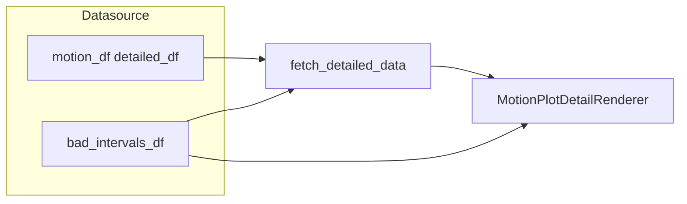

# Mask motion tracks with BAD intervals (data + overlay)

## Current behavior

- `[MotionTrackDatasource](c:/Users/pho/repos/EmotivEpoc/ACTIVE_DEV/pyPhoTimeline/pypho_timeline/rendering/datasources/specific/motion.py)` subclasses `[IntervalProvidingTrackDatasource](c:/Users/pho/repos/EmotivEpoc/ACTIVE_DEV/pyPhoTimeline/pypho_timeline/rendering/datasources/track_datasource.py)`, which loads per-epoch slices in `fetch_detailed_data` and plots them via `[MotionPlotDetailRenderer.render_detail](c:/Users/pho/repos/EmotivEpoc/ACTIVE_DEV/pyPhoTimeline/pypho_timeline/rendering/datasources/specific/motion.py)`.
- `[TrackRenderer](c:/Users/pho/repos/EmotivEpoc/ACTIVE_DEV/pyPhoTimeline/pypho_timeline/rendering/graphics/track_renderer.py)` caches detail by `get_detail_cache_key`; any change to “excluded” samples must change that key or invalidate cache.
- There is **no** existing API for time-based bad segments (only EEG `exclude_bad_channels` in `[stream_to_datasources.py](c:/Users/pho/repos/EmotivEpoc/ACTIVE_DEV/pyPhoTimeline/pypho_timeline/rendering/datasources/stream_to_datasources.py)`).

## Design

1. **Data model (explicit “excluded” periods)**
  - Add optional `bad_intervals_df` (name can be `exclusion_intervals_df` if you prefer) on `MotionTrackDatasource`, stored as a normalized internal frame with `**t_start` (float Unix seconds) and `t_duration` (seconds)**—same contract as overview intervals—so it matches the x-axis used in `[MotionPlotDetailRenderer](c:/Users/pho/repos/EmotivEpoc/ACTIVE_DEV/pyPhoTimeline/pypho_timeline/rendering/datasources/specific/motion.py)` (see clamping via `datetime_to_unix_timestamp`).
  - Accept either that schema **or** a small adapter: e.g. MNE-style `**onset` + `duration`** (as produced by `[MotionData.find_high_accel_periods` / `is_moving_annots_df](c:/Users/pho/repos/EmotivEpoc/ACTIVE_DEV/PhoPyMNEHelper/src/phopymnehelper/motion_data.py)`) plus a `**time_origin_unix: float`** (recording start in Unix seconds) so `t_start = time_origin_unix + onset`, `t_duration = duration`. Document that this must match how `motion_df['t']` was built.
  - Optional boolean `exclude_bad_from_detail: bool = True`: when True, `fetch_detailed_data` drops rows whose `t` falls inside any bad interval (after the existing interval slice); when False, only the overlay is drawn (useful for “mark but don’t delete” workflows).
2. **Filtering in `fetch_detailed_data`**
  - Implement in `MotionTrackDatasource` (override) or in `IntervalProvidingTrackDatasource` behind an optional hook—**prefer overriding on `MotionTrackDatasource` only** to keep the scope minimal.  
  - Reuse the same datetime/unix comparisons as the parent (mask on `detailed_df['t']` vs each bad `[t_start, t_end)`).  
  - Apply filtering **after** downsampling if you want fewer points in bad regions (current code downsamples after slice); alternatively filter before downsampling for stricter exclusion—recommend **filter before downsampling** so bad samples never influence retained points.
3. **Rendering: black fill at 90% opacity**
  - In `MotionPlotDetailRenderer`, add optional `bad_intervals_df` (or read from renderer state set when `MotionTrackDatasource.get_detail_renderer()` runs—cleanest: pass the same frame into the renderer ctor from the datasource).  
  - For each bad segment, **intersect** with the current detail interval’s `[t_start_unix, t_end_unix]` from the `interval` argument (same logic as lines 140–151 in motion renderer).  
  - For each non-empty intersection, append a pyqtgraph `LinearRegionItem(values=(x0, x1), orientation='vertical', brush=..., movable=False)` with brush e.g. black at alpha 0.9 (`mkColor` + `setAlphaF(0.9)`), and add those items to the **list returned by `render_detail`** so `[TrackRenderer._clear_detail](c:/Users/pho/repos/EmotivEpoc/ACTIVE_DEV/pyPhoTimeline/pypho_timeline/rendering/graphics/track_renderer.py)` removes them with the rest.  
  - Z-order: add region items **after** line plots so the darken sits on top (pyqtgraph default stacking: later `addItem` is on top—confirm with one test).
4. **Cache correctness**
  - Override `get_detail_cache_key` on `MotionTrackDatasource` to append a stable suffix derived from `bad_intervals_df` (e.g. hash of rounded `(t_start, t_duration)` rows) so async cache does not serve stale data when bad intervals change.  
  - If bad intervals are updated at runtime, also emit `source_data_changed_signal` and document that the widget should refresh the track (or call an existing refresh path if one exists).
5. **Notebook / pipeline wiring**
  - Example in `testing_notebook.ipynb`: convert `is_moving_annots_df` to unix `t_start`/`t_duration` using your recording’s origin, then `MotionTrackDatasource(..., bad_intervals_df=...)`.  
  - Optional follow-up: thread a parameter through `[stream_to_datasources.py](c:/Users/pho/repos/EmotivEpoc/ACTIVE_DEV/pyPhoTimeline/pypho_timeline/rendering/datasources/stream_to_datasources.py)` only if you need automatic construction from streams.

## Files to touch

- `[pypho_timeline/rendering/datasources/specific/motion.py](c:/Users/pho/repos/EmotivEpoc/ACTIVE_DEV/pyPhoTimeline/pypho_timeline/rendering/datasources/specific/motion.py)` — constructor + `fetch_detailed_data` override + `get_detail_cache_key` + pass bad intervals into `MotionPlotDetailRenderer`.
- Possibly `[pypho_timeline/rendering/datasources/track_datasource.py](c:/Users/pho/repos/EmotivEpoc/ACTIVE_DEV/pyPhoTimeline/pypho_timeline/rendering/datasources/track_datasource.py)` — only if you factor shared “intervals in unix” normalization into a tiny helper used by both motion and MNE adapters.

## Risks / decisions

- **Time base**: MNE `onset` is usually relative to `meas_date`/recording start; absolute `motion_df['t']` is often Unix. The adapter + explicit `time_origin_unix` avoids silent misalignment.
- **Overlapping bad intervals**: merge or not; simplest is independent regions (overdraw is fine).
- **EEG and other tracks**: same pattern could be reused later in `EEGPlotDetailRenderer`; out of scope unless you want one shared mixin.

