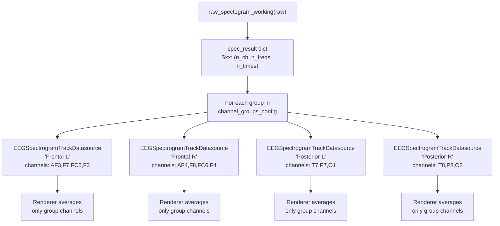

# Multi-Group EEG Spectrogram Tracks

## Current State

- `EEGComputations.raw_spectogram_working(raw)` returns a single dict with `Sxx` shaped `(n_channels, n_freqs, n_times)` -- per-channel spectrograms, no averaging done at this stage.
- A single `EEGSpectrogramTrackDatasource` is created per EEG stream in [stream_to_datasources.py](pypho_timeline/rendering/datasources/stream_to_datasources.py) (line 431).
- `EEGSpectrogramDetailRenderer._get_sxx_2d()` in [eeg.py](pypho_timeline/rendering/datasources/specific/eeg.py) (line 482) averages across **all** visible/good channels via `np.nanmean(Sxx[visible_indices, :, :], axis=0)`, producing a single 2D spectrogram.

## Existing Channel Group Patterns

Found in [analyze_saved_EEG_Recordings_collab.ipynb](../PhoOfflineEEGAnalysis/examples_jupyter/analyze_saved_EEG_Recordings_collab.ipynb):

```python
custom_channel_groups_dict = {
    'frontal': (['AF3', 'F7', 'FC5', 'F3'], ['AF4', 'F8', 'FC6', 'F4'])
}
```

Also in [fatigue_analysis.py](../PhoPyMNEHelper/src/phopymnehelper/analysis/computations/fatigue_analysis.py) (lines 58-62): inline region-based groups (frontal, parietal, occipital, central, left/right hemispheres).

## Design




All four datasources **share the same `spec_result` reference** (no data duplication). Each renderer selects only its group's channel indices from the 3D `Sxx` before averaging.

## Changes

### 1. New `SpectrogramChannelGroupConfig` dataclass -- [eeg.py](pypho_timeline/rendering/datasources/specific/eeg.py)

Add near the top of `eeg.py`:

```python
from dataclasses import dataclass, field

@dataclass
class SpectrogramChannelGroupConfig:
    """Defines a named group of EEG channels to average for one spectrogram track."""
    name: str
    channels: List[str]
```

Add a module-level default for Emotiv Epoc X:

```python
EMOTIV_EPOC_X_SPECTROGRAM_GROUPS: List[SpectrogramChannelGroupConfig] = [
    SpectrogramChannelGroupConfig(name='Frontal-L', channels=['AF3', 'F7', 'FC5', 'F3']),
    SpectrogramChannelGroupConfig(name='Frontal-R', channels=['AF4', 'F8', 'FC6', 'F4']),
    SpectrogramChannelGroupConfig(name='Posterior-L', channels=['T7', 'P7', 'O1']),
    SpectrogramChannelGroupConfig(name='Posterior-R', channels=['T8', 'P8', 'O2']),
]
```

### 2. Modify `EEGSpectrogramDetailRenderer` -- [eeg.py](pypho_timeline/rendering/datasources/specific/eeg.py)

- Add a `group_channels: Optional[List[str]]` parameter to `__init`__.
- In `_get_sxx_2d()`, when `group_channels` is set, use those channel names (intersected with available `ch_names`) instead of `channel_visibility` for selecting which channels to average. Fall back to current `channel_visibility` behavior when `group_channels` is `None`.

### 3. Modify `EEGSpectrogramTrackDatasource` -- [eeg.py](pypho_timeline/rendering/datasources/specific/eeg.py)

- Add an optional `group_config: Optional[SpectrogramChannelGroupConfig]` parameter to `__init`__.
- Store it as `self._group_config`.
- In `get_detail_renderer()`, pass `group_channels=self._group_config.channels` when creating the renderer (or `None` if no group config, preserving backward compat).

### 4. Modify spectrogram creation in [stream_to_datasources.py](pypho_timeline/rendering/datasources/stream_to_datasources.py)

- Import `SpectrogramChannelGroupConfig` and `EMOTIV_EPOC_X_SPECTROGRAM_GROUPS`.
- Add an optional `spectrogram_channel_groups` parameter to `perform_process_all_streams_multi_xdf()` (default: `EMOTIV_EPOC_X_SPECTROGRAM_GROUPS`).
- Replace the single spectrogram datasource creation (lines 431-434) with a loop over the channel groups:

```python
for group_cfg in spectrogram_channel_groups:
    group_key = f"EEG_Spectrogram_{stream_name}_{group_cfg.name}"
    spec_ds = EEGSpectrogramTrackDatasource(
        intervals_df=merged_intervals_df.copy(),
        spectrogram_result=spec_result,
        custom_datasource_name=group_key,
        group_config=group_cfg,
    )
    all_streams_datasources[group_key] = spec_ds
    all_streams[group_key] = merged_intervals_df
```

- If `spectrogram_channel_groups` is `None` or empty, fall back to a single "all channels" spectrogram track (current behavior).

### 5. Update `__all__` exports in [eeg.py](pypho_timeline/rendering/datasources/specific/eeg.py)

Add `SpectrogramChannelGroupConfig` and `EMOTIV_EPOC_X_SPECTROGRAM_GROUPS` to `__all`__.

## Backward Compatibility

- All new parameters are optional with `None` defaults.
- When no `group_config` is provided, the existing all-channels averaging behavior is preserved.
- The `channel_visibility` mechanism continues to work as a secondary filter when `group_channels` is set (visible channels within the group).

