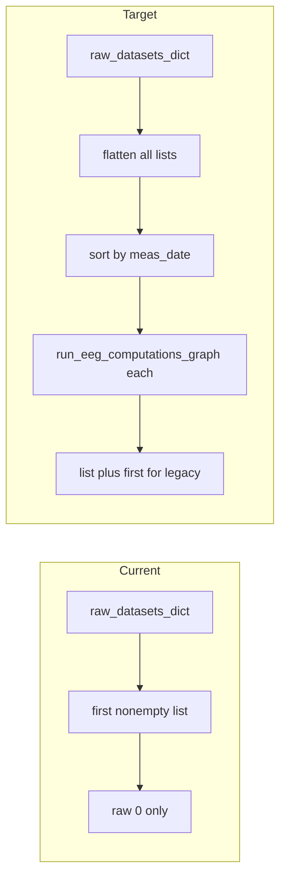

# Multi-raw EEG spectrogram recompute

## Problem

In `[eeg.py](C:\Users\pho\repos\EmotivEpoc\ACTIVE_DEV\pyPhoTimeline\pypho_timeline\rendering\datasources\specific\eeg.py)`, `EEGSpectrogramTrackDatasource.compute` (lines 822–836) does two narrowing steps:

1. `_first_nonempty_raw_list_from_dict` returns only the **first non-empty value** in `raw_datasets_dict`, so raws from other XDF keys are never seen.
2. It then uses `[0]`, so only the **first Raw** in that list is computed.

The datasource already supports per-interval detail via `_spectrogram_results` and `[fetch_detailed_data](C:\Users\pho\repos\EmotivEpoc\ACTIVE_DEV\pyPhoTimeline\pypho_timeline\rendering\datasources\specific\eeg.py)` (match `t_start` / `t_duration` to row index into that list). Recompute should populate that list so each interval gets the spectrogram for the matching segment.

## Design choices

- **Flatten**: Collect every non-empty list from **all** keys in `raw_datasets_dict` (stable key order, e.g. `sorted(..., key=str)`), not only the first key. This matches how `_all_eeg_for_montage` is built in `[stream_to_datasources.py](C:\Users\pho\repos\EmotivEpoc\ACTIVE_DEV\pyPhoTimeline\pypho_timeline\rendering\datasources\stream_to_datasources.py)` (line 512).
- **Order**: Sort flattened raws by recording start using the same idea as PhoPyMNEHelper’s `[xdf_files.py](C:\Users\pho\repos\EmotivEpoc\ACTIVE_DEV\PhoPyMNEHelper\src\phopymnehelper\xdf_files.py)` (`raw_timerange()[0]`, with `None` last). Timeline intervals for merged EEG are built with `merged_intervals_df = ...sort_values('t_start')` (see `[stream_to_datasources.py](C:\Users\pho\repos\EmotivEpoc\ACTIVE_DEV\pyPhoTimeline\pypho_timeline\rendering\datasources\stream_to_datasources.py)` ~437, and `[EEGTrackDatasource.from_multiple_sources](C:\Users\pho\repos\EmotivEpoc\ACTIVE_DEV\pyPhoTimeline\pypho_timeline\rendering\datasources\specific\eeg.py)` ~475), so **chronological raws ↔ chronological interval rows** is the intended pairing when counts match.
- **Length mismatch**: If `len(sorted_raws) != len(self.intervals_df)`:
  - Take `n = min(...)`, compute `n` spectrograms, build a list of length `len(self.intervals_df)` with `None` for missing slots (or only for trailing rows—pick one rule and log a **single** clear warning).
  - Avoid crashing; keep behavior defined.
- **Outputs**:
  - Set `self._spectrogram_results` to the per-row list (always for multi-interval; for a single interval you can still use a one-element list for consistency).
  - Set `self._spectrogram_result` to the first **non-None** result (or first element) so existing code that only reads `_spectrogram_result` still works (e.g. `get_spectrogram_ch_names` when `_spectrogram_results` is absent—after this change, prefer setting both).
- **Success flag**: In `on_compute_finished`, treat success as at least one non-None spectrogram when `_spectrogram_results` is used; keep backward compatibility when only `_spectrogram_result` is set.
- **Parent fallback**: Keep the existing pattern that copies `raw_datasets_dict` from `parent()` when no raws are found locally (`[eeg.py](C:\Users\pho\repos\EmotivEpoc\ACTIVE_DEV\pyPhoTimeline\pypho_timeline\rendering\datasources\specific\eeg.py)` 828–831), then flatten.

## Implementation steps (minimal surface)

1. In `[eeg.py](C:\Users\pho\repos\EmotivEpoc\ACTIVE_DEV\pyPhoTimeline\pypho_timeline\rendering\datasources\specific\eeg.py)`, add small helpers next to `_first_nonempty_raw_list_from_dict`:
  - `_flatten_raw_lists_from_dict(...)` → `List[Any]`
  - `_sort_raws_by_meas_start(...)` → sorted list (use `getattr(r, "raw_timerange", None)` and fall back to `r.info.get("meas_date")` if needed)
2. Replace the body of `EEGSpectrogramTrackDatasource.compute` to:
  - resolve `raw_datasets_dict` (existing),
  - `raws = _sort_raws_by_meas_start(_flatten_raw_lists_from_dict(...))`,
  - loop: `run_eeg_computations_graph(raw, session=session_fingerprint_for_raw_or_path(raw), goals=("spectogram",))` and collect `["spectogram"]` dicts,
  - assign `_spectrogram_results` and `_spectrogram_result` as above,
  - call `on_recompute_finished()` (unchanged call site).
3. Adjust `EEGSpectrogramTrackDatasource.on_compute_finished` to compute `was_success` from the new list + `_spectrogram_result`.
4. **Optional consistency** (separate small follow-up, not required for the user’s line reference): `[stream_to_datasources.py](C:\Users\pho\repos\EmotivEpoc\ACTIVE_DEV\pyPhoTimeline\pypho_timeline\rendering\datasources\stream_to_datasources.py)` ~520–541 still computes spectrogram only on the first raw at load time; mirroring the same flatten/sort/align logic there would make **initial** state match **recompute**. Only add if you want load and recompute identical without touching the UI.

## Files touched

- Primary: `[pypho_timeline/rendering/datasources/specific/eeg.py](C:\Users\pho\repos\EmotivEpoc\ACTIVE_DEV\pyPhoTimeline\pypho_timeline\rendering\datasources\specific\eeg.py)`
- Optional: `[pypho_timeline/rendering/datasources/stream_to_datasources.py](C:\Users\pho\repos\EmotivEpoc\ACTIVE_DEV\pyPhoTimeline\pypho_timeline\rendering\datasources\stream_to_datasources.py)` (initial spectrogram build parity)

## Testing suggestions

- Multi-XDF EEG stream: two files → two intervals → two raws; open detail on each interval and confirm spectrograms differ (or at least both load).
- Single file, multiple merged EEG raws (multiple devices): verify count-mismatch warning and that first N intervals still get results if `n` matches.

