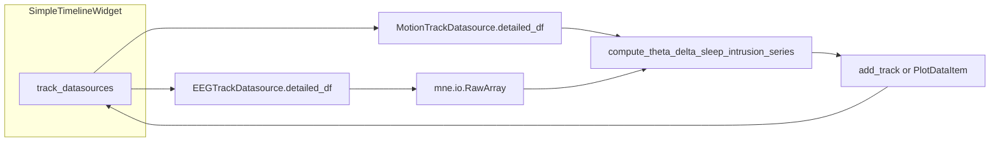

# Run `compute_theta_delta_sleep_intrusion_series` from an active `SimpleTimelineWidget`

## Where the API lives

- Implementation: `[PhoPyMNEHelper/src/phopymnehelper/analysis/computations/specific/ADHD_sleep_intrusions.py](c:/Users/pho/repos/EmotivEpoc/ACTIVE_DEV/PhoPyMNEHelper/src/phopymnehelper/analysis/computations/specific/ADHD_sleep_intrusions.py)` — entry point `compute_theta_delta_sleep_intrusion_series(raw_eeg, motion_df=None, ...)`.
- Public import (re-exported): `[PhoPyMNEHelper/src/phopymnehelper/analysis/computations/specific/__init__.py](c:/Users/pho/repos/EmotivEpoc/ACTIVE_DEV/PhoPyMNEHelper/src/phopymnehelper/analysis/computations/specific/__init__.py)`.

```python
from phopymnehelper.analysis.computations.specific import compute_theta_delta_sleep_intrusion_series
```

## What the timeline already gives you

After `TimelineBuilder.build_from_xdf_file[s](...) → timeline: SimpleTimelineWidget` (same pattern as `[testing_notebook.ipynb](c:/Users/pho/repos/EmotivEpoc/ACTIVE_DEV/pyPhoTimeline/testing_notebook.ipynb)`):

- **Track names**: `timeline.get_all_track_names()` — EEG tracks are prefixed `EEG_`, motion with `MOTION_` (see `[stream_to_datasources.py](c:/Users/pho/repos/EmotivEpoc/ACTIVE_DEV/pyPhoTimeline/pypho_timeline/rendering/datasources/stream_to_datasources.py)` ~L162–169, 138–147).
- **Datasources**: `timeline.track_datasources[name]` is a `[RenderPlotsData](c:/Users/pho/repos/EmotivEpoc/ACTIVE_DEV/pyPhoTimeline/pypho_timeline/rendering/mixins/track_rendering_mixin.py)`-backed mapping; use the same string keys as track names. Alternatively `timeline.get_track_tuple(name)` returns `(widget, renderer, datasource)`.
- **Full series for analysis**: `[EEGTrackDatasource](c:/Users/pho/repos/EmotivEpoc/ACTIVE_DEV/pyPhoTimeline/pypho_timeline/rendering/datasources/specific/eeg.py)` / `[MotionTrackDatasource](c:/Users/pho/repos/EmotivEpoc/ACTIVE_DEV/pyPhoTimeline/pypho_timeline/rendering/datasources/specific/motion.py)` store the complete `detailed_df` at ingest time. Downsampling in `[IntervalProvidingTrackDatasource.get_detail_for_interval](c:/Users/pho/repos/EmotivEpoc/ACTIVE_DEV/pyPhoTimeline/pypho_timeline/rendering/datasources/track_datasource.py)` applies when **rendering** a window, not to the stored `detailed_df` — so `eeg_ds.detailed_df` is appropriate for building `Raw` (unlike grabbing downsampled detail slices from the UI).

## Notebook recipe (conceptual steps)

1. **Build the widget** (you already have this in the notebook): `timeline = TimelineBuilder().build_from_xdf_files(...)`.
2. **Resolve concrete names** (examples only; use your `get_all_track_names()` output):
  - `eeg_name = "EEG_Epoc X"` (or whatever appears after `EEG_`)
  - `motion_name = "MOTION_Epoc X Motion"` (must contain accelerometer columns `AccX`, `AccY`, `AccZ` expected by `[MotionData.compute_rolling_motion_change_detection](c:/Users/pho/repos/EmotivEpoc/ACTIVE_DEV/PhoPyMNEHelper/src/phopymnehelper/motion_data.py)`)
3. **Pull DataFrames**:
  - `eeg_ds = timeline.track_datasources[eeg_name]` → `eeg_df = eeg_ds.detailed_df.sort_values("t").reset_index(drop=True)`
  - `motion_ds = timeline.track_datasources[motion_name]` → `motion_df = motion_ds.detailed_df.sort_values("t").copy()`
4. **Build `mne.io.RawArray` from `eeg_df`** (no single library helper is required; mirror the docstring in `ADHD_sleep_intrusions.py`):
  - Channel columns: all columns except `"t"` (or `eeg_ds.channel_names` if set).
  - `sfreq`: from median sample spacing, `1.0 / np.median(np.diff(eeg_df["t"].to_numpy()))` (timelines from XDF use the same absolute `t` axis as in `stream_to_datasources`).
  - `data`: shape `(n_channels, n_times)` — `eeg_df[ch_names].to_numpy().T`.
  - **Units**: MNE expects **volts**; if your stream is microvolts, multiply by `1e-6` before `RawArray` (verify against your acquisition pipeline).
  - **Reference time**: `t0 = float(eeg_df["t"].iloc[0])`. Set `raw.set_meas_date(...)` to a timezone-aware UTC `datetime` derived from `t0` (or `timeline.reference_datetime` if it matches that epoch) so motion-related annotation metadata stays consistent with `[compute_theta_delta_sleep_intrusion_series](c:/Users/pho/repos/EmotivEpoc/ACTIVE_DEV/PhoPyMNEHelper/src/phopymnehelper/analysis/computations/specific/ADHD_sleep_intrusions.py)` (it passes `meas_date` / `raw.info["meas_date"]` into `MotionData.find_high_accel_periods`).
5. **Align motion `t` with `raw.times`**: The function docstring states `motion_df` must use column `**t**` (seconds) **aligned with `raw_eeg.times`**. XDF-built dataframes use absolute unix-style `t`; subtract the **same** `t0` used as the EEG session origin so both EEG and motion live on **relative seconds from recording start**, matching `raw.times` starting at 0:
  - `motion_df["t"] = motion_df["t"].to_numpy(dtype=float) - t0`
6. **Run the computation**:

```python
out = compute_theta_delta_sleep_intrusion_series(raw, motion_df=motion_df, window_sec=4.0, step_sec=1.0)
# out["times"], out["theta_delta_ratio"], out["session_mean_theta_delta"], out["bad_channel_result"], ...
```

   Optional: `motion_df=None` runs spectral pipeline without motion masking (see module docstring).

7. **Optional**: Plot `out["times"]` vs `out["theta_delta_ratio"]` in a plain matplotlib cell; `nan` entries mark motion- or QC-excluded windows per the implementation.

## Render in the timeline after computation completes

The timeline x-axis for XDF-backed widgets matches **`eeg_df["t"]`**: wall-clock numeric time (unix seconds when `reference_datetime` is in play—see `[SimpleTimelineWidget.apply_active_window_from_plot_x](c:/Users/pho/repos/EmotivEpoc/ACTIVE_DEV/pyPhoTimeline/pypho_timeline/widgets/simple_timeline_widget.py)` and `[TimelineBuilder._add_tracks_to_timeline](c:/Users/pho/repos/EmotivEpoc/ACTIVE_DEV/pyPhoTimeline/pypho_timeline/timeline_builder.py)`). The ADHD helper returns `out["times"]` in **seconds relative to `raw.times`**. For any in-timeline plot, map window centers to absolute time: `x_abs = t0 + out["times"]` (same `t0 = float(eeg_df["t"].iloc[0])` as above).

### A. New docked track (recommended)

Mirror `[TimelineBuilder._add_tracks_to_timeline](c:/Users/pho/repos/EmotivEpoc/ACTIVE_DEV/pyPhoTimeline/pypho_timeline/timeline_builder.py)` (L1392–1459): embed pyqtgraph dock, set x-range to session, `[add_track](c:/Users/pho/repos/EmotivEpoc/ACTIVE_DEV/pyPhoTimeline/pypho_timeline/rendering/mixins/track_rendering_mixin.py)(...)`.

1. Build `detailed_df` with `t = x_abs` and a column for the ratio (e.g. `theta_delta`).
2. Build `intervals_df` with one row spanning the stream (`t_start`, `t_duration`, `t_end`, optional style columns)—easiest is to copy the structure from `eeg_ds.intervals_df` and adjust spans if needed.
3. Instantiate `[IntervalProvidingTrackDatasource](c:/Users/pho/repos/EmotivEpoc/ACTIVE_DEV/pyPhoTimeline/pypho_timeline/rendering/datasources/track_datasource.py)` with `custom_datasource_name="ANALYSIS_theta_delta"` and a `[DataframePlotDetailRenderer](c:/Users/pho/repos/EmotivEpoc/ACTIVE_DEV/pyPhoTimeline/pypho_timeline/rendering/detail_renderers/generic_plot_renderer.py)` (same pattern as eQuality streams in `[stream_to_datasources.py](c:/Users/pho/repos/EmotivEpoc/ACTIVE_DEV/pyPhoTimeline/pypho_timeline/rendering/datasources/stream_to_datasources.py)` ~L149–160).
4. **UI wiring** (same idea as `[add_video_track](c:/Users/pho/repos/EmotivEpoc/ACTIVE_DEV/pyPhoTimeline/pypho_timeline/widgets/simple_timeline_widget.py)`): `timeline.TrackRenderingMixin_on_buildUI()` if needed; `add_new_embedded_pyqtgraph_render_plot_widget` with `sync_mode=SynchronizedPlotMode.TO_GLOBAL_DATA` from `[synchronized_plot_mode](c:/Users/pho/repos/EmotivEpoc/ACTIVE_DEV/pyPhoTimeline/pypho_timeline/core/synchronized_plot_mode.py)`; set `plot_item` x-range like `_add_tracks_to_timeline` (L1425–1451); `timeline.add_track(datasource, name=track_name, plot_item=plot_item)`.

**When to run this block:** Only after `out` exists (or from a completion callback). Then the first `TrackRenderer.update_viewport` sees real `detailed_df` and you avoid async cache surprises.

**Overview strip:** If you use `[TimelineOverviewStrip](c:/Users/pho/repos/EmotivEpoc/ACTIVE_DEV/pyPhoTimeline/pypho_timeline/widgets/timeline_overview_strip.py)`, you may need to rebuild/refresh so a new row appears; optional if you only care about the main stack.

### B. Overlay on existing EEG `PlotItem`

1. `widget, _, _ = timeline.get_track_tuple(eeg_name)` then `plot_item = widget.getRootPlotItem()`.
2. After `out`: `import pyqtgraph as pg`; `curve = pg.PlotDataItem(x=x_abs, y=..., pen=pg.mkPen("y", width=2))`; `plot_item.addItem(curve)`. Scale `y` if EEG trace and ratio share a view box.
3. Re-runs: `curve.setData(x=x_abs, y=...)`.

No `TrackDatasource`; the curve appears as soon as `addItem` / `setData` runs on the GUI thread.

### C. Long runs: update UI when the worker finishes

Run `compute_theta_delta_sleep_intrusion_series` off the Qt main thread (`ThreadPoolExecutor`, `QThread`, …). Before touching `timeline` or pyqtgraph, marshal to the GUI thread: e.g. `QtCore.QTimer.singleShot(0, lambda: build_track_or_overlay(out))`.

If you ever mutate an existing datasource’s `detailed_df` after the track exists, call `[AsyncDetailFetcher.clear_cache](c:/Users/pho/repos/EmotivEpoc/ACTIVE_DEV/pyPhoTimeline/pypho_timeline/rendering/async_detail_fetcher.py)` for that `track_id` and force a viewport refresh (see `[TrackRenderer._trigger_visibility_render](c:/Users/pho/repos/EmotivEpoc/ACTIVE_DEV/pyPhoTimeline/pypho_timeline/rendering/graphics/track_renderer.py)` ~L778–799). Prefer **add track after `out`** over this pattern.

### Summary choice

- **New `add_track` dock:** Full `TO_GLOBAL_DATA` sync and detail pipeline; more boilerplate (`intervals_df`, renderer).
- **`PlotDataItem` overlay:** Minimal code; y-axis may need scaling or a secondary view box.
- **Empty track first, fill later:** Possible but easier to get wrong (cache + refresh).

## Pitfalls to mention in the demo

- **Wrong track / missing motion**: If there is no `MOTION_`* track, pass `motion_df=None` or skip masking.
- **Merged / multi-file EEG**: If your session used `EEGTrackDatasource.from_multiple_sources`, `detailed_df` is already concatenated — same recipe applies.
- **Irregular sampling**: If median `dt` is unstable, prefer nominal `sfreq` from XDF stream metadata when you have it.

## Optional diagram



No repo code changes are required for this plan iteration; add the notebook cells when you choose to execute.