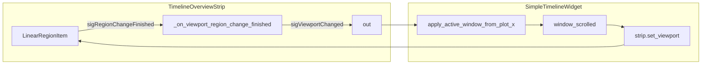

# Enable overview LinearRegionItem drag-to-pan

## Current behavior

- `[timeline_overview_strip.py](c:\Users\pho\repos\EmotivEpoc\ACTIVE_DEV\pyPhoTimeline\pypho_timeline\widgets\timeline_overview_strip.py)` builds `_viewport_region` with `**movable=False**` (line 53), which in pyqtgraph disables dragging the filled region and the edge lines (`[LinearRegionItem](c:\Users\pho\repos\EmotivEpoc\ACTIVE_DEV\pyPhoTimeline\pypho_timeline\EXTERNAL\pyqtgraph\graphicsItems\LinearRegionItem.py)`: `setMovable` / `mouseDragEvent` require `self.movable`).
- `**_on_viewport_region_change_finished**` (lines 67–91) clamps the region to the view X limits and emits `**sigViewportChanged**`, but it is **never connected** to any signal, so user interaction cannot drive the main window.
- `[simple_timeline_widget.py](c:\Users\pho\repos\EmotivEpoc\ACTIVE_DEV\pyPhoTimeline\pypho_timeline\widgets\simple_timeline_widget.py)` already connects `strip.sigViewportChanged` → `apply_active_window_from_plot_x` and `window_scrolled` → `strip.set_viewport` (lines 656–657). The data path is complete; only the strip needs to emit on user edits.

## Implementation (single file)

**File:** `[pypho_timeline/widgets/timeline_overview_strip.py](c:\Users\pho\repos\EmotivEpoc\ACTIVE_DEV\pyPhoTimeline\pypho_timeline\widgets\timeline_overview_strip.py)`

1. **Constructor:** Change `LinearRegionItem(..., movable=False)` to `**movable=True`** (or omit; default is `True` in pyqtgraph). Keeps the overview plot itself non-pannable via existing `vb.setMouseEnabled(False, False)`; only the region becomes interactive.
2. **After** `addItem(self._viewport_region)`, **connect**
  `self._viewport_region.sigRegionChangeFinished.connect(self._on_viewport_region_change_finished)`  
  - pyqtgraph **≥ 0.13.7** (`[pyproject.toml](c:\Users\pho\repos\EmotivEpoc\ACTIVE_DEV\pyPhoTimeline\pyproject.toml)`) exposes `sigRegionChangeFinished`; it fires when the user finishes dragging the region or an edge, and when `setRegion` runs (programmatic updates are already wrapped in `blockSignals` in `set_viewport`, so no feedback loop).
3. **Docs:** Adjust the class/module wording: the strip remains “read-only” for **view** pan/zoom, but the **viewport region** is user-draggable. Update `set_viewport` docstring if it still says the region is fully “read-only” in a misleading way.

## Optional follow-up (not required for the request)

- For **continuous** panning while dragging, connect `**sigRegionChanged`** as well (or instead), possibly with light throttling, since each emission would call `apply_active_window_from_plot_x` and refresh tracks—heavier than “on release” only.

## Verification

- Run the app with an overview strip: drag the **center** of the shaded band to pan; drag **edges** to change window width; confirm primary tracks follow and the region still updates when scrolling the main plots.

