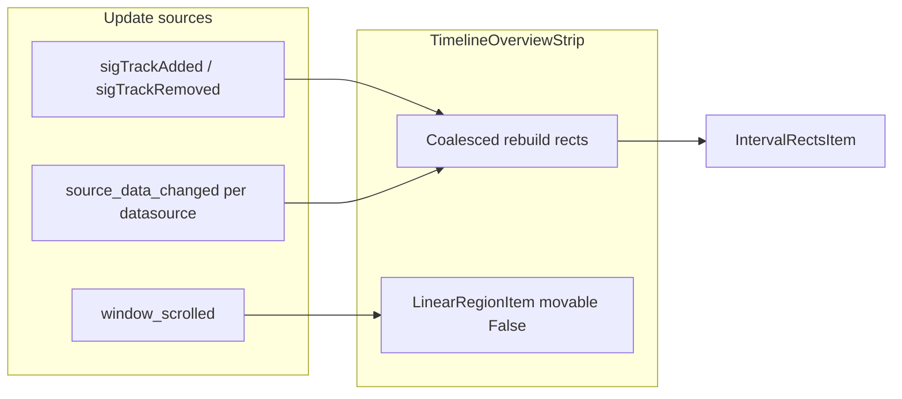

# Overview track (minimap) for SimpleTimelineWidget

## Context

- Primary tracks already expose interval overview via `[TrackDatasource.get_overview_intervals()](c:/Users/pho/repos/EmotivEpoc/ACTIVE_DEV/pyPhoTimeline/pypho_timeline/rendering/datasources/track_datasource.py)` (defaults to `df`). Detailed/async rendering stays in `[TrackRenderer](c:/Users/pho/repos/EmotivEpoc/ACTIVE_DEV/pyPhoTimeline/pypho_timeline/rendering/graphics/track_renderer.py)`; the minimap must **not** attach `detail_render_callback` or tooltips.
- Interval geometry reuse: `[IntervalRectsItem](c:/Users/pho/repos/EmotivEpoc/ACTIVE_DEV/pyPhoTimeline/pypho_timeline/rendering/graphics/interval_rects_item.py)` + tuple building from `[Render2DEventRectanglesHelper._build_interval_tuple_list_from_dataframe](c:/Users/pho/repos/EmotivEpoc/ACTIVE_DEV/pyPhoTimeline/pypho_timeline/rendering/helpers/render_rectangles_helper.py)` after normalizing each row’s DataFrame (same required columns as the helper).
- Viewport indicator: PyQtGraph’s `[LinearRegionItem(..., movable=False)](c:/Users/pho/repos/EmotivEpoc/ACTIVE_DEV/pyPhoTimeline/pypho_timeline/EXTERNAL/pyqtgraph/graphicsItems/LinearRegionItem.py)` — **not** a symbol named `pg.CustomLinearRegion` (that type does not exist here; calendar code uses `LinearRegionItem` / `ClickableLinearRegionItem` in `[timeline_calendar_widget.py](c:/Users/pho/repos/EmotivEpoc/ACTIVE_DEV/pyPhoTimeline/pypho_timeline/widgets/timeline_calendar_widget.py)`).

## Design

1. **New widget** `[pypho_timeline/widgets/timeline_overview_strip.py](c:/Users/pho/repos/EmotivEpoc/ACTIVE_DEV/pyPhoTimeline/pypho_timeline/widgets/timeline_overview_strip.py)` (keeps `[simple_timeline_widget.py](c:/Users/pho/repos/EmotivEpoc/ACTIVE_DEV/pyPhoTimeline/pypho_timeline/widgets/simple_timeline_widget.py)` smaller and avoids circular imports with `widgets.__init__`).
  - Subclass `pg.PlotWidget` (or wrap a single `PlotItem`): **disable all mouse interaction** on the ViewBox (`setMouseEnabled(False, False)`), hide auto-range buttons, optional `setMenuEnabled(False)`.
  - **X axis**: reuse `create_am_pm_date_axis` when `reference_datetime` is set (same idea as `[PyqtgraphTimeSynchronizedWidget._buildGraphics](c:/Users/pho/repos/EmotivEpoc/ACTIVE_DEV/pyPhoTimeline/pypho_timeline/core/pyqtgraph_time_synchronized_widget.py)`); otherwise numeric seconds axis.
  - **Y layout**: `n = len(primary_track_names)`. Set `setYRange(0, n, padding=0)`. Row `i` uses `series_vertical_offset = i + margin` and `series_height = 1 - 2*margin` so intervals sit inside band `[i, i+1]`.
  - **Grid**: `showGrid(x=True, y=True, alpha=…)` so horizontal lines land on integer row boundaries (separators between tracks).
  - **Left axis (optional but useful)**: compact tick labels at `i + 0.5` with track names (truncate long names) — keeps the “vertical stack” readable without extra Qt widgets.
  - **Single `IntervalRectsItem`**: build one merged tuple list for all tracks (fewer scene items than N separate items). Set `clickable = False` on the item to skip hover/click paths in `IntervalRectsItem`.
  - **Data pipeline** (per primary track, in order):
    - `overview_df = datasource.get_overview_intervals().copy()`
    - Ensure `t_duration` (derive from `t_end - t_start` if needed).
    - Convert `t_start` to **unix float** when datetime-like (mirror logic in `_build_interval_tuple_list_from_dataframe`).
    - Ensure `pen` / `brush` exist (defaults e.g. semi-transparent fill + thin border if missing).
    - Overwrite `series_vertical_offset` / `series_height` for the strip row (ignore datasource’s own offsets for this view).
    - Run helper’s `_build_interval_tuple_list_from_dataframe` on the prepared df and extend a master list.
  - **Full X range**: compute `x_min, x_max` as the union of `datasource.total_df_start_end_times` for included primary tracks (converted to the same x units as rects), with a small epsilon if degenerate. `setXRange` + `setLimits` so the view is fixed (no user zoom).
  - **Viewport region**: add one `LinearRegionItem` with `movable=False`, `orientation='vertical'`, subtle brush/pen, high `setZValue`. Public method `set_viewport(x0, x1)` uses `blockSignals` on the region while updating (pattern from `[TimelineCalendarWidget.set_active_window](c:/Users/pho/repos/EmotivEpoc/ACTIVE_DEV/pyPhoTimeline/pypho_timeline/widgets/timeline_calendar_widget.py)`) — **do not** connect `sigRegionChanged` to navigation (read-only).
2. **Wire into `SimpleTimelineWidget`**
  - Add `add_timeline_overview_strip(self, position='top', row_height_px=20, ...)` (or similar): instantiate `TimelineOverviewStrip`, insert into `self.ui.layout` **above** the control row (default) or below via parameter; store on `self.ui.timeline_overview_strip`.
  - Pass `reference_datetime`, and a resolver for primary tracks: `self.get_track_names_for_window_sync_group('primary')` intersected with `self.track_datasources`.
  - Connections:
    - `self.window_scrolled.connect(strip.set_viewport)` (float unix start/end already match main plots when using datetime mode).
    - `self.sigTrackAdded` / `self.sigTrackRemoved` → schedule strip rebuild.
    - For each `TrackDatasource`, connect `source_data_changed_signal` to the same debounced rebuild; disconnect removed datasources in `_on_track_removed` handler (track connection dict on the widget or strip).
  - **Debouncing**: single `QTimer` (e.g. 30–50 ms) coalesces rapid `source_data_changed` bursts so streaming updates do not rebuild every frame.
  - Initial sync: after first build, call `set_viewport` from current `active_window_start_time` / `active_window_end_time` via `_window_value_to_signal_float`.
3. **Edge cases**
  - **Zero primary tracks**: show empty plot with default x range from `total_data_start_time` / `total_data_end_time` if available.
  - **Tracks without interval columns**: skip row or show empty band (log at debug only).
  - **Compare column**: out of scope unless you want a second region; primary viewport only matches your wording.
4. **Tests / manual check**
  - Smoke: notebook or manual run with multiple streams — intervals visible per row, region follows jump buttons / scroll, mouse does not pan overview.

## Files to touch

| File                                                                                                                                                          | Change                                                                                                                                                                           |
| ------------------------------------------------------------------------------------------------------------------------------------------------------------- | -------------------------------------------------------------------------------------------------------------------------------------------------------------------------------- |
| New: `pypho_timeline/widgets/timeline_overview_strip.py`                                                                                                      | Overview `PlotWidget`, rebuild + viewport API                                                                                                                                    |
| `[pypho_timeline/widgets/simple_timeline_widget.py](c:/Users/pho/repos/EmotivEpoc/ACTIVE_DEV/pyPhoTimeline/pypho_timeline/widgets/simple_timeline_widget.py)` | `add_timeline_overview_strip`, signal wiring, optional default call from `setupUI` behind a flag (prefer opt-in `add_timeline_overview_strip()` so existing apps stay unchanged) |

Optional: re-export from `[pypho_timeline/widgets/__init__.py](c:/Users/pho/repos/EmotivEpoc/ACTIVE_DEV/pyPhoTimeline/pypho_timeline/widgets/__init__.py)` via lazy pattern if you want `from pypho_timeline.widgets import TimelineOverviewStrip`.