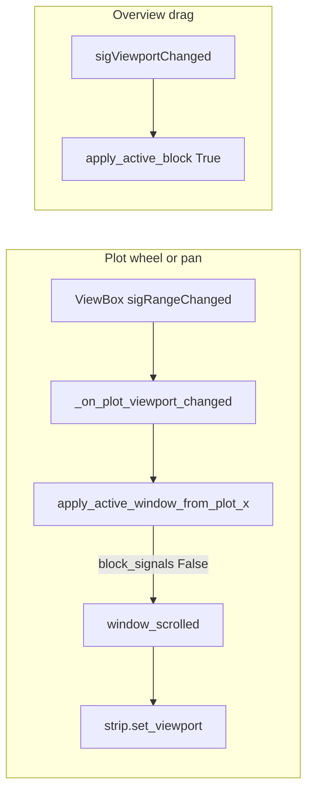

# Sync overview strip on track wheel / pan

## Problem

`[TimelineOverviewStrip](C:\Users\pho\repos\EmotivEpoc\ACTIVE_DEV\pyPhoTimeline\pypho_timeline\widgets\timeline_overview_strip.py)` is updated via `[window_scrolled` → `set_viewport](C:\Users\pho\repos\EmotivEpoc\ACTIVE_DEV\pyPhoTimeline\pypho_timeline\widgets\simple_timeline_widget.py)` (around line 718).

Plot-driven changes go through `[TrackRenderingMixin._on_plot_viewport_changed](C:\Users\pho\repos\EmotivEpoc\ACTIVE_DEV\pyPhoTimeline\pypho_timeline\rendering\mixins\track_rendering_mixin.py)` → `apply_active_window_from_plot_x(x0, x1)` **without** the third argument, so `[block_signals` defaults to `True](C:\Users\pho\repos\EmotivEpoc\ACTIVE_DEV\pyPhoTimeline\pypho_timeline\widgets\simple_timeline_widget.py)` and `**window_scrolled` is never emitted** ([lines 440–445](C:\Users\pho\repos\EmotivEpoc\ACTIVE_DEV\pyPhoTimeline\pypho_timeline\widgets\simple_timeline_widget.py)).

Overview drag still avoids emitting: `[strip.sigViewportChanged](C:\Users\pho\repos\EmotivEpoc\ACTIVE_DEV\pyPhoTimeline\pypho_timeline\widgets\simple_timeline_widget.py)` is connected to the same slot with **two** arguments only, so `block_signals` stays `**True`** (no behavior change there).

## Implementation

**File:** `[pypho_timeline/rendering/mixins/track_rendering_mixin.py](C:\Users\pho\repos\EmotivEpoc\ACTIVE_DEV\pyPhoTimeline\pypho_timeline\rendering\mixins\track_rendering_mixin.py)`

In the `deferred_update` closure inside `_on_plot_viewport_changed` (currently ~line 272), change:

- `apply_fn(x0, x1)` → `apply_fn(x0, x1, False)`

Optional one-line comment above that call: plot-originated updates should broadcast `window_scrolled` so overview/calendar/table listeners stay in sync; overview → plot path still uses default `block_signals=True`.

No changes required in `[simple_timeline_widget.py](C:\Users\pho\repos\EmotivEpoc\ACTIVE_DEV\pyPhoTimeline\pypho_timeline\widgets\simple_timeline_widget.py)` unless you want a docstring tweak on `apply_active_window_from_plot_x` clarifying that `**False`** is used for user pan/zoom on tracks, `**True`** (default) when the slot is also driven by `sigViewportChanged` (two-arg connection).

## Why this is safe

- During `window_scrolled.emit`, `[apply_active_window_from_plot_x](C:\Users\pho\repos\EmotivEpoc\ACTIVE_DEV\pyPhoTimeline\pypho_timeline\widgets\simple_timeline_widget.py)` sets `_applying_window_from_signal = True`, so `_on_plot_viewport_changed` [returns early](C:\Users\pho\repos\EmotivEpoc\ACTIVE_DEV\pyPhoTimeline\pypho_timeline\rendering\mixins\track_rendering_mixin.py) for synchronous nested range updates.
- `[set_viewport](C:\Users\pho\repos\EmotivEpoc\ACTIVE_DEV\pyPhoTimeline\pypho_timeline\widgets\timeline_overview_strip.py)` blocks region signals while updating the `LinearRegionItem`.
- Epsilon check against `_last_applied_plot_window_x0/x1` [before calling `apply_fn](C:\Users\pho\repos\EmotivEpoc\ACTIVE_DEV\pyPhoTimeline\pypho_timeline\rendering\mixins\track_rendering_mixin.py)` suppresses redundant emissions for the same range.

## Verification

- Add overview strip, wheel or drag-pan a **primary** track: minimap viewport region should track the visible window.
- Drag overview region: no runaway signal loop; tracks still follow (unchanged two-arg connection).
- Quick regression: calendar / table widgets still receive `window_scrolled` after plot pan (they already had partial state updates via `apply_active_window_from_plot_x`; now they also get the signal consistently).

