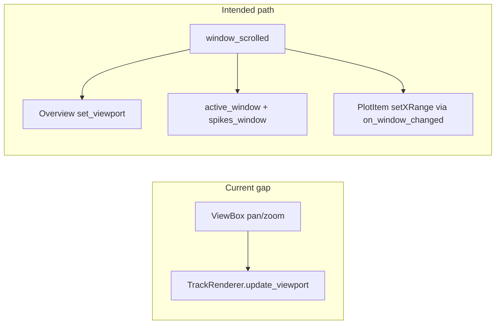

# TimelineOverviewStrip ↔ main viewport synchronization

## Root cause

- `[TimelineOverviewStrip](c:/Users/pho/repos/EmotivEpoc/ACTIVE_DEV/pyPhoTimeline/pypho_timeline/widgets/timeline_overview_strip.py)` already exposes `set_viewport(x_start, x_end)` and wires it in `[add_timeline_overview_strip](c:/Users/pho/repos/EmotivEpoc/ACTIVE_DEV/pyPhoTimeline/pypho_timeline/widgets/simple_timeline_widget.py)` via `self.window_scrolled.connect(strip.set_viewport)`.
- **Pan/zoom on a track** is handled in `[TrackRenderingMixin._on_plot_viewport_changed](c:/Users/pho/repos/EmotivEpoc/ACTIVE_DEV/pyPhoTimeline/pypho_timeline/rendering/mixins/track_rendering_mixin.py)`: it only calls `track_renderer.update_viewport(x0, x1)`. It does **not** update `active_window_start_time` / `active_window_end_time`, `spikes_window`, or emit `window_scrolled`, so the overview region (and any other `window_scrolled` listeners) stay stale while the plot `ViewBox` shows the real range.
- The overview region is created with `movable=False`, so **vice-versa** (dragging the region) cannot work until it is made interactive and connected.

## Implementation plan

### 1. Central helper on `SimpleTimelineWidget`: apply full window from plot coordinates

Add something like `apply_active_window_from_plot_x(float x0, float x1)` that:

- Normalizes order (`x0, x1 = sorted`).
- Updates internal state consistently with existing modes:
  - If `reference_datetime` is set, PyQtGraph plot x is **Unix seconds** (same as overview intervals from `datetime_to_unix_timestamp` in `[rebuild](c:/Users/pho/repos/EmotivEpoc/ACTIVE_DEV/pyPhoTimeline/pypho_timeline/widgets/timeline_overview_strip.py)`); convert to `datetime`/`pd.Timestamp` via existing helpers (e.g. `unix_timestamp_to_datetime`) for `active_window_*` + `spikes_window.update_window_start_end`, matching how `[PyqtgraphTimeSynchronizedWidget.on_window_changed](c:/Users/pho/repos/EmotivEpoc/ACTIVE_DEV/pyPhoTimeline/pypho_timeline/core/pyqtgraph_time_synchronized_widget.py)` sets `setXRange`.
  - If not in datetime mode, keep scalar floats as today.
- Emits `window_scrolled.emit(emit_start, emit_end)` using the **same numeric convention as `set_viewport`** (Unix floats when using date axes; plain floats otherwise—align with `_window_value_to_signal_float` / `simulate_window_scroll`).
- Optionally calls `_update_interval_jump_buttons_enabled()` like `simulate_window_scroll`.

This is strictly more general than `simulate_window_scroll(new_start)` (which preserves duration) because pan **and** zoom change both edges.

### 2. Push ViewBox changes into that helper (primary tracks only)

In `[TrackRenderingMixin._on_plot_viewport_changed](c:/Users/pho/repos/EmotivEpoc/ACTIVE_DEV/pyPhoTimeline/pypho_timeline/rendering/mixins/track_rendering_mixin.py)`, after scheduling `track_renderer.update_viewport`:

- If `self.get_track_window_sync_group(track_name) != 'primary'`, return (compare / other groups must not drive the global window).
- If the host widget does not implement the hook (optional `getattr(self, '_should_sync_timeline_from_plot_range', lambda: True)` or `hasattr(self, 'apply_active_window_from_plot_x')`), no-op for generic mixin users.
- **Debounce / dedupe** to avoid spam from X-linked `ViewBox`s (`[setXLink` in `specific_dock_widget_mixin](c:/Users/pho/repos/EmotivEpoc/ACTIVE_DEV/pyPhoTimeline/pypho_timeline/docking/specific_dock_widget_mixin.py)`):
  - Keep last applied `(x0, x1)` on the timeline; skip if both ends are within a small epsilon.
  - Alternatively a single-shot `QTimer` coalescing (e.g. 20–30 ms) if multiple events still slip through.

### 3. Close the feedback loop (programmatic `setXRange`)

When `window_scrolled` fires, docked widgets call `on_window_changed` → `setXRange`, which triggers `sigRangeChanged` again. The epsilon check in step 2 prevents re-emitting identical ranges. If tiny numerical drift still causes loops, add a short-lived `self._applying_window_from_signal` guard set only inside the helper when emitting, and have `_on_plot_viewport_changed` return early while the flag is set.

### 4. Overview strip: region → timeline

In `[TimelineOverviewStrip](c:/Users/pho/repos/EmotivEpoc/ACTIVE_DEV/pyPhoTimeline/pypho_timeline/widgets/timeline_overview_strip.py)`:

- Set `_viewport_region` to `movable=True` (and use default edge handles so width/zoom can change).
- Add `sigViewportChanged = QtCore.Signal(float, float)` (Unix/plot x, matching `set_viewport`).
- Connect `_viewport_region.sigRegionChangeFinished` (or `sigRegionChanged` with throttling if you want live sync) to read `getRegion()`, normalize, optionally clamp to the strip’s current `ViewBox` x limits, emit `sigViewportChanged`.
- Keep `set_viewport` using `blockSignals(True/False)` around `setRegion` so external updates do not re-emit.

In `add_timeline_overview_strip`, connect `strip.sigViewportChanged` to `apply_active_window_from_plot_x` (or the helper from step 1).

### 5. Coherence fix (recommended alongside): `window_scrolled` floats vs `float_to_datetime`

Today `[PyqtgraphTimeSynchronizedWidget.on_window_changed](c:/Users/pho/repos/EmotivEpoc/ACTIVE_DEV/pyPhoTimeline/pypho_timeline/core/pyqtgraph_time_synchronized_widget.py)` passes non-datetime floats through `float_to_datetime`, which documents them as **seconds relative to `reference_datetime`**, while plot x and `[simulate_window_scroll](c:/Users/pho/repos/EmotivEpoc/ACTIVE_DEV/pyPhoTimeline/pypho_timeline/widgets/simple_timeline_widget.py)` often use **Unix seconds** (`.timestamp()`). When `reference_datetime` is set, that mismatch can desynchronize tracks from signals.

**Minimal fix:** if both `start_t` and `end_t` are numeric and look like Unix times (e.g. `> 1e9`), convert with `unix_timestamp_to_datetime` / `pd.Timestamp(..., unit='s', tz='UTC')` instead of `float_to_datetime`. That makes `window_scrolled` and plot coordinates one consistent domain.

## Files to touch

| File                                                                                                                                                        | Change                                                                                                          |
| ----------------------------------------------------------------------------------------------------------------------------------------------------------- | --------------------------------------------------------------------------------------------------------------- |
| `[simple_timeline_widget.py](c:/Users/pho/repos/EmotivEpoc/ACTIVE_DEV/pyPhoTimeline/pypho_timeline/widgets/simple_timeline_widget.py)`                      | New `apply_active_window_from_plot_x`; connect overview `sigViewportChanged`; optional guard state for feedback |
| `[track_rendering_mixin.py](c:/Users/pho/repos/EmotivEpoc/ACTIVE_DEV/pyPhoTimeline/pypho_timeline/rendering/mixins/track_rendering_mixin.py)`               | Extend `_on_plot_viewport_changed` to call the helper for primary tracks + dedupe                               |
| `[timeline_overview_strip.py](c:/Users/pho/repos/EmotivEpoc/ACTIVE_DEV/pyPhoTimeline/pypho_timeline/widgets/timeline_overview_strip.py)`                    | Movable region, signal, `sigRegionChangeFinished` handler                                                       |
| `[pyqtgraph_time_synchronized_widget.py](c:/Users/pho/repos/EmotivEpoc/ACTIVE_DEV/pyPhoTimeline/pypho_timeline/core/pyqtgraph_time_synchronized_widget.py)` | Unix-vs-offset heuristic in `on_window_changed` (recommended)                                                   |

## Verification

- With `reference_datetime` set: pan and wheel-zoom a primary track; overview blue band follows; no runaway signal churn.
- Drag and resize the overview region; all primary tracks’ x ranges update together.
- Compare-column tracks (`window_sync_group='compare'`) do not overwrite the primary window when manipulated.
- Interval jump buttons and calendar (if present) still update when the window changes from the overview.

