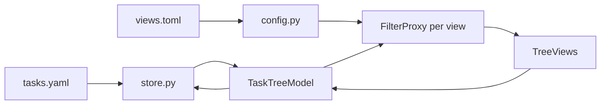

# PyQt6 hierarchical task tracker (UV + plaintext)

## Target codebase

Implement in [PhoTaskTracker](c:/Users/pho/repos/EmotivEpoc/ACTIVE_DEV/PhoTaskTracker): replace the stub [main.py](c:/Users/pho/repos/EmotivEpoc/ACTIVE_DEV/PhoTaskTracker/main.py), trim [pyproject.toml](c:/Users/pho/repos/EmotivEpoc/ACTIVE_DEV/PhoTaskTracker/pyproject.toml) to dependencies that serve this app (remove `phopylslhelper`, `ipykernel`, `pandas`, `numpy` unless you explicitly want them), and add `uv add pyyaml` (or `ruamel.yaml` if you later want round-trip comment preservation in YAML—start with PyYAML for simplicity).

Default file locations (configurable in config): e.g. `~/.config/photasktracker/tasks.yaml` and `views.toml`, or project-local `./tasks.yaml` for easy git/versioning.

## Plaintext data model (tasks)

**File:** `tasks.yaml` (single document, human-editable).

- Each task node: stable `id` (UUID string), `text`, optional `done` (bool), `tags` (list of strings).
- **Hierarchical tags:** convention `segment/segment/leaf` (e.g. `work/client-a/urgent`). No separate tag table required initially; the UI can offer autocomplete from tags seen in the file and a simple tag “path” editor.
- **Hierarchy:** nested `children: [...]` list under each node (YAML maps naturally to nesting).
- **Timestamps (auto, ISO 8601):** `created_at`, `updated_at`, `finished_at` (null when not finished). Rules:
  - On new item: set `created_at` and `updated_at` to “now.”
  - On any edit (text, tags, done, reparent): bump `updated_at`.
  - When marked done: set `finished_at` if unset; when unmarked: clear `finished_at`.
  - Optional: bump `updated_at` when finishing/unfinishing.

**Module:** e.g. `photasktracker/models.py` (dataclass or `attrs`—you already have `attrs` in pyproject; either keep attrs or use stdlib `dataclasses` and drop attrs to reduce deps) + `photasktracker/store.py` for `load_tasks(path) -> root` / `save_tasks(path, root)` with atomic write (write temp + replace).

## Plaintext configuration (multiple views)

**File:** `views.toml` (or `config.toml` with a `[paths]` section + `[[views]]` array).

Each view entry defines a **named filter**, for example:

- `name` (display name)
- `include_tag_prefix` (optional; show subtree if any tag starts with prefix)
- `hide_finished` (bool)
- optional `text_contains` for quick prototyping

The app loads this at startup and builds one **QTreeView** (or tabbed views) per entry, all driven by the same in-memory tree plus a **per-view `QSortFilterProxyModel`** subclass that implements tree-aware filtering: a row is visible if it matches the filter **or** any descendant matches (standard pattern: override `filterAcceptsRow` and recurse into children).

Allow **reload from disk** for both tasks and views (menu action) so hand-edited plaintext is picked up without restart.

## PyQt6 GUI architecture

**Main window:** `QMainWindow` with:

- **Central:** tab widget or splitter where each tab is one “view” (`QTreeView` + optional line edit for quick filter override is optional later).
- **Toolbar / menu:** New task, Delete, Indent, Outdent, Toggle done, Add tag (dialog or inline), Save, Reload, Open data file path in explorer (platform-specific optional).
- **Model:** `QAbstractItemModel` subclass (e.g. `TaskTreeModel`) backed by the in-memory tree of nodes. Columns (minimal first pass): **Done** (checkstate), **Title**, **Tags** (comma-joined or path display), **Created**, **Updated**, **Finished**.
- **Nesting / un-nesting:**
  - **Drag-and-drop** with `Qt.DropAction.MoveAction` and custom `mimeData` carrying task `id` (or persistent index mapping); `dropMimeData` reparents node and calls `save`.
  - **Indent / Outdent** actions: move node to be last child of previous sibling, or move to parent’s parent’s children after parent—mirror behavior of outliners (TaskPaper-style).
- **Editing:** `QTreeView` with appropriate flags (`Editable` on title/tags columns) or delegate; on `dataChanged`, update model timestamps and persist (debounced save optional to avoid excessive writes).

**Package layout** (suggested):

```
PhoTaskTracker/
  pyproject.toml
  src/photasktracker/   # or flat photasktracker/ if you prefer src-less; match one style
    __init__.py
    main.py             # entry: QApplication, MainWindow
    models.py
    store.py
    config.py           # views.toml + paths
    task_tree_model.py
    task_filter_proxy.py
    main_window.py
```

Use `project.scripts` in `pyproject.toml` for `photasktracker = "photasktracker.main:main"` (adjust if using `src` layout).

## Persistence and “plaintext-manageable” workflow

- Save after structural edits and on quit (`closeEvent`); optional timer debounce for typing.
- Document in README: YAML schema, tag path convention, and example `views.toml`.
- If two processes edit the same file, last writer wins (document; optional future: file watcher + merge prompt).

## Testing / manual verification

- Manual: create nest via Tab/Indent and DnD; verify YAML on disk reflects hierarchy; toggle done and check `finished_at`; edit YAML externally and Reload.

## Mermaid (data flow)



## Out of scope for “basic” pass (easy follow-ups)

- Recurrence, due dates, full-text search across files, sync, encryption, undo stack, ruamel.yaml for comment round-trip, tag hierarchy sidebar widget.
