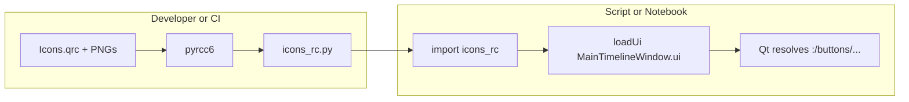

# Qt `.qrc` → Python: build and notebook-friendly workflow

## Goal

`MainTimelineWindow.ui` references `:/buttons/...` paths. Those only resolve after Qt resource data is registered, which happens when Python executes the module produced by Qt’s **rcc** (`pyrcc6` for [PyQt6](c:/Users/pho/repos/EmotivEpoc/ACTIVE_DEV/pyPhoTimeline/pyproject.toml) per your dependencies). `loadUi` does **not** read `.qrc` files at runtime by itself.

## Recommended approach (works for `uv sync`, editable installs, notebooks)

**Ship a generated module in the repo** (e.g. [`pypho_timeline/resources/icons/icons_rc.py`](c:/Users/pho/repos/EmotivEpoc/ACTIVE_DEV/pyPhoTimeline/pypho_timeline/resources/icons/icons_rc.py)) and **import it once before** `loadUi(uiFile, self)` in [`MainTimelineWindow.py`](c:/Users/pho/repos/EmotivEpoc/ACTIVE_DEV/pyPhoTimeline/pypho_timeline/widgets/TimelineWindow/MainTimelineWindow.py) (or from a tiny helper imported by that module). Side-effect import is enough: `import pypho_timeline.resources.icons.icons_rc  # noqa: F401`.

Why commit the generated file:

- **PEP 517 isolated builds** (wheel/sdist) only see `[build-system] requires` — today that is only `hatchling`. A Hatch build hook that shells to `pyrcc6` would **fail** unless you add something like `pyqt6-tools` to `build-system.requires`, which pulls a large Qt toolchain into **every** install-from-source build (CI, downstream users).
- **Notebooks** use the same installed package as scripts; they do not run a separate “compile step”. If `icons_rc.py` is part of the installed tree, icons work identically.

## Generation command (developers / when `Icons.qrc` or PNGs change)

From repo root (paths relative to [`Icons.qrc`](c:/Users/pho/repos/EmotivEpoc/ACTIVE_DEV/pyPhoTimeline/pypho_timeline/resources/icons/Icons.qrc) are already correct for the `<file>…</file>` entries):

```text
pyrcc6 pypho_timeline/resources/icons/Icons.qrc -o pypho_timeline/resources/icons/icons_rc.py
```

Use the venv that already has [`pyqt6-tools`](c:/Users/pho/repos/EmotivEpoc/ACTIVE_DEV/pyPhoTimeline/pyproject.toml), e.g. `uv run pyrcc6 …` after `uv sync --all-extras`.

Optional polish:

- Add a **Hatch env script** under `[tool.hatch.envs.default.scripts]` (or a `dev` env) named `compile-icons` that runs the same command, so `hatch run compile-icons` matches your Hatch-centric habits while day-to-day stays `uv run`.
- Add a **CI check** (or pre-commit) that fails if `Icons.qrc` / PNGs are newer than `icons_rc.py` unless someone re-ran `pyrcc6` — prevents drift without heavy build hooks.

## UI file cleanup (same change set)

The `logToggleButton` `<iconset>` in [`MainTimelineWindow.ui`](c:/Users/pho/repos/EmotivEpoc/ACTIVE_DEV/pyPhoTimeline/pypho_timeline/widgets/TimelineWindow/MainTimelineWindow.ui) has a malformed tail after `</activeon>` (stray `:/buttons/...` before `</iconset>`). Fix that XML so Designer and `loadUi` parse the iconset reliably.

## Binding note (qtpy + PyQt6)

`pyrcc6` output imports **PyQt6** (`QtCore.qRegisterResourceData`). Your project already depends on `pyqt6`; that matches. If anyone forces `QT_API=pyqt5` while using this wheel, importing a PyQt6-generated `icons_rc` could load two bindings — rare for your stack; document “resources built for PyQt6” if needed.

## Optional: strict “compile on every wheel” (usually not worth it)

If you truly need regeneration inside **isolated** wheel builds: extend `[build-system] requires` with a package that provides `pyrcc6`, then implement a **Hatch build hook** (`BuildHookInterface`) that runs `pyrcc6` before the wheel is assembled. Tradeoff: heavier, slower, and more fragile for consumers building from sdist.


