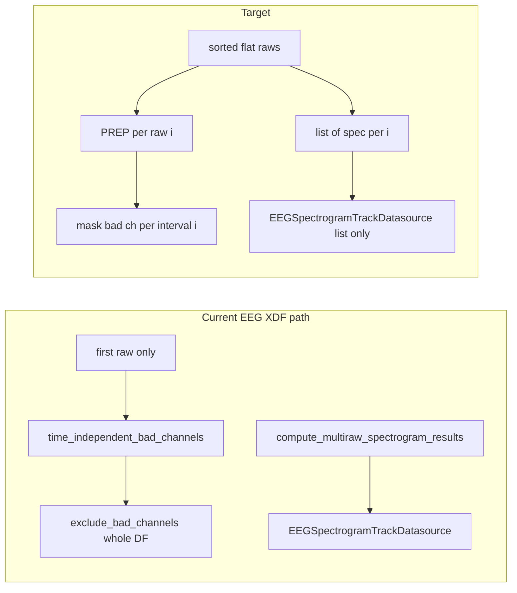

# Remove “first only” multi-raw hacks (full session data)

## Problem summary

Several code paths assume **one** `Raw` or **one** spectrogram dict when the timeline has **many** disjoint sessions:

- [stream_to_datasources.py](C:/Users/pho/repos/EmotivEpoc/ACTIVE_DEV/pyPhoTimeline/pypho_timeline/rendering/datasources/stream_to_datasources.py) uses `first_chronological_raw_from_datasets_dict`, runs PREP once, then `exclude_bad_channels` on the **merged** `EEGTrackDatasource` (global column drop).
- [eeg.py](C:/Users/pho/repos/EmotivEpoc/ACTIVE_DEV/pyPhoTimeline/pypho_timeline/rendering/datasources/specific/eeg.py): `compute_multiraw_spectrogram_results` returns a redundant “representative” first dict; `EEGSpectrogramTrackDatasource`/`from_multiple_sources`/`get_spectrogram_ch_names`/`fetch_detailed_data` use index `0` as proxy or fallback.
- Same file: `_first_nonempty_raw_list_from_dict` only returns the **first non-empty dict value** (drops other XDF keys).
- Motion block in `stream_to_datasources.py` uses `_lst[0]` from the first non-empty dict bucket to decide “raw exists” (unordered + first element only).

Merged `merged_intervals_df` is already `sort_values('t_start')` ([stream_to_datasources.py](C:/Users/pho/repos/EmotivEpoc/ACTIVE_DEV/pyPhoTimeline/pypho_timeline/rendering/datasources/stream_to_datasources.py) ~428), matching the intended alignment with `RawProvidingTrackDatasource.get_sorted_and_extracted_raws` used for spectrograms.

## 1. Shared alignment helper

In [eeg.py](C:/Users/pho/repos/EmotivEpoc/ACTIVE_DEV/pyPhoTimeline/pypho_timeline/rendering/datasources/specific/eeg.py) (next to `compute_multiraw_spectrogram_results`), add a small internal or public helper used by spectrograms and bad-channel masking, e.g. `aligned_chronological_raws_for_intervals(intervals_df, raw_datasets_dict) -> Tuple[List[Any], int]`:

- `raws = RawProvidingTrackDatasource.get_sorted_and_extracted_raws(raw_datasets_dict)`
- `n_iv = len(intervals_df)`
- If `n_iv == 0` or not `raws`: return `[], 0`
- `n = min(len(raws), n_iv)`; if `n != len(raws)` or `n != n_iv`, log the same style of warning already used in `compute_multiraw_spectrogram_results` (~43–44).
- Return `raws, n` (callers only use first `n` raws aligned to the first `n` rows of `intervals_df` in **current row order**; ensure callers use the same `intervals_df` instance/order as the datasource, or explicitly `sort_values('t_start').reset_index(drop=True)` once).

## 2. EEG: per-interval bad channels (replace global exclude on XDF path)

In [eeg.py](C:/Users/pho/repos/EmotivEpoc/ACTIVE_DEV/pyPhoTimeline/pypho_timeline/rendering/datasources/specific/eeg.py) on `EEGTrackDatasource`:

- Add **`mask_bad_eeg_channels_by_interval_rows(self, bad_channels_per_row: List[List[str]], intervals_df: Optional[pd.DataFrame] = None) -> None`** (name can be shortened):
  - Use `intervals_df or self.intervals_df`.
  - For each index `i` in `range(min(len(bad_channels_per_row), len(intervals_df)))`, compute `[t_lo, t_hi)` from `t_start` and `t_duration` / `t_end` if present; normalize datetimes with existing [`datetime_to_unix_timestamp`](C:/Users/pho/repos/EmotivEpoc/ACTIVE_DEV/pyPhoTimeline/pypho_timeline/utils/datetime_helpers.py) where needed (mirror patterns in [EEGSpectrogramDetailRenderer.get_detail_bounds](C:/Users/pho/repos/EmotivEpoc/ACTIVE_DEV/pyPhoTimeline/pypho_timeline/rendering/datasources/specific/eeg.py) ~942–963).
  - For `detailed_df` and `normalization_reference_df`, select rows whose `t` falls in that window (handle datetime vs numeric `t` consistently) and set values for listed channels to `np.nan` (keeps columns for other sessions; avoids global `drop`).
  - Optionally update `channel_names` only if you still want to hide bad traces globally — **default: do not change `channel_names`** so options panels stay stable; bad channels show as flat/empty in-window only.

**Stream path** in [stream_to_datasources.py](C:/Users/pho/repos/EmotivEpoc/ACTIVE_DEV/pyPhoTimeline/pypho_timeline/rendering/datasources/stream_to_datasources.py) (~497–507):

- Remove import/use of `first_chronological_raw_from_datasets_dict`.
- Get `raws, n = aligned_chronological_raws_for_intervals(merged_intervals_df, datasource.raw_datasets_dict)`.
- `bad_per_row: List[List[str]] = []`
- For `i in range(n)`: `bad_ch_result = EEGComputations.time_independent_bad_channels(raws[i], ...)`; append `bad_ch_result.get('all_bad_channels', []) or []`.
- If `len(merged_intervals_df) > n`, append empty lists for remaining rows (no masking) or pad to `len(merged_intervals_df)` — document behavior; log once if padding needed.
- Call `datasource.mask_bad_eeg_channels_by_interval_rows(bad_per_row, merged_intervals_df)`; **remove** `exclude_bad_channels`.

Keep `exclude_bad_channels` for callers that truly have one session and want global drops; it remains valid API.

## 3. Multiraw spectrograms: list-only return

In [eeg.py](C:/Users/pho/repos/EmotivEpoc/ACTIVE_DEV/pyPhoTimeline/pypho_timeline/rendering/datasources/specific/eeg.py):

- Change **`compute_multiraw_spectrogram_results`** to return **`List[Optional[Dict[str, Any]]]`** only (same length as `intervals_df`, with trailing `None` if more intervals than raws, matching current `out` padding intent — clarify and implement consistently).
- Internally reuse the alignment helper; remove `rep = next(...)` entirely.
- Update [stream_to_datasources.py](C:/Users/pho/repos/EmotivEpoc/ACTIVE_DEV/pyPhoTimeline/pypho_timeline/rendering/datasources/stream_to_datasources.py): `spec_results = compute_multiraw_spectrogram_results(...)`; stop unpacking two values; construct `EEGSpectrogramTrackDatasource(..., spectrogram_results=spec_results)` with no representative dict (see §4).

Search the repo for any other callers (currently only `stream_to_datasources` + definition).

## 4. EEGSpectrogramTrackDatasource: no first-only metadata or fallbacks

In [eeg.py](C:/Users/pho/repos/EmotivEpoc/ACTIVE_DEV/pyPhoTimeline/pypho_timeline/rendering/datasources/specific/eeg.py):

- **`__init__`**: Make `spectrogram_result: Optional[Dict] = None`. **Normalize**: if `spectrogram_results is None` and `spectrogram_result is not None`, set `spectrogram_results = [spectrogram_result]` and `spectrogram_result = None` so single-interval call sites ([timeline_builder.py](C:/Users/pho/repos/EmotivEpoc/ACTIVE_DEV/pyPhoTimeline/pypho_timeline/timeline_builder.py) ~1185) stay one line. Validate that after normalization there is at least one non-`None` entry if you require non-empty.
- **`from_multiple_sources`**: Stop using `spectrogram_results[0]`; call `cls(..., spectrogram_result=None, spectrogram_results=spectrogram_results, ...)`.
- **`get_spectrogram_ch_names`**: Build **sorted union** of `ch_names` from every non-`None` dict in `spectrogram_results`; if only legacy `spectrogram_result` set, use that.
- **`fetch_detailed_data`**: If row match fails or index out of range, **return `None`** and log a **debug** (or single **warning**) — remove `return self._spectrogram_results[0]`.

Adjust **`on_compute_finished`** so success / channel union logic does not depend on `_spectrogram_result` when `_spectrogram_results` is the canonical list (keep backward compat if `_spectrogram_result` alone was set).

## 5. Motion: “any raw” without first-of-bucket

In [stream_to_datasources.py](C:/Users/pho/repos/EmotivEpoc/ACTIVE_DEV/pyPhoTimeline/pypho_timeline/rendering/datasources/stream_to_datasources.py) (~461–470):

- Replace the `_motion_rdd.values()` / `_lst[0]` loop inline with `len(RawProvidingTrackDatasource.get_sorted_and_extracted_raws(datasource.raw_datasets_dict)) > 0` for the gate (import `RawProvidingTrackDatasource` from `track_datasource` or call through `MotionTrackDatasource` if it inherits the classmethod — verify MRO).

## 6. Remove / replace broken helpers

In [eeg.py](C:/Users/pho/repos/EmotivEpoc/ACTIVE_DEV/pyPhoTimeline/pypho_timeline/rendering/datasources/specific/eeg.py):

- **Delete** `first_chronological_raw_from_datasets_dict`.
- **Delete** `_first_nonempty_raw_list_from_dict` OR replace with a one-line wrapper: `get_sorted_and_extracted_raws(raw_datasets_dict)` returning `List` (not “first dict value only”) — then update `__all__` to export only the correct helper name.

Update [stream_to_datasources.py](C:/Users/pho/repos/EmotivEpoc/ACTIVE_DEV/pyPhoTimeline/pypho_timeline/rendering/datasources/stream_to_datasources.py) imports and [__all__](C:/Users/pho/repos/EmotivEpoc/ACTIVE_DEV/pyPhoTimeline/pypho_timeline/rendering/datasources/specific/eeg.py) accordingly.

## 7. Timeline merge: spectrogram datasources may carry lists

In [timeline_builder.py](C:/Users/pho/repos/EmotivEpoc/ACTIVE_DEV/pyPhoTimeline/pypho_timeline/timeline_builder.py) (~761–768), merging `EEGSpectrogramTrackDatasource` group currently collects only `_spectrogram_result`. Add a helper (local or on the class) e.g. `flatten_spectrogram_payload(ds) -> List[Dict]`:

- If `_spectrogram_results` is a non-empty list with any non-`None` entries: return `[x for x in _spectrogram_results if x is not None]`.
- Else if `_spectrogram_result is not None`: return `[self._spectrogram_result]`.
- Else: `[]`.

Use this when building `spec_results` so merging matches `intervals_dfs` length when each datasource stores multi-interval lists.

## 8. Optional consistency: `compute()` iteration order on EEG / spectrogram datasources

[EEGTrackDatasource.compute](C:/Users/pho/repos/EmotivEpoc/ACTIVE_DEV/pyPhoTimeline/pypho_timeline/rendering/datasources/specific/eeg.py) and [EEGSpectrogramTrackDatasource.compute](C:/Users/pho/repos/EmotivEpoc/ACTIVE_DEV/pyPhoTimeline/pypho_timeline/rendering/datasources/specific/eeg.py) iterate `raw_datasets_dict.items()` (insertion/key order), **not** chronological flatten. For strict alignment with `intervals_df` when users hit “recompute”, refactor to:

- `for eeg_raw in RawProvidingTrackDatasource.get_sorted_and_extracted_raws(self.raw_datasets_dict): ... append ...`

Same appended order as preload path; document that `computed_result['spectogram']` list order matches sorted raws, not dict keys.

## 9. Notebooks and plans (non-code or user-gated)

- [testing_notebook.ipynb](C:/Users/pho/repos/EmotivEpoc/ACTIVE_DEV/pyPhoTimeline/testing_notebook.ipynb) and [testing_PhoLogToLabStreamingLayer_xdfOpening_notebook.ipynb](C:/Users/pho/repos/EmotivEpoc/ACTIVE_DEV/pyPhoTimeline/testing_PhoLogToLabStreamingLayer_xdfOpening_notebook.ipynb) reference `_first_nonempty_raw_list_from_dict` and `eeg_raw = ...[0]`. Update cells **after** user approval (per your notebook rule), or leave a short comment in the plan for a manual follow-up.
- [.cursor/plans/multi-raw_spectrogram_compute_258b988e.plan.md](C:/Users/pho/repos/EmotivEpoc/ACTIVE_DEV/pyPhoTimeline/.cursor/plans/multi-raw_spectrogram_compute_258b988e.plan.md) is obsolete relative to this work; do not edit unless you want housekeeping.

## 10. Verification

- Run existing tests under [pyPhoTimeline/tests](C:/Users/pho/repos/EmotivEpoc/ACTIVE_DEV/pyPhoTimeline/tests) (e.g. `test_runtime_downsampling.py`).
- Add a focused unit test for `mask_bad_eeg_channels_by_interval_rows` (two disjoint time ranges, two channel sets) and/or for `compute_multiraw_spectrogram_results` list length vs intervals.
- Smoke: build timeline from two XDFs for one EEG stream — waveform shows session-specific masking; spectrogram detail picks correct dict per interval; options panel channel list is union of `ch_names`.
