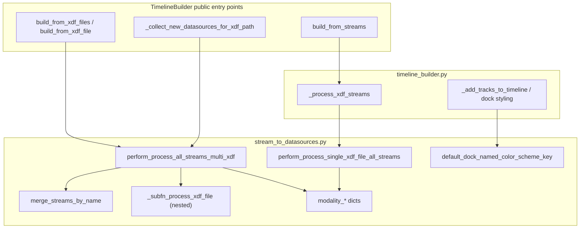

# Call hierarchy and redundancy: `stream_to_datasources.py`

## Call hierarchy (within pyPhoTimeline)

| Symbol | Defined in | Called from |
|--------|------------|-------------|
| `perform_process_all_streams_multi_xdf` | [stream_to_datasources.py](c:/Users/pho/repos/EmotivEpoc/ACTIVE_DEV/pyPhoTimeline/pypho_timeline/rendering/datasources/stream_to_datasources.py) | [timeline_builder.py](c:/Users/pho/repos/EmotivEpoc/ACTIVE_DEV/pyPhoTimeline/pypho_timeline/timeline_builder.py) (`build_from_xdf_files` ~L97, ~L394; `_collect_new_datasources_for_xdf_path` ~L190) |
| `merge_streams_by_name` | same | Only `perform_process_all_streams_multi_xdf` (~L316); also **re-exported** from [simple_timeline_widget.py](c:/Users/pho/repos/EmotivEpoc/ACTIVE_DEV/pyPhoTimeline/pypho_timeline/widgets/simple_timeline_widget.py) (~L1136) for backward compatibility |
| Nested `_subfn_process_xdf_file` | same | Only `perform_process_all_streams_multi_xdf` when `enable_raw_xdf_processing` (~L445) |
| `perform_process_single_xdf_file_all_streams` | same | [timeline_builder.py](c:/Users/pho/repos/EmotivEpoc/ACTIVE_DEV/pyPhoTimeline/pypho_timeline/timeline_builder.py) `_process_xdf_streams` (~L1330) used exclusively by `build_from_streams` (~L530) |
| `default_dock_named_color_scheme_key` | same | [timeline_builder.py](c:/Users/pho/repos/EmotivEpoc/ACTIVE_DEV/pyPhoTimeline/pypho_timeline/timeline_builder.py) (~L1399, ~L1447); **cross-repo**: `PhoPyMNEHelper` imports it ([bad_epochs.py](c:/Users/pho/repos/EmotivEpoc/ACTIVE_DEV/PhoPyMNEHelper/src/phopymnehelper/analysis/computations/specific/bad_epochs.py)) |
| `modality_channels_dict` / `modality_channels_normalization_mode_dict` | same | Internal branches in both `perform_process_*` functions; `modality_channels_dict` + `modality_sfreq_dict` + both processors **lazy-exported** via [widgets/__init__.py](c:/Users/pho/repos/EmotivEpoc/ACTIVE_DEV/pyPhoTimeline/pypho_timeline/widgets/__init__.py) |

**Important path split:** `build_from_xdf_file` delegates to `build_from_xdf_files`, so **all disk-based XDF loading** goes through `perform_process_all_streams_multi_xdf` (even a single file). Only **`build_from_streams`** (in-memory `pyxdf` dicts, no guaranteed file paths/headers) uses `perform_process_single_xdf_file_all_streams`.

---

## What is redundant / not needed?

### Functions: none are dead

Every top-level function in the file is referenced (directly or via re-exports). The nested `_subfn_process_xdf_file` is also used.

### Duplication (not “delete this”, but “two copies of the same idea”)

- **`perform_process_single_xdf_file_all_streams` and `perform_process_all_streams_multi_xdf`** duplicate large chunks: duration repair when `stream_duration <= 0`, interval `DataFrame` shape, modality detection (Motion / eQuality / EEG / EventBoard/TextLogger), and datasource construction. They diverge where multi adds: `merge_streams_by_name`, reference-datetime alignment, `from_multiple_sources`, MNE raw loading, spectrograms, `lab_obj_dict`, etc.
- **Optional consolidation** (future refactor): one internal implementation with flags or always routing `build_from_streams` through the multi path with synthetic paths / `file_headers=None`—only if you accept behavior parity review (raw processing, alignment, spectrogram side effects).

### Constants / dict entries: partially unused **inside this module**

- **`modality_sfreq_dict`**: Not read anywhere in [pyPhoTimeline](c:/Users/pho/repos/EmotivEpoc/ACTIVE_DEV/pyPhoTimeline) `.py` files except definition and exports ([widgets/__init__.py](c:/Users/pho/repos/EmotivEpoc/ACTIVE_DEV/pyPhoTimeline/pypho_timeline/widgets/__init__.py), [simple_timeline_widget.py](c:/Users/pho/repos/EmotivEpoc/ACTIVE_DEV/pyPhoTimeline/pypho_timeline/widgets/simple_timeline_widget.py)). Treat as **public API / notebook convenience**, not dead if downstream users import it.
- **`GENERIC` keys** in `modality_channels_dict`, `modality_sfreq_dict`, and `modality_channels_normalization_mode_dict`: **Never indexed** in this file; only `EEG`, `MOTION`, and `LOG` are used in processing. Same caveat: may exist for consumers of the exported dicts.
- **Trivial dead code**: `try` / `except` that only `raise` (~L444–L448 in `perform_process_all_streams_multi_xdf`) adds no behavior.

### Metadata drift (cosmetic)

- `@function_attributes(..., uses=[..., 'unix_timestamp_to_datetime', ...])` on `perform_process_all_streams_multi_xdf` does not match imports in the file (no `unix_timestamp_to_datetime` usage there). Harmless for runtime; fix if you rely on that metadata for tooling.

---

## Bottom line

- **Do not remove** `perform_process_single_xdf_file_all_streams` without changing `TimelineBuilder.build_from_streams` to use another processor.
- **Do not remove** `merge_streams_by_name` without inlining or dropping the public re-export from `simple_timeline_widget`.
- **`modality_sfreq_dict` / `GENERIC` entries** are not redundant for a **minimal internal** module, but they are **unused by stream conversion logic** inside this file; removal or trimming is an **API-breaking** decision unless you grep dependents (notebooks, other repos) first.
