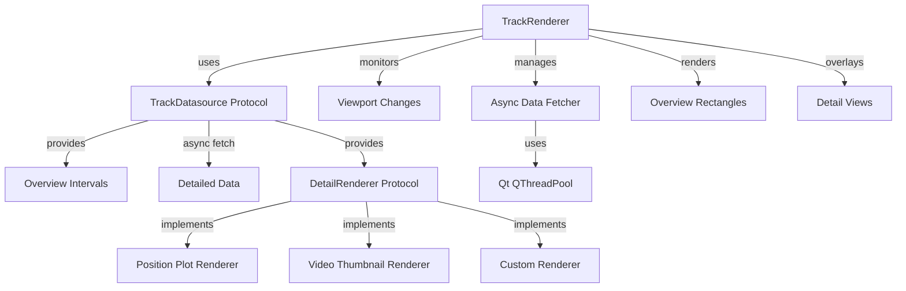

# Timeline Track Rendering Interface with Async Deta

il Loading

## Overview

This plan implements a timeline track rendering system that supports:

1. **Overview rendering**: Simple interval rectangles showing data availability
2. **Async detail loading**: Detailed data fetched when intervals enter the viewport
3. **Flexible rendering**: Protocol-based system supporting different track types (position plots, video thumbnails, etc.)
4. **Performance**: Qt worker threads for async fetching with caching

## Architecture




## Implementation Details

### 1. Protocol Definitions

**File**: `pypho_timeline/rendering/datasources/track_datasource.py`

- `TrackDatasource` protocol extending `IntervalsDatasource`:
- `get_overview_intervals() -> pd.DataFrame`: Returns overview interval data
- `fetch_detailed_data(interval: pd.Series) -> Any`: Synchronous interface (called from worker)
- `get_detail_renderer() -> DetailRenderer`: Returns renderer for this track type
- `get_detail_cache_key(interval: pd.Series) -> str`: Unique key for caching
- `DetailRenderer` protocol:
- `render_detail(plot_item: pg.PlotItem, interval: pd.Series, detail_data: Any) -> List[pg.GraphicsObject]`: Renders detailed view
- `clear_detail(plot_item: pg.PlotItem, graphics_objects: List[pg.GraphicsObject])`: Cleans up rendered objects
- `get_detail_bounds(interval: pd.Series, detail_data: Any) -> Tuple[float, float, float, float]`: Returns (x_min, x_max, y_min, y_max) for detail view

### 2. Async Data Fetching

**File**: `pypho_timeline/rendering/async_detail_fetcher.py`

- `AsyncDetailFetcher` class:
- Manages Qt `QThreadPool` for worker threads
- `fetch_detail_async(track_id: str, interval: pd.Series, callback: Callable)`: Queues async fetch
- `cancel_pending_fetches(track_id: str, interval_keys: List[str])`: Cancels fetches for intervals that left viewport
- In-memory cache with LRU eviction for fetched detail data
- Emits Qt signals when detail data is ready

### 3. Track Renderer

**File**: `pypho_timeline/rendering/graphics/track_renderer.py`

- `TrackRenderer` class:
- Manages overview `IntervalRectsItem` for a track
- Tracks which intervals are currently in viewport
- Manages overlay graphics items for detailed views
- Integrates with `AsyncDetailFetcher` for data loading
- Handles viewport changes via `LiveWindowEventIntervalMonitoringMixin`
- Updates overlay positions when viewport scrolls

### 4. Track Rendering Mixin

**File**: `pypho_timeline/rendering/mixins/track_rendering_mixin.py`

- `TrackRenderingMixin` class:
- Extends `EpochRenderingMixin` functionality
- `add_track(track_datasource: TrackDatasource, name: str, **kwargs)`: Adds a new track
- `remove_track(name: str)`: Removes a track
- Manages multiple `TrackRenderer` instances
- Connects to viewport change signals
- Provides track-specific configuration (height, colors, etc.)

### 5. Built-in Detail Renderers

**File**: `pypho_timeline/rendering/detail_renderers/__init__.py`

- `PositionPlotDetailRenderer`: Renders position data as `pg.PlotDataItem` line plot
- `VideoThumbnailDetailRenderer`: Renders video frames as `pg.ImageItem` thumbnails
- `GenericPlotDetailRenderer`: Generic renderer for arbitrary plot data

### 6. Integration Points

- Extend `EpochRenderingMixin.add_rendered_intervals()` to accept `TrackDatasource`
- Update `LiveWindowEventIntervalMonitoringMixin` to work with `TrackRenderer`
- Add viewport monitoring to `PyqtgraphTimeSynchronizedWidget`

## File Structure

```javascript
pypho_timeline/rendering/
├── datasources/
│   ├── track_datasource.py          # TrackDatasource and DetailRenderer protocols
│   └── interval_datasource.py       # (existing)
├── graphics/
│   ├── track_renderer.py            # TrackRenderer class
│   └── interval_rects_item.py       # (existing)
├── mixins/
│   ├── track_rendering_mixin.py     # TrackRenderingMixin
│   ├── epoch_rendering_mixin.py     # (existing, may extend)
│   └── live_window_monitoring_mixin.py  # (existing)
├── detail_renderers/
│   ├── __init__.py
│   ├── position_plot_renderer.py
│   ├── video_thumbnail_renderer.py
│   └── generic_plot_renderer.py
└── async_detail_fetcher.py           # AsyncDetailFetcher class
```


## Usage Example

```python
# Define a position track datasource
class PositionTrackDatasource:
    def get_overview_intervals(self) -> pd.DataFrame:
        # Return intervals where position data exists
        return self.df[['t_start', 't_duration', ...]]
    
    def fetch_detailed_data(self, interval: pd.Series) -> pd.DataFrame:
        # Fetch position samples for this interval
        mask = (self.position_df['t'] >= interval['t_start']) & \
               (self.position_df['t'] < interval['t_start'] + interval['t_duration'])
        return self.position_df[mask]
    
    def get_detail_renderer(self) -> DetailRenderer:
        return PositionPlotDetailRenderer()

# Add track to timeline
timeline_widget.add_track(
    track_datasource=PositionTrackDatasource(...),
    name='position_track',
    height=100
)
```


## Performance Considerations

- **Caching**: LRU cache for fetched detail data (configurable size)
- **Debouncing**: Rate-limit viewport change handlers to prevent excessive fetches
- **Cancellation**: Cancel pending fetches when intervals leave viewport
- **Lazy loading**: Only fetch details for visible intervals
- **Memory management**: Clear detail graphics when intervals leave viewport

## Testing Strategy