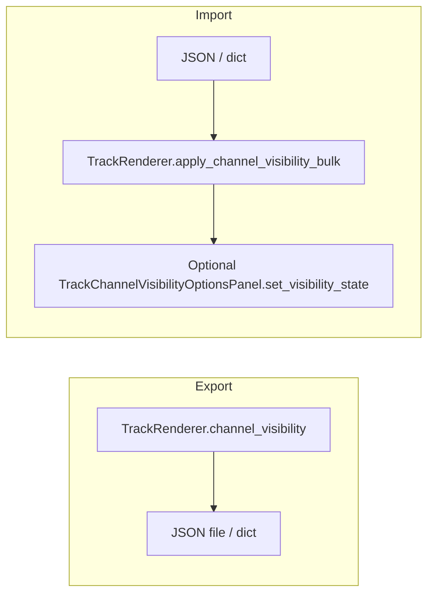

# Save / restore track options (channel visibility)

## Current behavior

- Per-track UI lives on `[PyqtgraphTimeSynchronizedWidget.getOptionsPanel()](c:\Users\pho\repos\EmotivEpoc\ACTIVE_DEV\pyPhoTimeline\pypho_timeline\core\pyqtgraph_time_synchronized_widget.py)`: for channel-based detail renderers it builds `[TrackChannelVisibilityOptionsPanel](c:\Users\pho\repos\EmotivEpoc\ACTIVE_DEV\pyPhoTimeline\pypho_timeline\widgets\track_options_panels.py)`, wired to `[TrackRenderer.update_channel_visibility](c:\Users\pho\repos\EmotivEpoc\ACTIVE_DEV\pyPhoTimeline\pypho_timeline\rendering\graphics\track_renderer.py)` (single-channel updates each trigger `_trigger_visibility_render()`).
- Authoritative runtime state for visibility is `[TrackRenderer.channel_visibility](c:\Users\pho\repos\EmotivEpoc\ACTIVE_DEV\pyPhoTimeline\pypho_timeline\rendering\graphics\track_renderer.py)` (initialized from `detail_renderer.channel_names`); `_render_detail` copies it onto `detail_renderer` as needed.
- `[SimpleTimelineWidget](c:\Users\pho\repos\EmotivEpoc\ACTIVE_DEV\pyPhoTimeline\pypho_timeline\widgets\simple_timeline_widget.py)` + `[TrackRenderingMixin](c:\Users\pho\repos\EmotivEpoc\ACTIVE_DEV\pyPhoTimeline\pypho_timeline\rendering\mixins\track_rendering_mixin.py)` expose `get_all_track_names()`, `get_track()`, and `get_track_tuple()` for iteration.

Compare tracks use distinct names (default `{primary}__compare` in `add_compare_track_view`), so saving keyed by track name naturally keeps primary vs compare separate.

## Design

- **Serialize from `TrackRenderer`**, not only from the panel, so configs can be saved before the dock/options UI ever opens.
- **Restore via one new bulk API** on `TrackRenderer` that updates all overlapping keys, optionally refreshes `_options_panel` with `set_visibility_state(..., emit_signals=False)`, then calls `_trigger_visibility_render()` **once** if anything changed.
- **JSON shape** (extensible): top-level `version` (int), `tracks` mapping `track_name -> { "kind": "channel_visibility", "channel_visibility": { str: bool } }`. Tracks with no channel visibility (empty dict / no channel names) are omitted from `tracks`.

## File changes

1. `**[pypho_timeline/rendering/graphics/track_renderer.py](c:\Users\pho\repos\EmotivEpoc\ACTIVE_DEV\pyPhoTimeline\pypho_timeline\rendering\graphics\track_renderer.py)`** (small, required for performance)
  - Add `apply_channel_visibility_bulk(self, visibility: Dict[str, bool]) -> bool` (or similar name): for each key in `visibility` that exists in `self.channel_visibility`, apply; skip unknown keys; if any value changed, sync `_options_panel` if set, then `_trigger_visibility_render()` once; return whether a rerender was triggered.
2. `**[pypho_timeline/widgets/track_options_panels.py](c:\Users\pho\repos\EmotivEpoc\ACTIVE_DEV\pyPhoTimeline\pypho_timeline\widgets\track_options_panels.py)**`
  - Define constants: e.g. `TRACK_OPTIONS_CONFIG_VERSION = 1`, `TRACK_OPTIONS_KIND_CHANNEL_VISIBILITY = "channel_visibility"`.
  - On `OptionsPanel`: optional hooks for future panels — e.g. `track_options_kind() -> Optional[str]` default `None`, `dump_track_options_state() -> Optional[Dict[str, Any]]` default `None`, `apply_track_options_state(data: Dict[str, Any]) -> None` default no-op.
  - On `TrackChannelVisibilityOptionsPanel`: implement hooks using existing `get_visibility_state` / `set_visibility_state` (for symmetry and future UI-driven export of panel-only fields).
  - Add small module-level helpers (optional but keeps widget thin): `build_track_options_document(track_renderers: Dict[str, TrackRenderer]) -> dict` and `apply_track_options_document(doc: dict, track_renderers: Dict[str, TrackRenderer], *, missing_track: str = "skip")` — or keep helpers as private functions next to the widget if you prefer zero extra public API on the module.
3. `**[pypho_timeline/widgets/simple_timeline_widget.py](c:\Users\pho\repos\EmotivEpoc\ACTIVE_DEV\pyPhoTimeline\pypho_timeline\widgets\simple_timeline_widget.py)**`
  - Public methods, e.g. `get_track_options_config() -> dict` and `set_track_options_config(config: dict) -> None` (validate `version`, ignore unknown kinds for forward compatibility).
  - Optional convenience: `save_track_options_config_to_path(path: Union[str, Path])` / `load_track_options_config_from_path(path: Union[str, Path])` using `json` + UTF-8.
  - Optional UX: two buttons in the existing `controls_layout` (next to interval jump / split) — “Save track options…” / “Load track options…” using `QFileDialog.getSaveFileName` / `getOpenFileName` (default filter `*.json`). Wire to the methods above.

## Edge cases

- **Unknown track names** in file: skip (log at debug/info).
- **Unknown channels** for an existing track: skip those keys (same as `update_channel_visibility` today).
- **Tracks without channels**: no entry in `tracks`; nothing to apply.
- **Panel created after load**: `getOptionsPanel()` already seeds from `track_renderer.channel_visibility` — no extra work if bulk apply updates the renderer first.

## Out of scope (unless you want them in the same change)

- Normalization modes, dock geometry, window position, or other non-options-panel state.
- Automatic persistence (e.g. `QSettings`) without an explicit file or caller.

