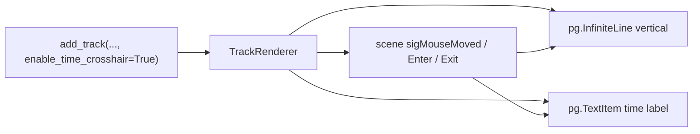

# Simple vertical time crosshair overlay on tracks

## Goal

Implement a crosshair overlay on timeline tracks that:

- Renders **only a vertical line** (no horizontal line)
- Shows a **label** that reflects the **x-axis (time)** — formatted as datetime when `reference_datetime` is set, or as `t = X.XX s` otherwise

## Architecture

- **Ownership**: The overlay lives in [TrackRenderer](pypho_timeline/rendering/graphics/track_renderer.py). TrackRenderer already has `plot_item`, and already resolves `reference_datetime` from the parent timeline for the vispy video path (lines 124–179). Reuse that resolution for time formatting.
- **Why TrackRenderer**: Works for any track regardless of widget type; keeps all track visuals in one place; cleanup in `remove()` is straightforward.

## Implementation

### 1. TrackRenderer – overlay setup and teardown

**New state (optional):**

- `self._time_crosshair_vline`: `pg.InfiniteLine(angle=90, movable=False)` added to `self.plot_item` with `ignoreBounds=True`, initially hidden.
- `self._time_crosshair_label`: `pg.TextItem` (e.g. anchor `(0.5, 0)` so it sits above the line), added to `plot_item`, initially hidden.
- `self._time_crosshair_proxy`: `pg.SignalProxy` for rate-limited `sigMouseMoved`.
- `self._reference_datetime`: resolved once when enabling the overlay (same parent-walk logic as existing vispy block, or from a new helper used there).

**New method:** `enable_time_crosshair_overlay(self)` (or call from `__init_`_ when a kwarg is True):

- Resolve `reference_datetime` (reuse the pattern in the existing block around 124–179 that walks parent/timeline; store in `self._reference_datetime`).
- Create and add vLine and TextItem to `self.plot_item`; store refs.
- Connect `plot_item.scene().sigMouseMoved` via `pg.SignalProxy(..., rateLimit=60)` to a slot `_on_time_crosshair_mouse_moved(pos)`.
- Connect `plot_item.scene().sigMouseEntered` / `sigMouseExited` to show/hide vLine and label.

**Mouse handler `_on_time_crosshair_mouse_moved(self, pos)`:**

- If `not plot_item.sceneBoundingRect().contains(pos)`: hide vLine and label, return.
- `vb = plot_item.getViewBox()`, `mousePoint = vb.mapSceneToView(pos)`, `x_point = mousePoint.x()`.
- `vLine.setPos(x_point)`, `vLine.setVisible(True)`.
- Get current view y range: `x_range, y_range = vb.viewRange()`, use `y_range[1]` (top) for label placement so the label sits at the top of the track.
- Format time string:
  - If `self._reference_datetime` is set: treat x as Unix timestamp → `unix_timestamp_to_datetime(x_point)` from [datetime_helpers](pypho_timeline/utils/datetime_helpers.py), then e.g. `dt.strftime('%H:%M:%S.%f')` or `'%Y-%m-%d %H:%M:%S'`.
  - Else: `f"t = {x_point:.2f} s"`.
- `label.setPos(x_point, y_top)`, `label.setText(time_str)`, `label.setVisible(True)`.

**Cleanup in `remove()`:**

- Disconnect the mouse proxy.
- If `_time_crosshair_vline` / `_time_crosshair_label` exist, `plot_item.removeItem(...)`, set refs to None.

**Constructor:** Add an optional kwarg `enable_time_crosshair: bool = False`. If True, call `enable_time_crosshair_overlay()` at the end of `__init_`_ (after `_update_overview()`). This keeps the API minimal and avoids `add_track` having to call a second method.

### 2. TrackRenderingMixin.add_track

- Pass through kwargs to `TrackRenderer`: `TrackRenderer(..., **kwargs)`.
- No need to parse `enable_time_crosshair` in the mixin; TrackRenderer will read it in `__init_`_ and call `enable_time_crosshair_overlay()` when True.

### 3. Time formatting details

- Use existing helpers from [pypho_timeline/utils/datetime_helpers.py](pypho_timeline/utils/datetime_helpers.py): `unix_timestamp_to_datetime(ts)` when x is Unix (i.e. when `reference_datetime` was set on the timeline). When x is relative seconds (no reference_datetime), display raw seconds as `t = X.XX s`.
- Optional: accept a small threshold (e.g. x > 1e9) to auto-detect Unix vs seconds if reference_datetime is missing; otherwise rely on presence of `reference_datetime` only.

### 4. Enabling the overlay

- **Per track**: When adding a track, pass `enable_time_crosshair=True`, e.g. in [SimpleTimelineWidget.add_video_track](pypho_timeline/widgets/simple_timeline_widget.py) or in timeline_builder when creating tracks. Example: `self.add_track(video_datasource, name=track_name, plot_item=plot_item, enable_time_crosshair=True)`.
- No change required for tracks that should not show the overlay (default remains False).

## Files to touch

| File                                                                                                                 | Changes                                                                                                                                                                                                                 |
| -------------------------------------------------------------------------------------------------------------------- | ----------------------------------------------------------------------------------------------------------------------------------------------------------------------------------------------------------------------- |
| [pypho_timeline/rendering/graphics/track_renderer.py](pypho_timeline/rendering/graphics/track_renderer.py)           | Add `enable_time_crosshair` kwarg in `__init_`_; add `enable_time_crosshair_overlay()`, `_on_time_crosshair_mouse_moved()`, enter/exit slots; add cleanup in `remove()`. Reuse or factor reference_datetime resolution. |
| [pypho_timeline/rendering/mixins/track_rendering_mixin.py](pypho_timeline/rendering/mixins/track_rendering_mixin.py) | Pass `**kwargs` from `add_track` into `TrackRenderer(...)` so `enable_time_crosshair` is forwarded.                                                                                                                     |
| [pypho_timeline/widgets/simple_timeline_widget.py](pypho_timeline/widgets/simple_timeline_widget.py)                 | Optional: pass `enable_time_crosshair=True` in `add_track()` for one track (e.g. first video track) so the feature is visible by default in the simple widget; or leave as opt-in only.                                 |

## Edge cases

- **No reference_datetime**: Label shows `t = X.XX s`; no dependency on datetime axis.
- **View range**: Label y position uses current view’s y range so it stays at the top of the visible track.
- **Multiple tracks**: Each TrackRenderer is independent; enable the overlay only on the tracks where it is desired.

## Testing

- Run the app (or testing_notebook) with at least one track added with `enable_time_crosshair=True`; move the mouse over the track and confirm the vertical line and time label appear and update, and disappear when leaving the plot. Remove the track and confirm no errors and overlay is gone.

