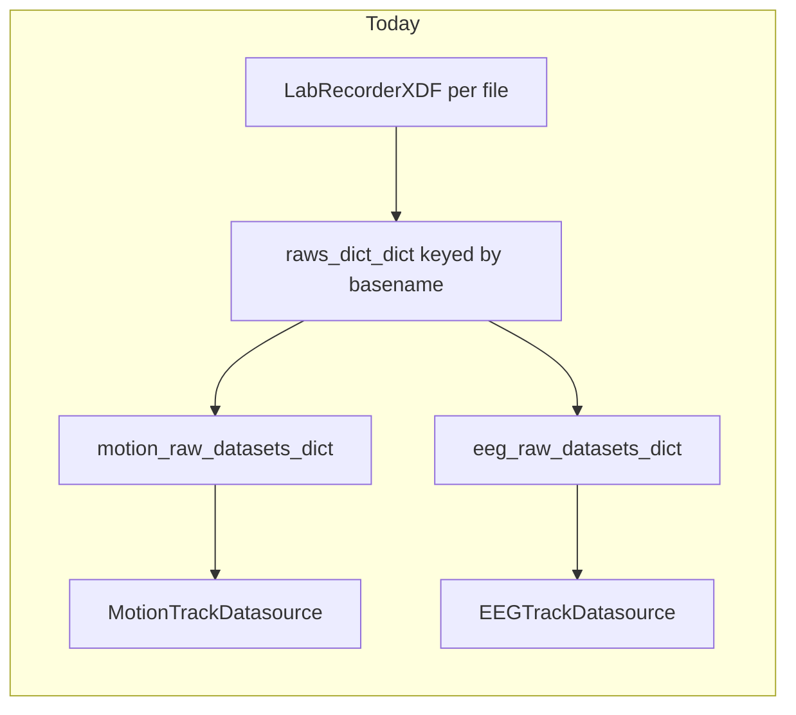
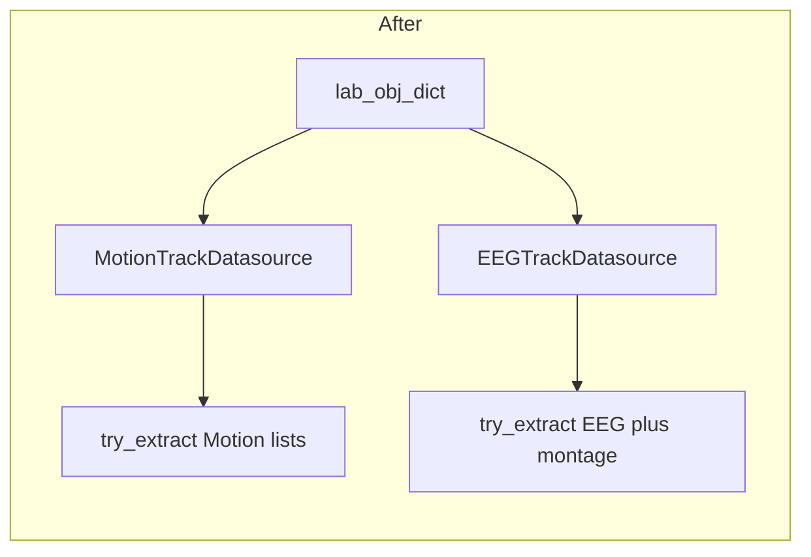

# Plan: Modal raw extraction via `lab_obj_dict`

## Context

- `[LabRecorderXDF](file:///C:/Users/pho/repos/EmotivEpoc/ACTIVE_DEV/PhoPyMNEHelper/src/phopymnehelper/xdf_files.py)` stores per-file MNE raws in `datasets_dict: Dict[DataModalityType, List[mne.io.Raw]]` (keys are **enum members**, not `.value` integers).
- `[_subfn_process_xdf_file](file:///C:/Users/pho/repos/EmotivEpoc/ACTIVE_DEV/pyPhoTimeline/pypho_timeline/rendering/datasources/stream_to_datasources.py)` already sets `a_raws_dict = a_lab_obj.datasets_dict or {}`, so the same information is on each `LabRecorderXDF` instance in `lab_obj_dict`.
- Today, `[perform_process_all_streams_multi_xdf](file:///C:/Users/pho/repos/EmotivEpoc/ACTIVE_DEV/pyPhoTimeline/pypho_timeline/rendering/datasources/stream_to_datasources.py)` duplicates that into `motion_raw_datasets_dict` / `eeg_raw_datasets_dict` before constructing `[MotionTrackDatasource](file:///C:/Users/pho/repos/EmotivEpoc/ACTIVE_DEV/pyPhoTimeline/pypho_timeline/rendering/datasources/specific/motion.py)` / `[EEGTrackDatasource](file:///C:/Users/pho/repos/EmotivEpoc/ACTIVE_DEV/pyPhoTimeline/pypho_timeline/rendering/datasources/specific/eeg.py)`.







## 1. Base behavior in `[track_datasource.py](file:///C:/Users/pho/repos/EmotivEpoc/ACTIVE_DEV/pyPhoTimeline/pypho_timeline/rendering/datasources/track_datasource.py)` (`RawProvidingTrackDatasource`)

- Add a hook (not a separate `typing.Protocol` unless you want static checks later):

```python
def try_extract_raw_datasets_dict(self) -> Optional[Dict[str, Optional[List[Any]]]]:
    return None
```

- In `__init__`, after assigning `_lab_obj_dict`, if `raw_datasets_dict is None`, set `_raw_datasets_dict = self.try_extract_raw_datasets_dict()` so dynamic dispatch hits subclasses when they extend `RawProvidingTrackDatasource`.
- Keep the existing `raw_datasets_dict` constructor argument for overrides/tests; only auto-fill when the caller passes `None`.
- Document in the class docstring that modality classes implement extraction from `lab_obj_dict`.

## 2. `[MotionTrackDatasource](file:///C:/Users/pho/repos/EmotivEpoc/ACTIVE_DEV/pyPhoTimeline/pypho_timeline/rendering/datasources/specific/motion.py)`

- Override `try_extract_raw_datasets_dict`: for each `source_id, lab` in `self.lab_obj_dict`, if `lab` is None or `lab.datasets_dict` is falsy, map `source_id -> None`; else take `list(lab.datasets_dict.get(DataModalityType.MOTION, []) or [])` and map to `None` if empty (match current “no raw” semantics).
- Import `DataModalityType` from the same place as elsewhere (e.g. `phopymnehelper.SavedSessionsProcessor`).
- Two blank lines between methods (per project convention).

## 3. `[EEGTrackDatasource](file:///C:/Users/pho/repos/EmotivEpoc/ACTIVE_DEV/pyPhoTimeline/pypho_timeline/rendering/datasources/specific/eeg.py)`

- Override `try_extract_raw_datasets_dict` to mirror the **intent** of current `[stream_to_datasources.py` lines 508–514](file:///C:/Users/pho/repos/EmotivEpoc/ACTIVE_DEV/pyPhoTimeline/pypho_timeline/rendering/datasources/stream_to_datasources.py): per source, take EEG lists from `lab.datasets_dict.get(DataModalityType.EEG, [])`, run `up_convert_raw_objects` when non-empty, build the dict.
- Move **global** montage setup here: flatten all non-empty per-source lists and call `EEGData.set_montage(datasets_EEG=...)` once when there is at least one raw (same as today, but colocated with extraction so callers do not duplicate it).
- **EEGSpectrogramTrackDatasource**: no change required if it continues to receive `raw_datasets_dict` from the parent EEG datasource (parent will now populate via extraction when `lab_obj_dict` is present).

## 4. Call site cleanup in `[stream_to_datasources.py](file:///C:/Users/pho/repos/EmotivEpoc/ACTIVE_DEV/pyPhoTimeline/pypho_timeline/rendering/datasources/stream_to_datasources.py)`

- **MOTION branch**: remove `motion_raw_datasets_dict` construction and `raw_datasets_dict=...` from `MotionTrackDatasource.from_multiple_sources`; pass only `lab_obj_dict=lab_obj_dict` (or omit `raw_datasets_dict` so it stays `None` and triggers extraction).
- Update the post-create loop that picks `raw = _lst[0]` for `MotionData.find_high_accel_periods` to iterate `datasource.raw_datasets_dict` (same structure as before).
- **EEG branch**: remove `eeg_raw_datasets_dict` construction, the per-key `up_convert_raw_objects` loop, and the `EEGData.set_montage` block before datasource creation. Pass only `lab_obj_dict`; montage runs inside `EEGTrackDatasource.try_extract_raw_datasets_dict`.
- Update downstream loops that scan for first non-empty EEG raw to use `datasource.raw_datasets_dict`.

**Note:** Switching lookups to enum keys (`DataModalityType.EEG` / `MOTION`) fixes a likely mismatch with the current `.get(DataModalityType.EEG.value, [])` pattern (`.value` is an int under `auto()`, not the dict key type).

## 5. Out of scope / follow-ups

- `[timeline_builder.py](file:///C:/Users/pho/repos/EmotivEpoc/ACTIVE_DEV/pyPhoTimeline/pypho_timeline/timeline_builder.py)` merge paths for `EEGTrackDatasource` / `MotionTrackDatasource` do not currently forward `lab_obj_dict` / `raw_datasets_dict`; merging multiple segment datasources may still drop those handles. Not part of this change unless you want merge-time dict union in the same PR.

## 6. Verification

- Run existing tests or a minimal import/`uv run` smoke path that builds datasources from XDF (if available).
- Manually: open timeline from multi-XDF path and confirm motion bad-interval logic and EEG spectrogram branch still find a raw when XDF processing is enabled.

