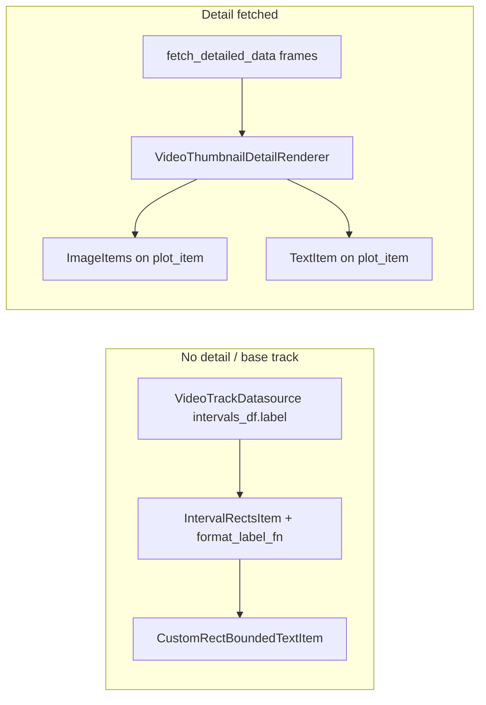

# Video track filename labels (overview + detail)

## Context

- **Without detail**: [`TrackRenderer._update_overview`](c:\Users\pho\repos\EmotivEpoc\ACTIVE_DEV\pyPhoTimeline\pypho_timeline\rendering\graphics\track_renderer.py) already passes `format_label_fn` for `VideoTrackDatasource`, which reads [`IntervalRectsItemData.label`](c:\Users\pho\repos\EmotivEpoc\ACTIVE_DEV\pyPhoTimeline\pypho_timeline\rendering\graphics\interval_rects_item.py). [`VideoTrackDatasource`](c:\Users\pho\repos\EmotivEpoc\ACTIVE_DEV\pyPhoTimeline\pypho_timeline\rendering\datasources\specific\video.py) fills `label` from `Path(video_file_path).name`. [`Render2DEventRectanglesHelper._build_interval_tuple_list_from_dataframe`](c:\Users\pho\repos\EmotivEpoc\ACTIVE_DEV\pyPhoTimeline\pypho_timeline\rendering\helpers\render_rectangles_helper.py) includes `label` on each `IntervalRectsItemData` when the column exists.
- **Overview rendering**: [`IntervalRectsItem.rebuild_label_items`](c:\Users\pho\repos\EmotivEpoc\ACTIVE_DEV\pyPhoTimeline\pypho_timeline\rendering\graphics\interval_rects_item.py) builds [`CustomRectBoundedTextItem`](c:\Users\pho\repos\EmotivEpoc\ACTIVE_DEV\pyPhoTimeline\pypho_timeline\_embed\AlignableTextItem.py) and calls `updatePosition()`, which places text **horizontally** at **top center** of the interval rect—not vertical.
- **With detail**: [`VideoThumbnailDetailRenderer.render_detail`](c:\Users\pho\repos\EmotivEpoc\ACTIVE_DEV\pyPhoTimeline\pypho_timeline\rendering\datasources\specific\video.py) adds a `pg.TextItem` and then thumbnail `ImageItem`s on the **same** `plot_item`. Items added later paint on top; text is added **before** thumbnails, so thumbnails can hide the label unless z-values/order are fixed. There is also an **x-axis inconsistency** when `use_vlc_item` is false: `t_start_sec` is forced to `0.0` but thumbnail `x_start` still uses raw `t_start` (see ~442–445 vs ~485).

## Minimal changes (recommended)

### 1. Vertical filename on overview rectangles

**File**: [`pypho_timeline/_embed/AlignableTextItem.py`](c:\Users\pho\repos\EmotivEpoc\ACTIVE_DEV\pyPhoTimeline\pypho_timeline\_embed\AlignableTextItem.py)

- Extend `CustomRectBoundedTextItem.__init__` with a small, explicit layout flag (e.g. `filename_vertical: bool = False` or `layout_mode: str = "top_center"`), stored on the instance.
- In `updatePosition()`, branch:
  - **Default** (current): top-center horizontal text.
  - **Vertical filename**: `setRotation(90)`, anchor e.g. `(0, 0.5)`, `setPos(a_rect.left(), a_rect.center().y())` so the label sits along the **left edge** of the interval and stays readable in the track band.

**File**: [`pypho_timeline/rendering/graphics/interval_rects_item.py`](c:\Users\pho\repos\EmotivEpoc\ACTIVE_DEV\pyPhoTimeline\pypho_timeline\rendering\graphics\interval_rects_item.py)

- Add one optional constructor argument (e.g. `label_layout: str = "top_center"`) and pass it into `CustomRectBoundedTextItem(...)` when building each label in `rebuild_label_items`.
- Thread the same kwarg through copies if any code paths reconstruct `IntervalRectsItem` without it (keep default for non-video tracks).

**File**: [`pypho_timeline/rendering/graphics/track_renderer.py`](c:\Users\pho\repos\EmotivEpoc\ACTIVE_DEV\pyPhoTimeline\pypho_timeline\rendering\graphics\track_renderer.py)

- When calling `Render2DEventRectanglesHelper.build_IntervalRectsItem_from_interval_datasource(...)`, pass `label_layout="vertical_left"` (exact name as implemented) **only** for `VideoTrackDatasource` alongside existing `format_label_fn`.

[`build_IntervalRectsItem_from_interval_datasource`](c:\Users\pho\repos\EmotivEpoc\ACTIVE_DEV\pyPhoTimeline\pypho_timeline\rendering\helpers\render_rectangles_helper.py) already forwards `**kwargs` into `IntervalRectsItem`, so no signature change required there beyond documenting the new optional arg.

### 2. Filename visible when detail thumbnails are drawn

**File**: [`pypho_timeline/rendering/datasources/specific/video.py`](c:\Users\pho\repos\EmotivEpoc\ACTIVE_DEV\pyPhoTimeline\pypho_timeline\rendering\datasources\specific\video.py) (`VideoThumbnailDetailRenderer`)

- **Unify X coordinates**: Compute a single `t_start_unix = scalar_interval_t_start_to_unix_seconds(t_start)` (and derive thumbnail positions from `t_start_unix + …`) for **both** VLC and non-VLC paths so text and thumbnails share the same axis as the rest of the timeline.
- **Draw order / stacking**: Add the filename `TextItem` **after** thumbnail `ImageItem`s **or** give the text item a **higher** `setZValue(...)` than images so filenames are not covered.
- **Placement**: Match overview intent: left edge of interval, vertically oriented (`setRotation(90)`), vertically centered in the row (`y_center` already computed)—consistent with `CustomRectBoundedTextItem` vertical mode so overlapping reads as one label when both layers align.
- **Bugfix**: In the branch that skips adding text, the current code references `text_item` in the warning ([~475](c:\Users\pho\repos\EmotivEpoc\ACTIVE_DEV\pyPhoTimeline\pypho_timeline\rendering\datasources\specific\video.py)); replace with a safe message (e.g. log `video_label` only).

### 3. Data sanity (only if needed)

**File**: [`VideoTrackDatasource`](c:\Users\pho\repos\EmotivEpoc\ACTIVE_DEV\pyPhoTimeline\pypho_timeline\rendering\datasources\specific\video.py)

- Confirm every construction path keeps `video_file_path` and thus `label` (already set in `__init__`). If you load intervals from CSV without repopulating `label`, ensure `label` is still derived from `video_file_path` (constructor already does this when column exists).

## What we are not doing (scope)

- No notebook edits.
- No change to `update_viewport` video special-case (`handle_video_tracks_differently` remains `False`) unless you explicitly want video to skip async detail again.

## Verification

- Scroll timeline so a video interval is **in view** but wait before thumbnails load: filename visible on blue bar (overview).
- After thumbnails appear: filename still visible (not obscured), vertical, same filename.
- Spot-check both with and without `video_file_path` / VLC path if you use both modes.
