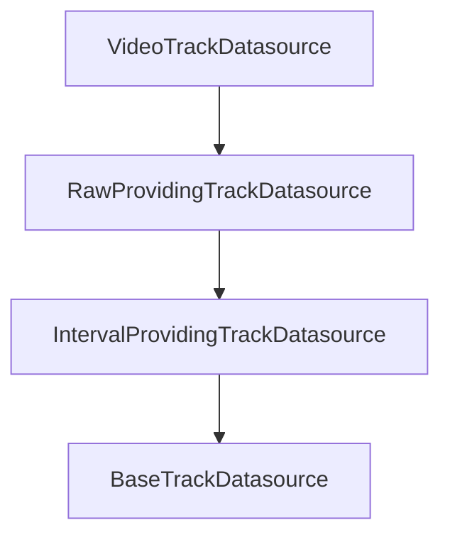

# Subclass `VideoTrackDatasource` from `RawProvidingTrackDatasource`

## Context

`[RawProvidingTrackDatasource](C:\Users\pho\repos\EmotivEpoc\ACTIVE_DEV\pyPhoTimeline\pypho_timeline\rendering\datasources\track_datasource.py)` (lines 787–875) subclasses `IntervalProvidingTrackDatasource` and only adds:

- Constructor args `lab_obj` / `raw_datasets` (default `None`) forwarded to the same interval/detail base state
- Properties `lab_xdf_obj` and `raw_datasets`

It does **not** override `fetch_detailed_data`, `get_detail_cache_key`, or `get_detail_renderer`. So `[VideoTrackDatasource](C:\Users\pho\repos\EmotivEpoc\ACTIVE_DEV\pyPhoTimeline\pypho_timeline\rendering\datasources\specific\video.py)` can move under `RawProvidingTrackDatasource` with almost no behavioral change: `super()` in `get_detail_cache_key` still resolves to `IntervalProvidingTrackDatasource.get_detail_cache_key`.

## Code changes (single file)

Edit `[video.py](C:\Users\pho\repos\EmotivEpoc\ACTIVE_DEV\pyPhoTimeline\pypho_timeline\rendering\datasources\specific\video.py)`:

1. **Import** (line 13): replace `IntervalProvidingTrackDatasource` with `RawProvidingTrackDatasource` on the existing `track_datasource` import line (it is the only use of `IntervalProvidingTrackDatasource` in this file).
2. **Class declaration** (~549): `class VideoTrackDatasource(RawProvidingTrackDatasource):`
3. **Class docstring** (~551–553): say it inherits from `RawProvidingTrackDatasource` and note optional XDF/MNE hooks via the parent (aligned with `[MotionTrackDatasource](C:\Users\pho\repos\EmotivEpoc\ACTIVE_DEV\pyPhoTimeline\pypho_timeline\rendering\datasources\specific\motion.py)` doc style).
4. `**__init__`** (~582–666):
  - **Minimal:** no change to the existing `super().__init__(intervals_df, detailed_df=None, custom_datasource_name=custom_datasource_name, parent=parent)` — `lab_obj` and `raw_datasets` default to `None` on the parent.  
  - **Recommended (optional):** add optional `lab_obj: Optional[LabRecorderXDF] = None` and `raw_datasets: Optional[List[mne.io.Raw]] = None` to the constructor signature (same pattern as `MotionTrackDatasource`) and pass them into `super().__init__(..., lab_obj=lab_obj, raw_datasets=raw_datasets, parent=parent)`. This requires importing `LabRecorderXDF` and `List` / `mne` types consistent with `[track_datasource.py](C:\Users\pho\repos\EmotivEpoc\ACTIVE_DEV\pyPhoTimeline\pypho_timeline\rendering\datasources\track_datasource.py)` / `[motion.py](C:\Users\pho\repos\EmotivEpoc\ACTIVE_DEV\pyPhoTimeline\pypho_timeline\rendering\datasources\specific\motion.py)` (likely `from phopymnehelper...` and `import mne` if not already in `video.py`).

No changes needed to: `fetch_detailed_data`, `get_detail_renderer`, `get_detail_cache_key`, `save_metadata_csv`, `init_from_saved_metadata_csv`, or `[specific/__init__.py](C:\Users\pho\repos\EmotivEpoc\ACTIVE_DEV\pyPhoTimeline\pypho_timeline\rendering\datasources\specific\__init__.py)`.

## Call sites and types

- `[track_renderer.py](C:\Users\pho\repos\EmotivEpoc\ACTIVE_DEV\pyPhoTimeline\pypho_timeline\rendering\graphics\track_renderer.py)` uses `isinstance(..., VideoTrackDatasource)` — unchanged.
- `isinstance(video_ds, IntervalProvidingTrackDatasource)` remains **True** (subclass of `RawProviding`).
- `isinstance(video_ds, RawProvidingTrackDatasource)` becomes **True**.

## Verification

- Run analyzer/tests on the package as you usually do (e.g. `uv run` + focused import of `VideoTrackDatasource` and a small instantiation from `video_paths` or empty `video_intervals_df`).

If you want **only** the mechanical base-class swap without new constructor parameters, skip step 4’s optional imports and keep the existing `super().__init__` call as-is.