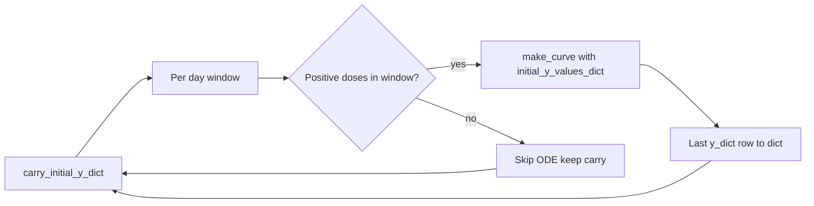

# Windowed DA/NE computation blocks in quantization

## Current gaps

[`ComputationTimeBlock.init_from_start_end_date`](c:/Users/pho/repos/EmotivEpoc/ACTIVE_DEV/Dose-Analysis-Python/src/dose_analysis_python/Helpers/quantization.py) (lines 175–238):

- Returns a list of **3-tuples** `(a_curr_start_date, a_curr_end_date, curr_block_records_df)` instead of **`ComputationTimeBlock`** instances (the attrs class at 160–172 is never instantiated).
- **`active_model.compute()`** does not pass `initial_y_values_dict`: [`BaseDoseCurveModel.compute`](c:/Users/pho/repos/EmotivEpoc/ACTIVE_DEV/Dose-Analysis-Python/src/dose_analysis_python/DoseCurveCalculation/BaseDoseCurveModel.py) only calls `make_curve(..., backend=self.parameters.get('backend', "pysb"))` and ignores other keys in `parameters` (lines 51–53). So carryover state cannot reach `computeDoseCurve` via `compute()` today.
- **Empty window branch** is `pass`: no carry logic, no structured result.
- **`merge_positive_dose_events`** raises `ValueError` if there are **no positive doses** in `recordSeries`; an empty slice or all-zero block must **not** call `make_curve` / `compute` without a guard (same as “no records in range”).

## Intended behavior (from comments + DA/NE API)

1. **Loop state**: `carry_initial: Optional[Dict[str, float]] = None` (keys aligned with [`STATE_NAMES_7`](c:/Users/pho/repos/EmotivEpoc/ACTIVE_DEV/Dose-Analysis-Python/src/dose_analysis_python/DoseCurveCalculation/pysb_pkpd_da_ne_monoamine.py)); first window uses `None` (defaults inside `merge_initial_y_values_dict`).
2. **When the window has data to simulate**: After `Quanta.get_quanta(record_df=curr_block_records_df)`, build `PySbPKPD_DA_NE_DoseCurveModel(recordSeries=curr_block_records_df, quanta=a_curr_quanta, max_events=..., follow_h_after_last=...)` and call **`make_curve(..., should_return_result_dict=True, initial_y_values_dict=carry_initial, backend=...)`** (not `compute()`), so `initial_y_values_dict` is honored. Use the same `backend` for all blocks (parameter default `"pysb"` with optional override argument on `init_from_start_end_date`).
3. **After a successful curve**: Set `carry_initial = {name: float(np.asarray(curve_dict["y_dict"][name]).reshape(-1)[-1]) for name in STATE_NAMES_7}`. Optionally add **`T_clock`** for PySB continuity in a **follow-up** (see note below); v1 can omit `T_clock` (each window resets clock to 0) and document that limitation for PySB tolerance continuity across windows.
4. **When the window has no rows or no positive doses**: Do not call `make_curve`. Keep `carry_initial` unchanged. Store `curve_dict=None` on the block (or omit).
5. **Return value**: Instantiate **`ComputationTimeBlock`** for each window. Extend the attrs class with optional fields, e.g. **`curve_dict: Optional[Dict[str, Any]] = None`** (and optionally **`quanta: Optional[pd.Series] = None`** if callers need it). Constructor usage: `cls(start_date=a_curr_start_date, end_date=a_curr_end_date, curr_block_records_df=curr_block_records_df, curve_dict=curve_dict, quanta=a_curr_quanta)` — adjust field defaults so existing three-field callers remain valid.
6. **Timezone**: Keep mask logic consistent: if `start_date` / `end_date` are naive, localize with the same `tz` used for `lo`/`hi` (default `"US/Eastern"` today), or document that callers must pass tz-aware timestamps matching `parsed_record_df['recordDoseValue'].index`.
7. **Cleanup**: Remove dead debug expressions (`total_duration` alone on a line, `curr_state_df.head(1)`, etc.) while touching the method.

## Files to change

| File | Change |
|------|--------|
| [`quantization.py`](c:/Users/pho/repos/EmotivEpoc/ACTIVE_DEV/Dose-Analysis-Python/src/dose_analysis_python/Helpers/quantization.py) | Extend `ComputationTimeBlock`; implement carry + `make_curve` + guards; return `List[ComputationTimeBlock]`; small helper `_row_y_dict_to_initial_y_values_dict(y_dict)` or inline dict comp from last index. |
| [`pysb_pkpd_da_ne_monoamine.py`](c:/Users/pho/repos/EmotivEpoc/ACTIVE_DEV/Dose-Analysis-Python/src/dose_analysis_python/DoseCurveCalculation/pysb_pkpd_da_ne_monoamine.py) (optional) | Add a **module-level** `y_dict_last_to_initial_y_values_dict(y_dict, index=-1)` used by quantization to avoid duplicating `STATE_NAMES_7` — or import `STATE_NAMES_7` in `quantization.py` only (already imports model from this module). |

## Tests

Add a focused test in [`tests/test_pysb_pkpd_da_ne_monoamine.py`](c:/Users/pho/repos/EmotivEpoc/ACTIVE_DEV/Dose-Analysis-Python/tests/test_pysb_pkpd_da_ne_monoamine.py) or new `tests/test_quantization_computation_time_block.py`:

- Build a small `parsed_record_df` with two doses in **different** day windows (or mock two iterations with patched dates).
- Run `ComputationTimeBlock.init_from_start_end_date(..., backend="scipy")`.
- Assert second block’s `make_curve` received carried state (e.g. second window’s first `DA_str` sample equals first window’s last `DA_str` within tolerance) **or** assert `initial_y_values_dict` passed by spying `make_curve` — simplest is **two synthetic windows** with known carry: first window compute, read last `y_dict`, second window must start from that dict when second dose is in second window only.

Alternatively unit-test a small private helper that maps `y_dict` last row to dict without full ODE if that’s easier.

## Note on `T_clock` across windows

PySB uses `T_clock` for tolerance; it is **not** in `y_dict`. Full cross-window PySB fidelity would set `T_clock` from elapsed wall time between global start and the new window’s dose `t0`. **v1**: document reset; optional **v2** in same PR if trivial: set `carry_initial["T_clock"]` from `curve_dict["t_h"][-1]` only approximates clock within one merged window, not wall gap between windows — so true continuity needs explicit datetime delta; **defer** unless you want it in scope.
