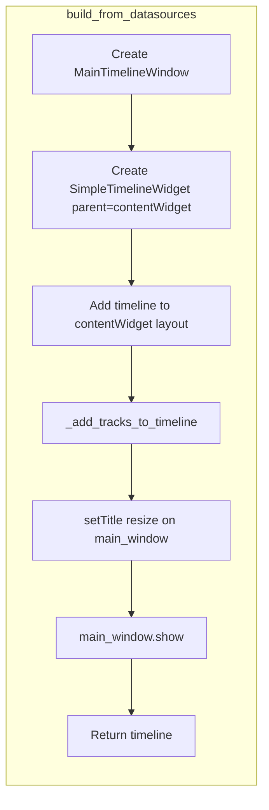

# Wrap SimpleTimelineWidget in MainTimelineWindow

## Current behavior

- [timeline_builder.py](pypho_timeline/timeline_builder.py) `build_from_datasources` (lines 767–783) creates a **standalone** `SimpleTimelineWidget`, calls `setWindowTitle`, `resize`, and `show()` on it, and returns the timeline. The timeline is a top-level window (no parent).
- [MainTimelineWindow](pypho_timeline/widgets/TimelineWindow/MainTimelineWindow.py) is a `QMainWindow` loaded from [MainTimelineWindow.ui](pypho_timeline/widgets/TimelineWindow/MainTimelineWindow.ui). The UI has a `contentWidget` (placeholder for main content), `logPanel`, and `footerBar` with log toggle. It currently has no layout on `contentWidget`.

## Target behavior

- Create a **MainTimelineWindow** first.
- Create **SimpleTimelineWidget** with the same arguments as now but **parent** set to the main window’s content area.
- Add the timeline to that content area so it fills the space above the log panel and footer.
- Apply **window title**, **resize**, and **show** to **MainTimelineWindow**, not to the timeline.
- Keep **returning the timeline** so existing callers (`update_timeline`, log docking via `timeline.ui.dynamic_docked_widget_container`, notebooks, etc.) remain valid. The timeline remains the logical “timeline” handle; the main window is just its container.

## Implementation

### 1. MainTimelineWindow: host the timeline

**File:** [MainTimelineWindow.py](pypho_timeline/widgets/TimelineWindow/MainTimelineWindow.py)

- Add an optional constructor argument, e.g. `show_immediately: bool = True`, so that when used from the builder the window is not shown until after the timeline is added and the window is configured.
- In `initUI`, ensure `contentWidget` has a layout (e.g. `QVBoxLayout` with zero margins) so the timeline can be added later.
- Optionally expose a property or setter for the embedded timeline (e.g. `timeline_widget`) for clarity; the builder will set it by adding the widget to `contentWidget`’s layout.
- When `show_immediately` is `False`, do **not** call `self.show()` in `__init`__; when `True`, keep current behavior for the `if __name__ == '__main__'` case.

### 2. timeline_builder: create MainTimelineWindow and embed timeline

**File:** [timeline_builder.py](pypho_timeline/timeline_builder.py)

- Import `MainTimelineWindow` from `pypho_timeline.widgets.TimelineWindow.MainTimelineWindow` (or the appropriate widget path).
- In `build_from_datasources` (around 766–783):
  1. Instantiate **MainTimelineWindow** with `show_immediately=False`.
  2. Create **SimpleTimelineWidget** with the same parameters as today, and `parent=main_window.contentWidget`.
  3. Add the timeline to the content area: `main_window.contentWidget.layout().addWidget(timeline)` (layout was set in step 1 of MainTimelineWindow).
  4. Call `_add_tracks_to_timeline(timeline, ...)` unchanged.
  5. Set title and size on **main_window**: `main_window.setWindowTitle(...)`, `main_window.resize(...)`.
  6. Call `main_window.show()`.
  7. Keep the existing log-dock block that uses `timeline.ui.dynamic_docked_widget_container` (unchanged).
  8. **Return `timeline`** as today (not the main window) so the public API is unchanged.

### 3. No change to callers or return type

- `build_from_datasources` continues to return `SimpleTimelineWidget`. No changes to `update_timeline`, notebooks, or `live_lsl_timeline` are required.
- The only behavioral change is that the timeline is embedded inside MainTimelineWindow instead of being a standalone window.

## Data flow (high level)

## Files to touch

| File                                                                                 | Change                                                                                                                                                                    |
| ------------------------------------------------------------------------------------ | ------------------------------------------------------------------------------------------------------------------------------------------------------------------------- |
| [MainTimelineWindow.py](pypho_timeline/widgets/TimelineWindow/MainTimelineWindow.py) | Add `show_immediately`; set layout on `contentWidget`; conditionally call `show()`.                                                                                       |
| [timeline_builder.py](pypho_timeline/timeline_builder.py)                            | Import MainTimelineWindow; in `build_from_datasources`, create main window, create timeline with parent, add to content, configure and show main window, return timeline. |

## Edge cases

- **Standalone MainTimelineWindow** (e.g. running `MainTimelineWindow.py` as script): still works by default with `show_immediately=True` and no timeline in content.
- **Log docking**: still uses `timeline.ui.dynamic_docked_widget_container`; the dock area lives inside the timeline widget, so no change.
- **Garbage collection**: timeline’s parent is the main window; returning the timeline keeps a reference, and the main window is kept alive as the timeline’s parent.

